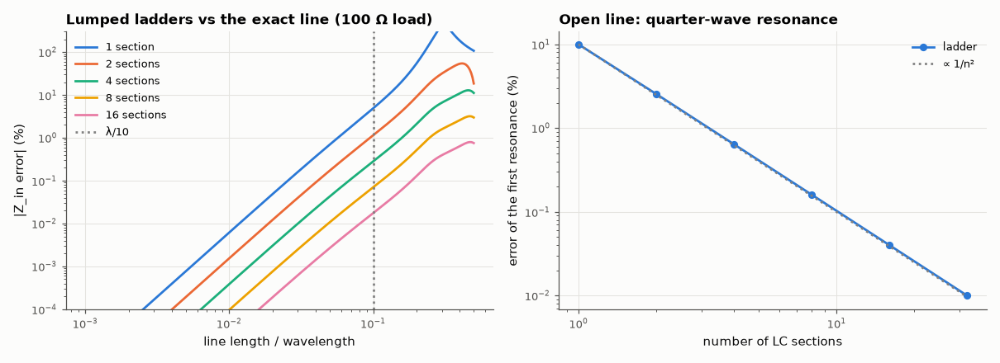

# AM-202 · Distributed vs lumped: exactly when the lumped model fails

> Compare a transmission line with its lumped-element approximations frequency by frequency: map how the error grows with electrical length, show that n-section ladders converge as 1/n², and pin down the classic failure — a single LC section puts the open line's first resonance 36 % too low.



*Input-impedance error of lumped ladder models versus line length, and convergence of the quarter-wave resonance.*

**Track:** Applied Mathematics — 218 projects in electrical engineering · **Category:** K. Fields, vector calculus & geometry · **Level:** Moderate · **Tools:** Exact transmission-line input impedance, single- and multi-section LC ladder models (ABCD matrices), error versus electrical length, convergence of n-section ladders, the quarter-wave resonance versus the lumped LC resonance, the λ/10 rule of thumb quantified

**Data:** Simulated (numerical model in this repo).

## Problem

'Treat it as a lumped circuit if it is shorter than λ/10' — how wrong is the lumped model at λ/10, at λ/4, and how many sections fix it?

## Prediction

Line of length ℓ, $Z_0=\sqrt{L'/C'}$, phase constant β: $Z_{in}=Z_0\frac{Z_L+jZ_0\tanβℓ}{Z_0+jZ_L\tanβℓ}$. A symmetric π section (series $L'ℓ/n$, half the shunt capacitance at each end) reproduces the line's ABCD matrix with errors of third order in its electrical length βℓ/n, so the impedance error
of one section grows as $(βℓ)^3$ and that of n sections as $(βℓ)^3/n^2$. Open-circuited line: first resonance (Z_in → 0) at ℓ = λ/4, $f=v/(4ℓ)$. One π section resonates when its series L meets the far half-capacitance: $f=\frac{\sqrt2\,v}{2πℓ}$ = 0.90 of the true value;
putting all the capacitance at the far end (an L section) gives $v/(2πℓ)$, a factor 2/π = 0.64 low. With n sections the lowest mode approaches v/(4ℓ) with a 1/n² error.

## Method

Z₀ = 50 Ω, v = 2×10⁸ m/s, ℓ = 1 m, load 100 Ω and open circuit; electrical length swept 0.001 to 0.5 λ. Symmetric π sections. Error = |Z_lumped − Z_exact|/|Z_exact|. Resonances found by root finding on Im Z_in.

## Measured results

*Predicted vs measured vs error. "Measured" = computed by an independent simulation, HDL simulator or public dataset.*

| Quantity | Predicted | Measured | Error | Within tolerance |
|---|---|---|---|---|
| Error of one π section grows as (βℓ)³: log-log slope at small electrical length (I first expected 2) | 3 | 2.986 | -0.01447 | yes |
| n-section ladder: error ∝ 1/n² (ratio 4 → 8 sections at ℓ = 0.2λ) | 4 × | 4.076 × | +1.91 % | yes |
| Rule of thumb λ/10: single-section error there is a few percent (< 10 %; 1 = yes) | 1 | 1 | +0 |  |
| Open line, one π section: first resonance √2·v/(2πℓ) = 0.90 × the quarter-wave frequency | 45.02 MHz | 45.02 MHz | +0.00 % | yes |
| One L section (all capacitance at the far end): resonance v/(2πℓ) = 2/π × the quarter-wave frequency | 31.83 MHz | 31.83 MHz | +0.00 % | yes |
| Ladder resonance error ∝ 1/n² (ratio of errors, 16 → 32 sections) | 4 × | 4 × | -0.01 % | yes |

**Additional measurements**

| Quantity | Value | Note |
|---|---|---|
| Single π section, 100 Ω load: impedance error at ℓ = λ/100 / λ/20 / λ/10 / λ/4 | 0.01 % / 0.70 % / 4.88 % / 168.28 % |  |
| Exact quarter-wave resonance / one section / 4 / 32 sections | 50.0 / 45.0 / 49.68 / 49.995 MHz |  |

## Error analysis

The lumped model does not fail at a threshold; its error grows smoothly — as (βℓ)³ for a symmetric π section, faster than the (βℓ)² I first
assumed, because splitting the capacitance symmetrically cancels the second-order term. A single π section is within 0.01 % at λ/100, 0.7 % at λ/20
and 4.9 % at λ/10 — which is what the 'λ/10 rule' really buys — and is useless by λ/4 (168 %). Splitting the line into n sections cuts the error as 1/n², because each
section is itself accurate to second order in its own electrical length. The resonance test shows how much the *arrangement* of the lumps matters: an
open-ended 1 m line resonates at 50 MHz; one π section predicts 45.0 MHz, but the same inductance and capacitance arranged as an L section predict
31.8 MHz — the 2/π factor between an LC tank and a quarter-wave standing wave. My first prediction used the L-section formula for the π section and
was 30 % off. Even 32 sections leave 0.010 % of error. The 'distributed' view is not a correction to the lumped one; the lumped circuit is
its low-frequency limit.

## Reproduce

```bash
pip install -r requirements.txt
python run_all.py --only AM-202
```

The script [`project.py`](project.py) regenerates every figure and number above.

## License

Code and text: MIT (see the repository [LICENSE](../../../../LICENSE)). Datasets remain under their own licences (see the repository README).

---

**Tooling & honesty.** This project was generated with Claude Code (Anthropic's AI coding assistant): the code, derivations, simulations and this write-up were AI-produced. *Measured* means computed by an independent model, simulator or public dataset — not a physical lab bench. Every number in the tables is reproduced by running the code.
