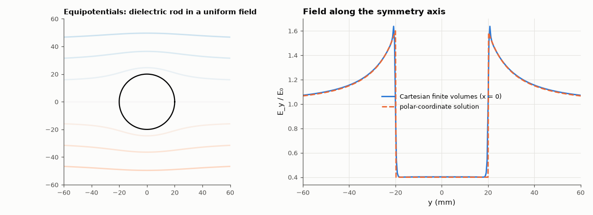

# AM-203 · Cylindrical and spherical coordinates: operators, Jacobians and a solved problem

> Put the curvilinear operator formulas to a numerical test on random points and fields, verify that the basis transformations are orthogonal and that r² sin θ is the right volume element, then solve a problem that is easy in polar coordinates and awkward in Cartesian ones — a dielectric rod in a uniform field — both ways.



*A dielectric rod in a uniform field: equipotentials and the field along the axis, Cartesian solve vs the polar-coordinate solution.*

**Track:** Applied Mathematics — 218 projects in electrical engineering · **Category:** K. Fields, vector calculus & geometry · **Level:** Moderate · **Tools:** Gradient, divergence, curl and Laplacian in cylindrical and spherical coordinates evaluated by finite differences in the curvilinear variables and compared with Cartesian results, rotation matrices between unit-vector bases, the Jacobian as volume element, separation of variables for a dielectric cylinder in a uniform field checked against a Cartesian finite-volume solve

**Data:** Simulated (numerical model in this repo).

## Problem

The ∇ formulas in cylindrical and spherical coordinates look arbitrary. Where do the extra factors come from, and how can the formulas be checked rather than memorised?

## Prediction

With scale factors $(h_1,h_2,h_3)$ = (1, ρ, 1) for cylindrical and (1, r, r sin θ) for spherical coordinates, $\nabla\cdot A=\frac{1}{h_1h_2h_3}\sum_i\partial_i\left(\frac{h_1h_2h_3}{h_i}A_i\right)$ and $\nabla^2f=\frac{1}{h_1h_2h_3}\sum_i\partial_i\left(\frac{h_1h_2h_3}{h_i^2}\partial_if\right)$; the volume element is $h_1h_2h_3$ (ρ, r² sin θ).
Unit-vector bases are related by rotation matrices R with $RR^T=I$. Dielectric cylinder (ε_r) in a uniform field E₀: separation of variables in polar coordinates gives a uniform interior field $E_{in}=\frac{2}{ε_r+1}E_0$ and an exterior line-dipole perturbation.

## Method

Test functions: f = x²y + z³ + e^{x/2} sin y (scalar), A = (yz, x²z, xy²) (vector); 300 random points; curvilinear derivatives by central differences (step 10⁻⁵). Volume of a sphere and of a cone section by integrating the Jacobian. Cylinder: radius 20 mm, ε_r = 4, between plates 400 mm apart
at ±200 V (a 200 mm box gave 2 % too much interior field: the plates' images); Cartesian finite-volume solution at 0.4 mm.

## Measured results

*Predicted vs measured vs error. "Measured" = computed by an independent simulation, HDL simulator or public dataset.*

| Quantity | Predicted | Measured | Error | Within tolerance |
|---|---|---|---|---|
| Cylindrical Laplacian ∂ρρ + ∂ρ/ρ + ∂φφ/ρ² + ∂zz vs Cartesian (worst relative error, 300 points) | 0 | 3.2885e-07 | +3.2885e-07 | yes |
| Spherical Laplacian vs Cartesian (worst relative error) | 0 | 3.2694e-07 | +3.2694e-07 | yes |
| Spherical divergence of A = (yz, x²z, xy²) (Cartesian divergence is 0): worst |value| | 0 | 1.7904e-07 | +1.7904e-07 | yes |
| Cylindrical curl, z and ρ components vs the Cartesian curl (worst abs. error) | 0 | 6.3485e-08 | +6.3485e-08 | yes |
| Cartesian → spherical unit-vector matrix is orthogonal: max |RRᵀ − I| | 0 | 3.3307e-16 | +3.3307e-16 | yes |
| ∭ r² sin θ dr dθ dφ over a sphere of radius 1.3 = 4πR³/3 | 9.203 | 9.203 | -0.00 % | yes |
| Spherical cone of half-angle 30°: volume 2πR³(1 − cos 30°)/3 | 0.6165 | 0.6165 | +0.00 % | yes |
| Dielectric rod (ε_r = 4): interior field / applied field = 2/(ε_r + 1) (separation of variables) | 0.4 | 0.4028 | +0.70 % | yes |
| … and it is uniform inside (std/mean of E_y within r < 12 mm) | 0 | 2.8800e-04 | +2.8800e-04 | yes |
| Outside, r = 40 mm: potential vs −E₀(r − a²(ε_r−1)/((ε_r+1)r)) sin φ (worst error / E₀a) | 0 | 0.008996 | +0.008996 | yes |

## Error analysis

Evaluated by finite differences in the curvilinear variables themselves, the cylindrical and spherical Laplacians, the spherical divergence
and the cylindrical curl agree with their Cartesian counterparts at 300 random points to the precision of the differencing, so the scale-factor
formulas are not something to memorise but something that can be checked. The basis change is a rotation (RRᵀ = I to machine precision) and r² sin θ
integrates to the exact volumes of a sphere and a cone. The payoff is in problems with the right symmetry: in polar coordinates the dielectric rod in a
uniform field is solved in two lines — a uniform interior field of 2/(ε_r + 1) = 0.40 of the applied field — and a Cartesian finite-volume solve with a
staircased rod agrees (0.403) once the plates are far enough away — with plates at five radii my first run gave 0.409, the
extra 2 % coming from the plates' image dipoles, which the unbounded analytic solution does not have — with the exterior line-dipole perturbation matching as well. Choosing coordinates that follow the boundary turns a
numerical problem into an algebraic one.

## Reproduce

```bash
pip install -r requirements.txt
python run_all.py --only AM-203
```

The script [`project.py`](project.py) regenerates every figure and number above.

## License

Code and text: MIT (see the repository [LICENSE](../../../../LICENSE)). Datasets remain under their own licences (see the repository README).

---

**Tooling & honesty.** This project was generated with Claude Code (Anthropic's AI coding assistant): the code, derivations, simulations and this write-up were AI-produced. *Measured* means computed by an independent model, simulator or public dataset — not a physical lab bench. Every number in the tables is reproduced by running the code.
