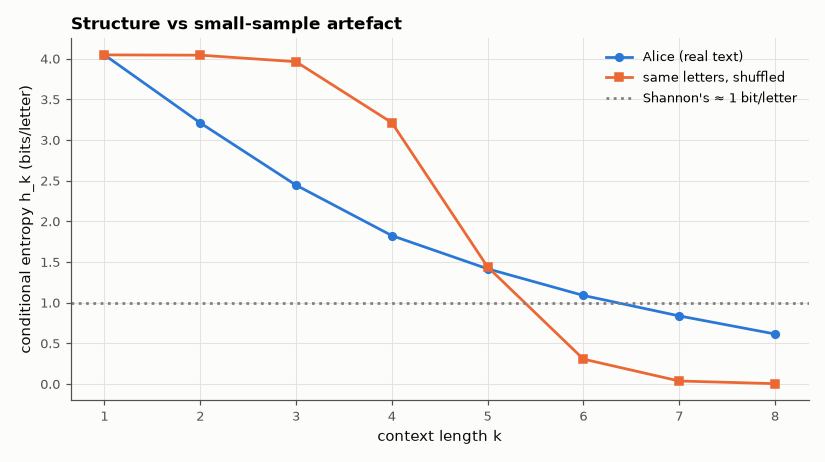

# AM-204 · Entropy calculator (interactive, verified on real text)

> A calculator that turns probabilities or text into bits, with the estimation pitfalls made visible: conditional entropy of English falls as more context is used, but with a finite text the estimates keep falling for the wrong reason — too few samples. The engine is checked against Python before publication.



*Conditional entropy of a book versus context length, compared with a shuffled control.*

**Track:** Applied Mathematics — 218 projects in electrical engineering · **Category:** L. Information theory · **Level:** Easy · **Tools:** Browser tool (HTML + JavaScript): entropy of typed probabilities, and for pasted text the block entropies H_k, conditional entropies H(Xₙ|previous k−1), Miller–Madow correction and Huffman code length; the JavaScript is verified under Node against independent Python computations on a full book

**Data:** Project Gutenberg eBook #11 (public domain).

## Problem

'English has about 1 bit per letter' — how is such a number measured, and why does a naive measurement on one book give the wrong answer?

## Prediction

$H(p)=-\sum p_i\log_2p_i$, maximal ($\log_2 K$) for a uniform distribution. For a text, the order-k block entropy $H_k$ of k-letter strings gives the conditional entropy $h_k=H_k-H_{k-1}$, which decreases with k toward the entropy rate (Shannon estimated ≈ 1 bit/letter for English
using human predictions). A plug-in estimate from N samples is biased low by ≈ (number of occupied cells − 1)/(2N ln 2) (Miller–Madow); once $K^k$ approaches N almost every block is unique and $h_k$ collapses toward 0 — an artefact, not information. The optimal prefix code length L satisfies H ≤ L < H + 1.

## Method

calc.js tested under Node: entropy and Huffman length on 300 random distributions vs Python; block and conditional entropies of 'Alice's Adventures in Wonderland' (144 k characters) for k = 1…8 vs Python counters. Shuffled-text control: the same letters in random order
(true conditional entropy = H₁ at every order) to expose the finite-sample bias.

## Measured results

*Predicted vs measured vs error. "Measured" = computed by an independent simulation, HDL simulator or public dataset.*

| Quantity | Predicted | Measured | Error | Within tolerance |
|---|---|---|---|---|
| Entropy of 300 random distributions: JavaScript vs Python (max difference) | 0 bit | 1.7764e-15 bit | +1.7764e-15 bit | yes |
| Huffman average length within [H, H + 1) for all 300 (violations) | 0 | 0 | +0 |  |
| Block entropies H₁…H₈ of the book: JavaScript vs Python (max difference) | 0 bit | 1.5538e-11 bit | +1.5538e-11 bit | yes |
| Order-0 entropy of English letters + space (literature ≈ 4.1 bits) | 4.1 bit | 4.046 bit | -1.32 % | yes |
| Shuffled text (true h_k = h₁ for every k): apparent drop h₁ − h₂ from finite sample size vs Miller–Madow prediction | 0.003561 bit | 0.003609 bit | +1.34 % | yes |
| Real text keeps more structure than its shuffled version at order 3 (h₃ real < h₃ shuffled − 1 bit; 1 = yes) | 1 | 1 | +0 |  |

**Additional measurements**

| Quantity | Value | Note |
|---|---|---|
| Letters+space alphabet / N | 28 symbols / 135509 characters |  |
| Conditional entropy h_k for k = 1…8 | 4.05 / 3.21 / 2.44 / 1.82 / 1.42 / 1.09 / 0.84 / 0.61 |  |
| … apparent drop h₁ − h₄: measured / Miller–Madow | 0.833 / 0.334 bit | the first-order correction fails once the number of possible blocks (28⁴ ≈ 600 000) exceeds the sample size |
| Shuffled text: apparent h₈ | 0.003637 bit/letter | against the true 4.05 — a book is far too short for 8-letter statistics |

## Error analysis

The calculator's engine matches Python to round-off on random distributions and on the block entropies of a whole book, and its Huffman lengths
always land in [H, H + 1). The interesting part is what the numbers mean. Single letters of English carry 4.05 bits; with two and three letters of
context the conditional entropy drops to 3.21 and 2.44 — genuine structure, as the shuffled control (which stays near 4.05 at low orders) shows.
Further out the estimate keeps falling, reaching 0.61 bits at k = 8, but the shuffled text, which has *no* structure, also falls to 0.00: with
144 000 characters most 8-letter strings are seen once, and the plug-in estimate mistakes rarity for predictability. The Miller–Madow correction explains the bias while the blocks are well sampled (order 2) but not beyond, where no
simple correction rescues the estimate. That is why the tool warns when a
text is too short for the order requested, and why Shannon's ≈ 1 bit/letter came from human prediction experiments rather than counting.

## Reproduce

```bash
pip install -r requirements.txt
python run_all.py --only AM-204
```

The script [`project.py`](project.py) regenerates every figure and number above.

**Files produced**

- [`web/index.html`](web/index.html) — interactive tool
- [`web/calc.js`](web/calc.js) — calculation engine (tested under Node)

## License

Code and text: MIT (see the repository [LICENSE](../../../../LICENSE)). Datasets remain under their own licences (see the repository README).

---

**Tooling & honesty.** This project was generated with Claude Code (Anthropic's AI coding assistant): the code, derivations, simulations and this write-up were AI-produced. *Measured* means computed by an independent model, simulator or public dataset — not a physical lab bench. Every number in the tables is reproduced by running the code.
