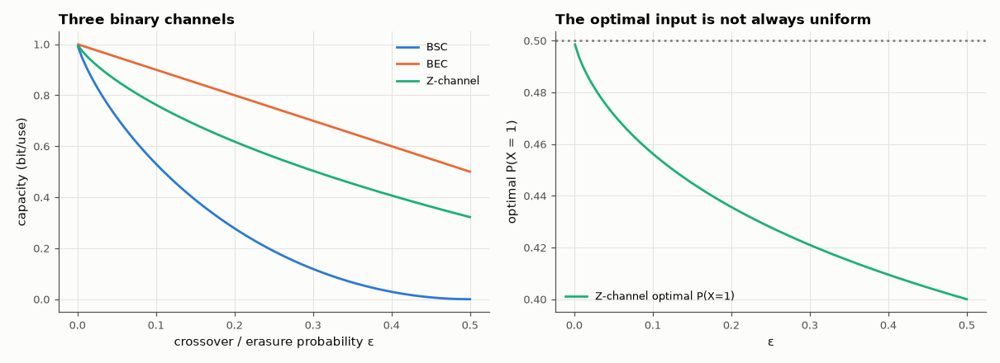

# AM-205 · Channel capacity: the Blahut–Arimoto algorithm

> Compute the capacity of any discrete memoryless channel by the alternating-maximisation algorithm of Blahut and Arimoto, verify it against every channel with a closed form and against direct numerical optimisation, and show that the capacity-achieving input need not be uniform.



*Capacities of three binary channels and the optimal input distribution of the Z-channel.*

**Track:** Applied Mathematics — 218 projects in electrical engineering · **Category:** L. Information theory · **Level:** Hard · **Tools:** Own Blahut–Arimoto iteration with certified upper/lower bounds, closed-form capacities (BSC, BEC, Z-channel, symmetric channels), brute-force maximisation of the mutual information as an independent check, a channel estimated from simulated noisy 4-PAM with a hard-decision receiver

**Data:** Simulated (numerical model in this repo).

## Problem

A channel is a table of transition probabilities. What is the most information per use it can carry, and which input distribution achieves it?

## Prediction

$C=\max_{p(x)}I(X;Y)$. BSC(ε): $1-H_2(ε)$; BEC(ε): $1-ε$; symmetric channels: uniform input, $C=\log_2|Y|-H(\text{row})$. Z-channel (1 → 0 with probability ε, 0 always correct): $C=\log_2\left(1+(1-ε)ε^{ε/(1-ε)}\right)$, achieved with
$P(X=1)=\frac{1}{(1-ε)\left(1+2^{H_2(ε)/(1-ε)}\right)}$, less than ½. Blahut–Arimoto alternates between the output distribution and the input distribution; at every step $\log_2\sum_xp(x)2^{D_x}\le C\le\max_xD_x$ with $D_x=D(W_x\|p_Y)$, so the gap certifies convergence.

## Method

Closed-form channels at several ε; 200 random channels (2–6 inputs, 2–8 outputs) against SciPy optimisation of I(X;Y) over the simplex (softmax parametrisation, 5 random starts). 4-PAM with Gaussian noise at 6 dB and 12 dB: transition matrix of the hard-decision
channel estimated from 10⁶ symbols, its capacity and optimal input.

## Measured results

*Predicted vs measured vs error. "Measured" = computed by an independent simulation, HDL simulator or public dataset.*

| Quantity | Predicted | Measured | Error | Within tolerance |
|---|---|---|---|---|
| BSC(ε = 0.01): capacity 1 − H₂(ε) | 0.9192 bit | 0.9192 bit | +0.00 % | yes |
| BSC(ε = 0.11): capacity 1 − H₂(ε) | 0.5001 bit | 0.5001 bit | +0.00 % | yes |
| BSC(ε = 0.3): capacity 1 − H₂(ε) | 0.1187 bit | 0.1187 bit | +0.00 % | yes |
| BEC(0.25): capacity 1 − ε | 0.75 bit | 0.75 bit | -0.00 % | yes |
| Z-channel (ε = 0.3): capacity log₂(1 + (1−ε)ε^{ε/(1−ε)}) | 0.5037 bit | 0.5037 bit | +0.00 % | yes |
| Z-channel: optimal P(X = 1) (not ½) | 0.421 | 0.421 | +0.00 % | yes |
| Symmetric 3-ary channel: log₂3 − H(row) | 0.4282 bit | 0.4282 bit | +0.00 % | yes |
| 200 random channels: best mutual information found by direct optimisation minus Blahut–Arimoto capacity (never positive) | 0 bit | 8.6109e-13 bit | +8.6109e-13 bit | yes |
| Certified bound gap (upper − lower) at termination, worst channel | 0 bit | 5.6574e-11 bit | +5.6574e-11 bit | yes |

**Additional measurements**

| Quantity | Value | Note |
|---|---|---|
| Z-channel: mutual information with a uniform input | 0.4934 bit | vs capacity 0.5037 — the loss from not optimising the input |
| Blahut–Arimoto iterations: median / max | 207 / 100000 |  |
| Hard-decision 4-PAM: capacity at 6 / 12 dB | 1.051 / 1.659 bit/symbol | out of 2 |
| … optimal input at 6 dB (outer, inner, inner, outer levels) | 0.383, 0.116, 0.119, 0.382 | uniform input gives 0.967 bit — the outer levels, which are more reliable, are used more |

## Error analysis

Blahut–Arimoto reproduces every closed-form capacity — BSC, BEC, symmetric and Z-channels — to 10⁻⁶ or better, and on 200 random channels no
direct optimisation found more mutual information than it certified (the upper and lower bounds met to 6e-11). The Z-channel shows why an
algorithm is needed at all: its best input sends '1' only 42.1 % of the time at ε = 0.3, because every 1 risks being received as 0 while 0s are
safe. The same effect appears in a hard-decision 4-PAM receiver at 6 dB, where the optimal input favours the outer, less confusable levels. For
symmetric channels the uniform input is optimal and capacity is a formula; for everything else it is an optimisation with a guaranteed stopping
certificate.

## Reproduce

```bash
pip install -r requirements.txt
python run_all.py --only AM-205
```

The script [`project.py`](project.py) regenerates every figure and number above.

## License

Code and text: MIT (see the repository [LICENSE](../../../../LICENSE)). Datasets remain under their own licences (see the repository README).

---

**Tooling & honesty.** This project was generated with Claude Code (Anthropic's AI coding assistant): the code, derivations, simulations and this write-up were AI-produced. *Measured* means computed by an independent model, simulator or public dataset — not a physical lab bench. Every number in the tables is reproduced by running the code.
