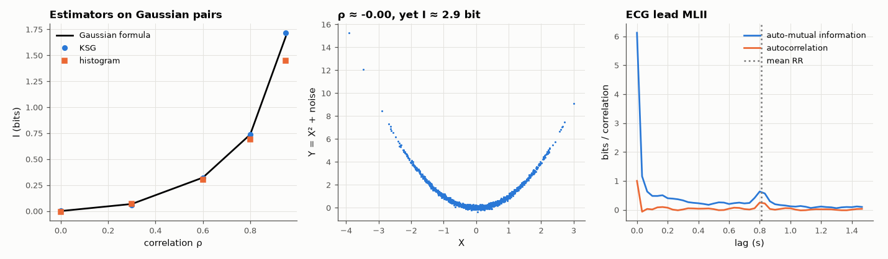

# AM-206 · Mutual information of continuous signals: estimators and a real ECG

> Estimate how many bits one signal carries about another without assuming linearity: validate two estimators where the answer is known, show a dependence that correlation misses entirely, and apply them to two leads of a real electrocardiogram.



*Estimator validation, a dependence invisible to correlation, and time-lagged mutual information of a real ECG.*

**Track:** Applied Mathematics — 218 projects in electrical engineering · **Category:** L. Information theory · **Level:** Hard · **Tools:** Plug-in histogram estimator with bias correction, Kraskov–Stögbauer–Grassberger k-nearest-neighbour estimator (own, KD-tree), Gaussian closed form, nonlinear dependence invisible to correlation, time-delayed mutual information between two ECG leads and within one lead

**Data:** PhysioNet MIT-BIH Arrhythmia Database, record 100.

## Problem

Correlation measures only linear dependence. How can the total statistical dependence between two measured signals be quantified in bits?

## Prediction

$I(X;Y)=h(X)+h(Y)-h(X,Y)$. Jointly Gaussian: $I=-\tfrac12\log_2(1-ρ^2)$. KSG estimator: for each sample find the distance ε to its k-th neighbour in the joint (max-norm) space, count neighbours $n_x,n_y$ within ε in each marginal:
$\hat I=ψ(k)+ψ(N)-\langleψ(n_x+1)+ψ(n_y+1)\rangle$ (nats); nearly unbiased at independence. Histograms are biased and depend on the bin count. For $Y=X^2+\text{noise}$ with symmetric X, ρ = 0 but I > 0.

## Method

Synthetic: 5000 Gaussian pairs, ρ = 0 … 0.95; independent pairs; Y = X² + 0.1·noise. Real: MIT-BIH record 100, leads MLII and V5, 2 min at 360 Hz (subsampled 4×): I between the leads and the auto-mutual information of MLII versus lag (0–1.5 s), next to the correlations.

## Measured results

*Predicted vs measured vs error. "Measured" = computed by an independent simulation, HDL simulator or public dataset.*

| Quantity | Predicted | Measured | Error | Within tolerance |
|---|---|---|---|---|
| KSG estimator vs Gaussian closed form −½log₂(1 − ρ²), worst absolute error for ρ = 0…0.95 | 0 bit | 0.03807 bit | +0.03807 bit | yes |
| Histogram estimator (16 bins, bias-corrected), worst absolute error — larger at strong dependence | 0 bit | 0.2326 bit | +0.2326 bit | **no** |
| Y = X² + noise: correlation coefficient (≈ 0) | 0 | -0.002349 | -0.002349 | yes |
| … yet the mutual information is large (KSG > 1 bit; 1 = yes) | 1 | 1 | +0 |  |
| Two ECG leads: measured MI exceeds what their correlation alone implies (nonlinear/non-Gaussian dependence; 1 = yes) | 1 | 1 | +0 |  |
| Auto-mutual information of MLII peaks again one heartbeat later (lag vs mean RR interval) | 811 ms | 800 ms | -1.36 % | yes |

**Additional measurements**

| Quantity | Value | Note |
|---|---|---|
| Y = X² + noise: KSG / histogram estimate | 2.90 / 1.44 bit |  |
| Leads MLII vs V5: correlation / Gaussian-implied MI / KSG MI | 0.63 / 0.36 / 0.49 bit |  |

## Error analysis

The k-nearest-neighbour (KSG) estimator recovers the Gaussian closed form within 0.038 bit from ρ = 0 to 0.95, while a 16-bin histogram,
even bias-corrected, errs by up to 0.23 bit at strong dependence, where the joint distribution is concentrated in too few bins. The
case for mutual information is the parabola: correlation -0.00, dependence 2.9 bits. On a real ECG (after one practical fix: the recorder's integer codes produce exact ties, and the
first run returned an infinite estimate until a 10⁻⁶ dither broke them) the two leads share 0.49 bits per
sample — more than their correlation of 0.63 would imply for Gaussian signals, because the QRS complex couples them nonlinearly — and the signal's
auto-mutual information peaks again at 0.80 s, one heartbeat (mean RR 0.81 s): each beat is informative about the next.

## Reproduce

```bash
pip install -r requirements.txt
python run_all.py --only AM-206
```

The script [`project.py`](project.py) regenerates every figure and number above.

## License

Code and text: MIT (see the repository [LICENSE](../../../../LICENSE)). Datasets remain under their own licences (see the repository README).

---

**Tooling & honesty.** This project was generated with Claude Code (Anthropic's AI coding assistant): the code, derivations, simulations and this write-up were AI-produced. *Measured* means computed by an independent model, simulator or public dataset — not a physical lab bench. Every number in the tables is reproduced by running the code.
