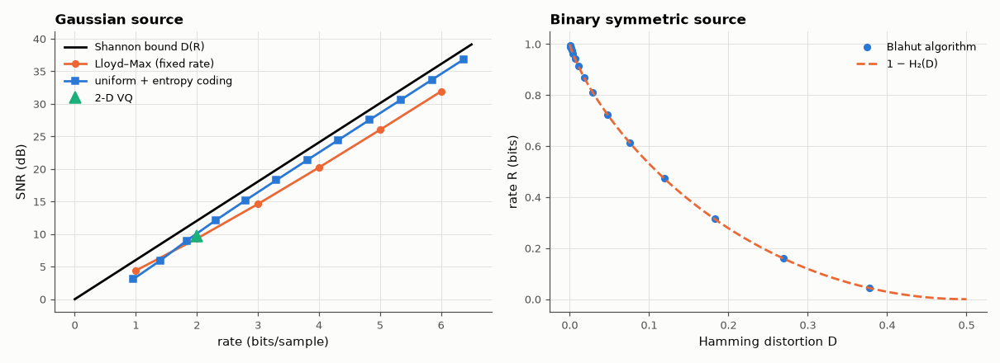

# AM-207 · Rate–distortion theory against real quantisers

> Compare the best achievable trade-off between bits and distortion with what practical quantisers achieve: the 6.02 dB-per-bit rule, the 1.53 dB 'space-filling' gap of scalar quantisation at high rate, how entropy coding and vector quantisation close part of it, and the numbers on real speech.



*Practical quantisers against the Gaussian rate–distortion bound, and R(D) of a binary source.*

**Track:** Applied Mathematics — 218 projects in electrical engineering · **Category:** L. Information theory · **Level:** Hard · **Tools:** Gaussian and binary rate–distortion functions, Blahut's algorithm for R(D) of a discrete source, own Lloyd–Max quantiser, entropy-coded uniform quantiser, k-means vector quantiser, real speech samples

**Data:** Free Spoken Digit Dataset (CC BY-SA 4.0).

## Problem

How many bits per sample does a given fidelity really require, and how far from that limit are the quantisers used in practice?

## Prediction

Gaussian source, squared error: $D(R)=σ^22^{-2R}$ — SNR = 6.02 R dB. Binary source with Hamming distortion: $R(D)=1-H_2(D)$. The optimal fixed-rate scalar (Lloyd–Max) quantiser of a Gaussian at high rate has $D≈\frac{\sqrt3π}{2}σ^22^{-2R}$ (4.35 dB above the bound); a uniform quantiser followed by ideal
entropy coding reaches $D≈\frac{πe}{6}σ^22^{-2R}$, i.e. 1.53 dB (≈ 0.25 bit) from the limit; vector quantisers in higher dimension recover part of that gap. Blahut's algorithm computes R(D) of any discrete source by alternating minimisation.

## Method

Gaussian source: Lloyd–Max for 1–6 bits with exact conditional means (iterated to convergence); 10⁶ Gaussian samples for the others: uniform quantiser with step chosen for entropy-coded rates 1–6 bits (entropy of the output as the rate); 2-D vector quantiser by k-means at 2 bits/sample. Binary source: Blahut R(D) vs 1 − H₂(D). Speech: all FSDD
recordings concatenated and normalised; 8-bit uniform PCM and μ-law, SNR vs the Gaussian bound at the same rate.

## Measured results

*Predicted vs measured vs error. "Measured" = computed by an independent simulation, HDL simulator or public dataset.*

| Quantity | Predicted | Measured | Error | Within tolerance |
|---|---|---|---|---|
| Lloyd–Max, 1 bit: SNR (optimal 2-level quantiser of a Gaussian: 1 − 2/π distortion → 4.40 dB) | 4.396 dB | 4.396 dB | +0 dB | yes |
| Lloyd–Max at 6 bits: gap to the bound 6.02·R dB (high-rate Panter–Dite limit: 4.35 dB, approached from below) | 4.35 dB | 4.21 dB | -0.1395 dB | yes |
| Entropy-coded uniform quantiser at high rate: gap to the bound (theory 10·log₁₀(πe/6) = 1.53 dB) | 1.533 dB | 1.527 dB | -0.005782 dB | yes |
| 2-D vector quantiser (16 cells = 2 bit/sample) beats the 4-level scalar quantiser (1 = yes) | 1 | 1 | +0 |  |
| Binary source: Blahut R(D) vs 1 − H₂(D) (worst difference over the curve) | 0 bit | 3.3307e-16 bit | +3.3307e-16 bit | yes |
| Speech, uniform 8-bit PCM: SNR = 6.02·8 + 4.77 − crest factor (dB) | 29.34 dB | 30.13 dB | +0.7895 dB | yes |
| μ-law companding gives a higher SNR than uniform 8-bit on real speech (1 = yes) | 1 | 1 | +0 |  |

**Additional measurements**

| Quantity | Value | Note |
|---|---|---|
| Lloyd–Max iterations needed at 1…6 bits | 2 / 55 / 205 / 743 / 2724 / 10239 | my first run stopped at 200 iterations and reported a 5.4 dB gap at 6 bits — not yet converged |
| At 2 bit/sample: SNR scalar Lloyd–Max / 2-D VQ / Shannon bound | 9.31 / 9.66 / 12.04 dB |  |
| Speech at 8 bit/sample: uniform / μ-law SNR vs Gaussian R–D bound 48.2 dB | 30.1 / 37.6 dB | crest factor 23.6 dB — speech spends most of its time far below full scale |

## Error analysis

The rate–distortion bound is reachable only in the limit, and the measurements show how far each practical step gets. A fixed-rate optimal
scalar quantiser stays about 4.2 dB below the 6.02-dB-per-bit line at high rate, as the Panter–Dite formula predicts; adding entropy
coding to a plain uniform quantiser closes most of that, leaving 1.53 dB — the 1.53 dB 'space-filling' loss of cubic cells, i.e. a
quarter of a bit per sample; a two-dimensional vector quantiser already recovers some of that at 2 bits. Blahut's algorithm reproduces the binary
R(D) = 1 − H₂(D) exactly. Real speech is the humbling case: 8-bit uniform PCM delivers only 30 dB because speech has a crest factor of 24 dB and
wastes most codes on rare peaks; μ-law companding raises it to 38 dB by spending resolution where the signal usually is.

## Reproduce

```bash
pip install -r requirements.txt
python run_all.py --only AM-207
```

The script [`project.py`](project.py) regenerates every figure and number above.

## License

Code and text: MIT (see the repository [LICENSE](../../../../LICENSE)). Datasets remain under their own licences (see the repository README).

---

**Tooling & honesty.** This project was generated with Claude Code (Anthropic's AI coding assistant): the code, derivations, simulations and this write-up were AI-produced. *Measured* means computed by an independent model, simulator or public dataset — not a physical lab bench. Every number in the tables is reproduced by running the code.
