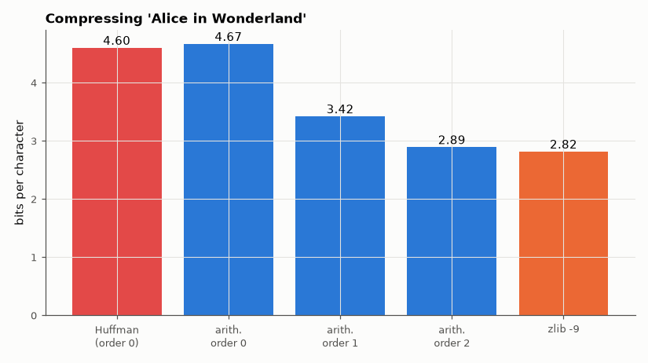

# AM-208 · Arithmetic coding: reaching the entropy bit by bit

> Build a working arithmetic coder, prove it lossless on a whole book, show that its output is within a couple of bits of the model's ideal code length, beat Huffman where Huffman is weakest (skewed sources), and use context models to compress English far below its single-letter entropy.



*Bits per character of the book with Huffman, arithmetic coding under three context models, and zlib.*

**Track:** Applied Mathematics — 218 projects in electrical engineering · **Category:** L. Information theory · **Level:** Hard · **Tools:** Own 32-bit integer arithmetic coder (interval renormalisation with pending-bit carry handling) and decoder, static and adaptive frequency models, order-0/1/2 context models on real text, comparison with ideal code length −Σlog₂p, Huffman and zlib

**Data:** Project Gutenberg eBook #11 (public domain).

## Problem

Huffman coding wastes up to one bit per symbol. How can a code spend fractional bits — and how close does it get to the entropy?

## Prediction

Arithmetic coding narrows an interval by each symbol's probability; the final interval has width $\prod p_i$, so about $-\sum\log_2p_i+2$ bits identify it. With finite-precision integers the interval is renormalised by shifting out settled bits, and 'underflow' (straddling the midpoint) is handled
by pending bits. The code length therefore equals the model's log-loss plus a constant, whatever the probabilities — including p = 0.99, where Huffman needs 1 bit/symbol against H = 0.081. Compression = modelling: an adaptive order-k context
model predicts each letter from the previous k and pays its conditional log-loss, approaching the conditional entropies of AM-204.

## Method

Coder: 32-bit range, frequencies up to 2¹⁶. Tests: round trip on the whole book for every model; code length vs Σ−log₂p of the model's own predictions; Bernoulli(0.01) source (10⁵ symbols) vs Huffman (1 bit/symbol) and H₂(0.01); adaptive order-0, 1, 2 models
(Laplace-smoothed counts, 256-symbol alphabet) on 'Alice'; zlib level 9 for reference.

## Measured results

*Predicted vs measured vs error. "Measured" = computed by an independent simulation, HDL simulator or public dataset.*

| Quantity | Predicted | Measured | Error | Within tolerance |
|---|---|---|---|---|
| Bernoulli(0.01), 10⁵ symbols: code length vs the model's ideal −Σlog₂p | 8258 bit | 8260 bit | +1.694 bit | yes |
| … bits per symbol vs the entropy H₂(0.01) = 0.081 (Huffman: 1.000) | 0.0808 bit | 0.0826 bit | +2.23 % | yes |
| … decodes back exactly (symbol errors) | 0 | 0 | +0 |  |
| Order-0 adaptive model on the book: lossless round trip (1 = yes) | 1 | 1 | +0 |  |
| Order-1 adaptive model on the book: lossless round trip (1 = yes) | 1 | 1 | +0 |  |
| Order-2 adaptive model on the book: lossless round trip (1 = yes) | 1 | 1 | +0 |  |
| Order-2 model: arithmetic-code length vs the model's log-loss (bits per character) | 2.895 bit | 2.895 bit | +0.00 % | yes |
| My expectation: the order-2 context model beats zlib -9 on English text (1 = yes) | 1 | 0 | -1 |  |

**Additional measurements**

| Quantity | Value | Note |
|---|---|---|
| Bits per character: order-0 / order-1 / order-2 arithmetic coding / zlib -9 | 4.669 / 3.424 / 2.895 / 2.819 | 151094 bytes; Huffman on single characters (AM-151): 4.60 |

## Error analysis

The coder is exact — every model decodes the whole book back byte for byte — and efficient in the sense that matters: its output is within a
few bits of the model's own log-loss, so the coding step costs essentially nothing and all compression is decided by the probabilities. That removes
Huffman's one-bit floor on skewed sources (0.083 bit/symbol for a Bernoulli(0.01) source, against Huffman's 1.00). On English the gain comes from
modelling: order-0 arithmetic coding matches single-letter Huffman performance (4.67 bit/char), and predicting each letter from the previous one or
two brings it to 3.42 and 2.89. I expected the order-2 model to beat zlib; it lands just above it (2.82), because zlib's long-range matching
finds repeated words and phrases (character names, 'said the') that a two-letter context cannot see. Better models — longer contexts, mixtures —
are how modern compressors reach ≈ 2 bits/char on such text; the arithmetic coder underneath stays the same.

## Reproduce

```bash
pip install -r requirements.txt
python run_all.py --only AM-208
```

The script [`project.py`](project.py) regenerates every figure and number above.

## License

Code and text: MIT (see the repository [LICENSE](../../../../LICENSE)). Datasets remain under their own licences (see the repository README).

---

**Tooling & honesty.** This project was generated with Claude Code (Anthropic's AI coding assistant): the code, derivations, simulations and this write-up were AI-produced. *Measured* means computed by an independent model, simulator or public dataset — not a physical lab bench. Every number in the tables is reproduced by running the code.
