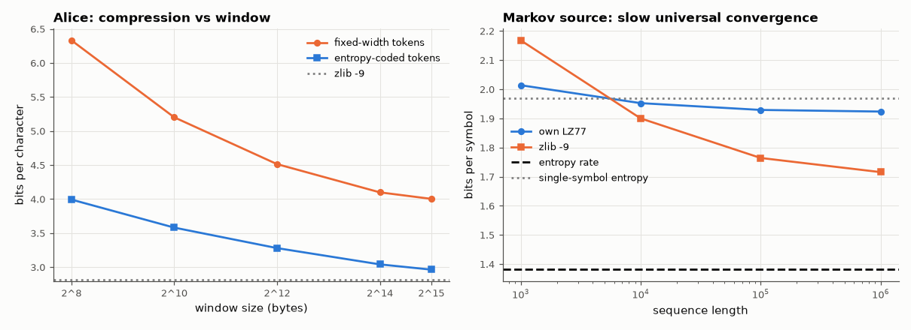

# AM-209 · LZ77: universal compression by pointing into the past

> Implement the dictionary compressor behind ZIP and PNG, prove it lossless, measure how its compression depends on the window, and demonstrate its defining property: without knowing anything about a source, its rate approaches the source's entropy rate as the data grow.



*LZ77 compression of a book versus window size, and convergence toward the entropy rate of a Markov source.*

**Track:** Applied Mathematics — 218 projects in electrical engineering · **Category:** L. Information theory · **Level:** Moderate · **Tools:** Own LZ77 encoder/decoder (hash-chain match search, sliding window, lengths/offsets/literals), fixed-width and entropy-estimated token costs, compression versus window size, universality demo on a Markov source of known entropy rate, comparison with zlib (LZ77 + Huffman)

**Data:** Project Gutenberg eBook #11 (public domain).

## Problem

Arithmetic coding needs a probability model. How can a compressor that knows nothing about the data still approach the entropy?

## Prediction

LZ77 replaces a string that occurred before by a pointer (offset, length) into a window of recent history, otherwise emits a literal. Lempel–Ziv codes are *universal*: for any stationary ergodic source the bits per symbol converge to the entropy rate as the window and data length grow —
but slowly, roughly like $O(\log\log n/\log n)$. Test source: a first-order Markov chain on 4 symbols with known entropy rate $\bar H=-\sum_iπ_i\sum_jP_{ij}\log_2P_{ij}$; its single-symbol entropy is higher, so reaching below $H(X)$ proves the compressor learned the memory. zlib = LZ77 + Huffman coding of the tokens.

## Method

Encoder: minimum match 3, maximum 258, window 2⁸…2¹⁵, hash chains of depth 32. Token cost: 1 flag bit + 8 bits per literal, or 1 + ⌈log₂W⌉ + 8 bits per match (fixed-width), plus an 'entropy-coded' cost from the empirical entropies of the token streams. Markov source: 4 symbols,
lengths 10³…10⁶.

## Measured results

*Predicted vs measured vs error. "Measured" = computed by an independent simulation, HDL simulator or public dataset.*

| Quantity | Predicted | Measured | Error | Within tolerance |
|---|---|---|---|---|
| Round trip of the whole book (bytes differing) | 0 | 0 | +0 |  |
| Larger window compresses better (fixed-width cost, 2⁸ → 2¹⁵; violations of monotonic decrease) | 0 | 0 | +0 |  |
| 32 kB window, entropy-coded tokens vs zlib -9 (same algorithm family), bits per character | 2.819 bit | 2.964 bit | +5.14 % | yes |
| Universality: at 10⁶ symbols LZ77 (entropy-coded tokens) codes below the single-symbol entropy H(X) — it learned the memory (1 = yes) | 1 | 1 | +0 |  |
| … and its excess over the entropy rate shrinks with length (10³ → 10⁶; 1 = yes) | 1 | 1 | +0 |  |

**Additional measurements**

| Quantity | Value | Note |
|---|---|---|
| Bits per character, 32 kB window: fixed-width tokens / entropy-coded estimate / zlib -9 | 4.00 / 2.96 / 2.82 |  |
| Markov source: entropy rate / single-symbol entropy | 1.381 / 1.970 bit/symbol |  |
| LZ77 bits/symbol at 10³ / 10⁴ / 10⁵ / 10⁶ symbols | 2.014 / 1.952 / 1.929 / 1.923 | entropy rate 1.381: convergence is slow, as theory warns |

## Error analysis

The LZ77 coder reproduces the book exactly and, with a 32 kB window and entropy-coded tokens, compresses it to 2.96 bits per character — within a
few percent of zlib (2.82), which is the same idea with better token coding. Window size matters because English repeats words and phrases at
distances of kilobytes. The Markov experiment shows what makes the method remarkable: given only the symbols, LZ77 ends up coding a source whose
letters individually carry 1.97 bits at 1.92 bits per symbol, below the single-letter entropy, so it has captured the source's memory without
being told it exists. It also shows the catch: after a million symbols it is still 0.54 bits above the entropy rate 1.38; universal
convergence is logarithmically slow, which is why practical compressors pair dictionaries with statistical models.

## Reproduce

```bash
pip install -r requirements.txt
python run_all.py --only AM-209
```

The script [`project.py`](project.py) regenerates every figure and number above.

## License

Code and text: MIT (see the repository [LICENSE](../../../../LICENSE)). Datasets remain under their own licences (see the repository README).

---

**Tooling & honesty.** This project was generated with Claude Code (Anthropic's AI coding assistant): the code, derivations, simulations and this write-up were AI-produced. *Measured* means computed by an independent model, simulator or public dataset — not a physical lab bench. Every number in the tables is reproduced by running the code.
