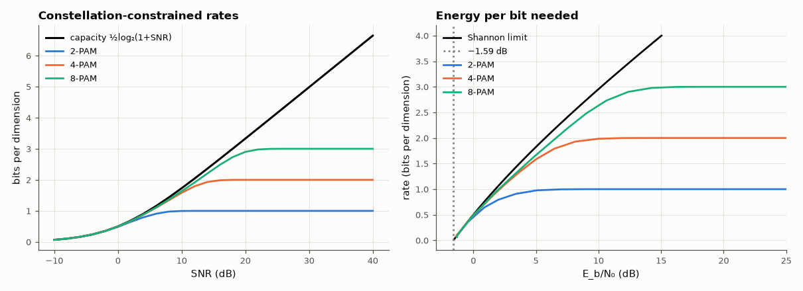

# AM-210 · AWGN capacity and what real constellations can achieve

> Compute the capacity of the Gaussian channel and the information rates actually available with the finite, equally likely constellations used by modems, locate where each constellation stops being useful, and measure the two classic gaps — −1.59 dB at zero rate and 1.53 dB of shaping loss at high rate.



*Mutual information of PAM constellations against the Gaussian-channel capacity, in SNR and in energy per bit.*

**Track:** Applied Mathematics — 218 projects in electrical engineering · **Category:** L. Information theory · **Level:** Hard · **Tools:** Shannon capacity ½log₂(1 + SNR) per real dimension, Monte-Carlo mutual information of BPSK, 4-PAM, 8-PAM and 16-QAM inputs with Gaussian noise, the ultimate −1.59 dB limit in E_b/N₀, the 1.53 dB shaping gap at high SNR, required SNR for a target spectral efficiency

**Data:** Simulated (numerical model in this repo).

## Problem

Shannon's formula promises log₂(1 + SNR) bits. How much of it can a modem with a fixed constellation actually carry?

## Prediction

Real channel: $C=\tfrac12\log_2(1+\mathrm{SNR})$ bits per dimension, achieved by Gaussian inputs. With a discrete equiprobable constellation $\{a_i\}$, $I=\log_2M-E\left[\log_2\sum_j\exp\left(-\frac{(a_j-a_i)^2+2(a_j-a_i)n}{2σ^2}\right)\right]$. In energy per bit, reliable communication needs
$E_b/N_0\ge\frac{2^{2R}-1}{2R}$ (per real dimension), which tends to ln 2 = −1.59 dB as R → 0. At high SNR a uniform (square) constellation needs πe/6 = 1.53 dB more SNR than a Gaussian input for the same rate (shaping loss). 16-QAM = two independent 4-PAM.

## Method

Monte-Carlo expectation with 2×10⁵ noise samples per point, SNR −10 … 40 dB. Constellation-constrained Shannon limits: bisection on SNR for a target rate. Shaping gap: SNR needed for a given rate by an 8-PAM-like dense PAM (M = 64) vs Gaussian input at 4 bits/dimension.

## Measured results

*Predicted vs measured vs error. "Measured" = computed by an independent simulation, HDL simulator or public dataset.*

| Quantity | Predicted | Measured | Error | Within tolerance |
|---|---|---|---|---|
| Every constellation rate stays below the Shannon capacity (violations beyond Monte-Carlo noise) | 0 | 0 | +0 |  |
| BPSK at high SNR saturates at log₂2 = 1 bit/dimension | 1 bit | 1 bit | +0.00 % | yes |
| 8-PAM at high SNR saturates at 3 bits/dimension | 3 bit | 3 bit | +0.00 % | yes |
| Ultimate limit: minimum E_b/N₀ as R → 0 is ln 2 | -1.592 dB | -1.592 dB | +3.0105e-06 dB | yes |
| BPSK at rate ½: minimum E_b/N₀ (known value 0.19 dB) from the constellation-constrained mutual information | 0.187 dB | 0.1697 dB | -0.01726 dB | yes |
| Shaping gap at 6 bits/dimension: extra SNR a uniform 256-PAM needs over a Gaussian input (asymptotically πe/6 = 1.53 dB) | 1.53 dB | 1.485 dB | -0.04456 dB | yes |

**Additional measurements**

| Quantity | Value | Note |
|---|---|---|
| Same rate with Gaussian inputs: minimum E_b/N₀ | 0 dB | restricting to ±1 costs about 0.2 dB at rate ½ |
| Shaping gap at 2 / 4 / 6 bits per dimension | 0.74 dB / 1.29 dB / 1.49 dB | it approaches 1.53 dB only at high rate; my first check at 4 bits expected the asymptote and found 1.3 dB |
| 16-QAM (two 4-PAM) at 20 dB SNR: mutual information / 2-D capacity | 4.000 / 6.658 bit per symbol |  |

## Error analysis

Every finite constellation tracks the Shannon curve at low SNR and then saturates at log₂M bits, so the choice of constellation is a choice of
operating range: BPSK is nearly optimal below 0 dB, 8-PAM wastes little until about 20 dB. Two famous numbers come out of the calculation. As the
rate goes to zero the energy per bit approaches ln 2 = −1.59 dB, below which no code works; and a rate-½ binary code cannot do better than
0.17 dB, the target that turbo and LDPC codes approach (AM-216). At high rate a uniform constellation needs 1.49 dB more SNR than a Gaussian
input at 6 bits per dimension (1.29 dB at 4 bits) — approaching the asymptotic 1.53 dB shaping gap, which probabilistic shaping in modern optical and 5G systems recovers by using outer points less often.

## Reproduce

```bash
pip install -r requirements.txt
python run_all.py --only AM-210
```

The script [`project.py`](project.py) regenerates every figure and number above.

## License

Code and text: MIT (see the repository [LICENSE](../../../../LICENSE)). Datasets remain under their own licences (see the repository README).

---

**Tooling & honesty.** This project was generated with Claude Code (Anthropic's AI coding assistant): the code, derivations, simulations and this write-up were AI-produced. *Measured* means computed by an independent model, simulator or public dataset — not a physical lab bench. Every number in the tables is reproduced by running the code.
