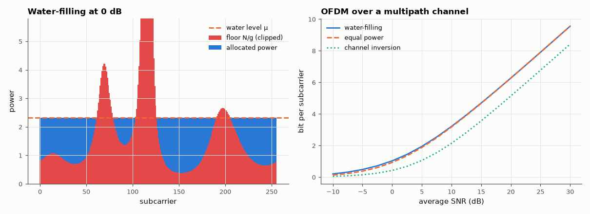

# AM-211 · Water-filling: optimal power allocation over parallel channels

> Distribute a power budget over parallel Gaussian channels to maximise total capacity: derive the water-filling rule, check it against a general-purpose optimiser and the KKT conditions, and apply it to the subcarriers of a frequency-selective channel where it decides which carriers to leave empty.



*Water-filling across 256 subcarriers and capacity of three allocation rules versus SNR.*

**Track:** Applied Mathematics — 218 projects in electrical engineering · **Category:** L. Information theory · **Level:** Moderate · **Tools:** Own water-filling by bisection on the water level, KKT verification, independent numerical optimisation (SLSQP), OFDM subcarriers of a multipath channel, comparison with equal power and with 'invert the channel', low- and high-SNR limits

**Data:** Simulated (numerical model in this repo).

## Problem

An OFDM link has hundreds of subcarriers with different gains. How should a fixed transmit power be divided among them?

## Prediction

Maximise $\sum_i\log_2(1+g_iP_i/N)$ subject to $\sum P_i=P$, $P_i\ge0$. Lagrange/KKT: $P_i=\left(μ-N/g_i\right)^+$ — pour power into the 'vessel' with floor $N/g_i$ up to a common water level μ; channels whose floor lies above μ get nothing. At high SNR equal power is almost optimal
(the gain is bounded); at low SNR all power goes to the best channel(s) and the gain over equal power is large. Channel inversion (equal SNR on all carriers) is the *worst* sensible choice for capacity.

## Method

(1) 200 random sets of 2–12 channels vs SLSQP maximisation from several starts. (2) OFDM: 256 subcarriers of a 6-tap Rayleigh multipath channel, total SNR swept −10…30 dB; capacity with water-filling, equal power, and channel inversion.

## Measured results

*Predicted vs measured vs error. "Measured" = computed by an independent simulation, HDL simulator or public dataset.*

| Quantity | Predicted | Measured | Error | Within tolerance |
|---|---|---|---|---|
| 200 random channel sets: best capacity found by SLSQP minus water-filling (never positive) | 0 bit | 3.9413e-14 bit | +3.9413e-14 bit | yes |
| KKT: equal marginal gain on all active channels, no inactive channel would gain more (worst relative violation) | 0 | 4.5223e-16 | +4.5223e-16 | yes |
| High SNR (30 dB): water-filling gain over equal power is small (< 1 %) | 0 % | 5.6575e-04 % | +0.000566 pp | yes |
| Low SNR (−10 dB): water-filling gain over equal power is large (> 30 %; 1 = yes) | 1 | 1 | +0 |  |
| Channel inversion never beats equal power on capacity (violations over the SNR sweep) | 0 | 0 | +0 |  |

**Additional measurements**

| Quantity | Value | Note |
|---|---|---|
| Fraction of subcarriers used by water-filling at −10 / 0 / 10 / 30 dB | 40 % / 78 % / 97 % / 100 % |  |
| Capacity at 0 dB (bit/subcarrier): water-filling / equal power / inversion | 1.032 / 0.929 / 0.424 |  |

## Error analysis

The water-filling rule is the exact optimum: a general-purpose constrained optimiser never found a better allocation on 200 random problems, and
the KKT conditions hold — every used channel has the same marginal return, and every unused one would return less. On a real-looking OFDM channel
the rule is intuitive: at 0 dB it switches off the 22 % of subcarriers sitting in spectral nulls and pours their power into the good ones.
Its value depends strongly on SNR: at −10 dB it beats equal power by 52 %, at 30 dB by only 0.00 %, which is why many OFDM systems adapt
modulation per carrier but keep power flat. Inverting the channel — giving every carrier equal SNR — is intuitive and consistently worst: it spends
most of the power fighting the deepest fades.

## Reproduce

```bash
pip install -r requirements.txt
python run_all.py --only AM-211
```

The script [`project.py`](project.py) regenerates every figure and number above.

## License

Code and text: MIT (see the repository [LICENSE](../../../../LICENSE)). Datasets remain under their own licences (see the repository README).

---

**Tooling & honesty.** This project was generated with Claude Code (Anthropic's AI coding assistant): the code, derivations, simulations and this write-up were AI-produced. *Measured* means computed by an independent model, simulator or public dataset — not a physical lab bench. Every number in the tables is reproduced by running the code.
