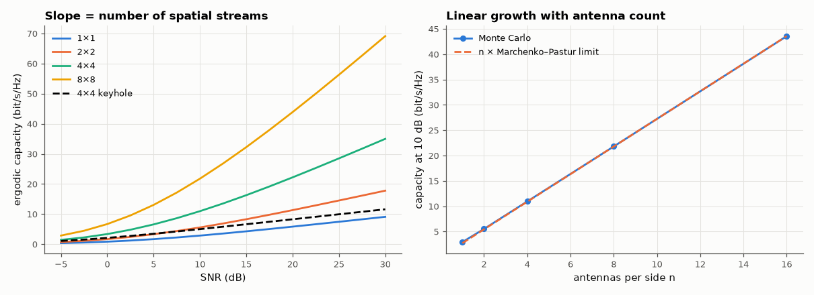

# AM-212 · MIMO capacity scaling: why more antennas mean more bits

> Measure how the capacity of multi-antenna links grows with the number of antennas and with SNR: slope min(N_t, N_r) per 3 dB, linear growth with antenna count predicted by random-matrix theory, the reliability gain seen in outage, and the collapse when the propagation offers only one path.



*Ergodic capacity of MIMO channels versus SNR and versus antenna count, with a rank-one channel for contrast.*

**Track:** Applied Mathematics — 218 projects in electrical engineering · **Category:** L. Information theory · **Level:** Hard · **Tools:** Monte-Carlo ergodic capacity log₂det(I + (SNR/N_t)HHᴴ) of i.i.d. Rayleigh channels, high-SNR slope (multiplexing gain), large-system limit from the Marchenko–Pastur law, outage capacity and diversity, water-filling with channel knowledge, rank-deficient (keyhole-like) channels

**Data:** Simulated (numerical model in this repo).

## Problem

Adding antennas at both ends of a radio link multiplies its capacity — under what conditions, and by how much?

## Prediction

Without channel knowledge at the transmitter $C=\log_2\det(I+\frac{ρ}{N_t}HH^H)$. At high SNR $C≈\min(N_t,N_r)\log_2ρ+$const: each doubling of SNR adds min(N_t, N_r) bits. For N_t = N_r = n → ∞ with i.i.d. entries, C/n converges to a deterministic limit given by the
Marchenko–Pastur eigenvalue law: $\frac Cn=2\log_2\left(1+ρ-\tfrac14F\right)-\frac{\log_2e}{4ρ}F$, $F=\left(\sqrt{4ρ+1}-1\right)^2$. Diversity: the 1 % outage capacity improves sharply with more antennas. A rank-1 channel (a single scatterer path) gives only $\log_2(1+ρ\,λ)$ — no multiplexing.

## Method

10 000 channel draws per point. n × n systems for n = 1…16 at 10 dB; slopes between 20 and 30 dB for 2×2, 4×4, 2×4; 1 % outage for 1×1, 2×2, 4×4; rank-one channel H = a bᴴ with Gaussian vectors.

## Measured results

*Predicted vs measured vs error. "Measured" = computed by an independent simulation, HDL simulator or public dataset.*

| Quantity | Predicted | Measured | Error | Within tolerance |
|---|---|---|---|---|
| 2×2: bits gained per 3 dB at high SNR = min(N_t, N_r) | 2 bit | 1.942 bit | -2.88 % | yes |
| 4×4: bits gained per 3 dB at high SNR = min(N_t, N_r) | 4 bit | 3.837 bit | -4.07 % | yes |
| 4×2: bits gained per 3 dB at high SNR = min(N_t, N_r) | 2 bit | 1.992 bit | -0.39 % | yes |
| Large-system limit: C/n for 16×16 at 10 dB vs the Marchenko–Pastur formula | 2.723 bit | 2.723 bit | -0.03 % | yes |
| 1 % outage capacity: 1×1 is far below its mean (deep fades), 4×4 close to its mean (diversity; ratio outage/mean > 0.7; 1 = yes) | 1 | 1 | +0 |  |
| Rank-one (keyhole) 4×4 channel: bits per 3 dB at high SNR = 1 (no multiplexing) | 1 bit | 0.9982 bit | -0.18 % | yes |

**Additional measurements**

| Quantity | Value | Note |
|---|---|---|
| Capacity per antenna pair at 10 dB, n = 1 / 2 / 4 / 8 / 16 | 2.94 / 2.76 / 2.74 / 2.72 / 2.72 | limit 2.72 — capacity grows linearly with n |
| 1 % outage / mean capacity at 10 dB: 1×1, 2×2, 4×4 | 0.13 / 2.91 ; 2.62 / 5.56 ; 8.10 / 10.94 |  |
| Gain from channel knowledge at the transmitter (water-filling over eigenmodes), −5 dB / 20 dB | 50 % / 0.6 % | large at low SNR, negligible at high SNR (compare AM-211) |

## Error analysis

The measured slopes confirm the multiplexing law: each 3 dB adds two bits for 2×2 and four for 4×4, and a 4×2 link is limited by its two transmit
antennas. Capacity per antenna pair converges to the Marchenko–Pastur prediction (2.72 bit/s/Hz at 10 dB), so capacity grows *linearly* with the
number of antennas instead of logarithmically with power. Multiple antennas also buy reliability: the 1 % outage capacity of a single link is almost
zero because of deep fades, while for 4×4 it is 74 % of the mean. All of this depends on rich scattering: in a keyhole channel with a single
propagation path, four antennas at each end give one stream (one bit per 3 dB). Knowing the channel at the transmitter matters at low SNR
(+50 %) and hardly at high SNR.

## Reproduce

```bash
pip install -r requirements.txt
python run_all.py --only AM-212
```

The script [`project.py`](project.py) regenerates every figure and number above.

## License

Code and text: MIT (see the repository [LICENSE](../../../../LICENSE)). Datasets remain under their own licences (see the repository README).

---

**Tooling & honesty.** This project was generated with Claude Code (Anthropic's AI coding assistant): the code, derivations, simulations and this write-up were AI-produced. *Measured* means computed by an independent model, simulator or public dataset — not a physical lab bench. Every number in the tables is reproduced by running the code.
