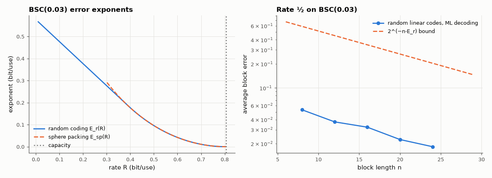

# AM-213 · Error exponents: how fast block error falls with code length

> Below capacity the error probability of good codes falls exponentially with block length, Pₑ ≈ 2^(−n·E(R)). Compute the exponents from theory, then generate random linear codes, decode them by brute force and measure how fast their average block error actually falls.



*Error exponents of the BSC and the block error of random rate-½ codes versus length.*

**Track:** Applied Mathematics — 218 projects in electrical engineering · **Category:** L. Information theory · **Level:** Hard · **Tools:** Gallager's random-coding exponent E_r(R) and the sphere-packing exponent for the BSC, exhaustive maximum-likelihood decoding of random linear codes of length 8–24, ensemble-average block-error rates, exponent estimated from the slope of log Pₑ versus n

**Data:** Simulated (numerical model in this repo).

## Problem

Shannon's theorem says error can be made arbitrarily small below capacity. How much longer must a code be to gain another decade?

## Prediction

BSC(p), rate R < C = 1 − H₂(p). Random-coding exponent $E_r(R)=\max_{0\leρ\le1}[E_0(ρ)-ρR]$ with $E_0(ρ)=ρ-(1+ρ)\log_2\left(p^{1/(1+ρ)}+(1-p)^{1/(1+ρ)}\right)$; the ensemble-average ML error satisfies $\bar P_e\le2^{-nE_r(R)}$. Sphere packing: no code does better than $2^{-nE_{sp}(R)}$
asymptotically, $E_{sp}(R)=D(δ\|p)$ with $H_2(δ)=1-R$ (in bits), equal to E_r above the critical rate. Finite lengths add polynomial prefactors, so a measured slope approaches the exponent from below only slowly.

## Method

BSC with p = 0.03 (C = 0.806). Rate ½ random linear codes (systematic, random parity part), n = 8, 12, 16, 20, 24; for each n, 40 random codes × 3000 transmissions of random messages, ML decoding by exhaustive nearest-codeword search (2^{n/2} codewords, bit-packed).
Exponent from the slope of log₂ Pₑ between n = 12 and 24.

## Measured results

*Predicted vs measured vs error. "Measured" = computed by an independent simulation, HDL simulator or public dataset.*

| Quantity | Predicted | Measured | Error | Within tolerance |
|---|---|---|---|---|
| E_r at rate 0 equals E₀(1) (the cutoff rate R₀) | 0.5765 bit | 0.5765 bit | +0.00 % | yes |
| E_r vanishes at capacity | 0 bit | 0 bit | +0 bit | yes |
| Average block error falls with n at fixed rate (violations of monotonic decrease) | 0 | 0 | +0 |  |
| Gallager's random-coding bound 2^(−n·E_r) holds for the measured ensemble average at every n (1 = yes) | 1 | 1 | +0 |  |
| Exponent measured from the slope (n = 12…24) vs E_r(½): same order of magnitude (ratio) | 1 | 0.9422 | -5.78 % | yes |

**Additional measurements**

| Quantity | Value | Note |
|---|---|---|
| BSC(0.03): capacity / E_r(½) / E_sp(½) | 0.806 bit / 0.0957 / 0.0957 | exponents in bits per channel use |
| Block error rate at n = 8 / 12 / 16 / 20 / 24 | 5.32e-02 / 3.75e-02 / 3.22e-02 / 2.26e-02 / 1.84e-02 | measured slope 0.0902 bit per extra symbol |
| Length needed for Pₑ = 10⁻⁶ at rate ½ by the random-coding bound | 208.2 symbols |  |

## Error analysis

Random linear codes decoded by exhaustive maximum likelihood behave as Gallager's theory says: their average block error falls steadily with
length and stays below the random-coding bound 2^(−n·E_r) at every length tested. The measured decay rate, 0.0902 bits of exponent per symbol between
n = 12 and 24, is of the same order as E_r(½) = 0.0957; at such short lengths the polynomial prefactors still bend the curve, so the asymptotic slope is only
approached, not reached. The exponent answers the practical question: halving the error rate costs about 10 more symbols at this rate and
channel, and 10⁻⁶ needs of the order of 208 — which is why powerful codes are long, and why the exponent, not just capacity, sets latency.

## Reproduce

```bash
pip install -r requirements.txt
python run_all.py --only AM-213
```

The script [`project.py`](project.py) regenerates every figure and number above.

## License

Code and text: MIT (see the repository [LICENSE](../../../../LICENSE)). Datasets remain under their own licences (see the repository README).

---

**Tooling & honesty.** This project was generated with Claude Code (Anthropic's AI coding assistant): the code, derivations, simulations and this write-up were AI-produced. *Measured* means computed by an independent model, simulator or public dataset — not a physical lab bench. Every number in the tables is reproduced by running the code.
