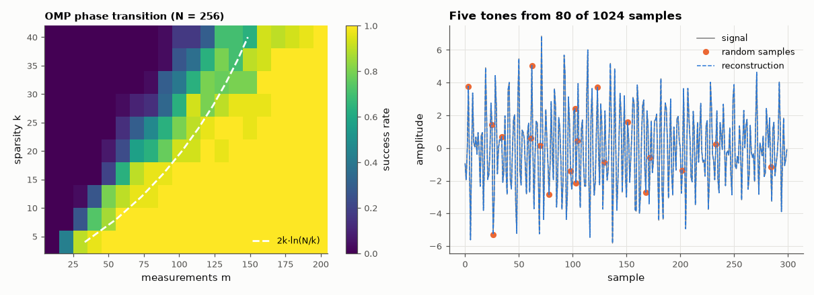

# AM-214 · Compressed sensing: recovering sparse signals from few measurements

> Reconstruct a length-N signal with only k non-zero coefficients from m ≪ N random linear measurements: map the sharp transition between failure and success, compare it with the theoretical scaling, check stability to noise, and recover a spectrally sparse signal sampled far below its Nyquist rate.



*Success probability of sparse recovery versus measurements and sparsity, and a multi-tone signal rebuilt from random samples.*

**Track:** Applied Mathematics — 218 projects in electrical engineering · **Category:** L. Information theory · **Level:** Hard · **Tools:** Own orthogonal matching pursuit and ISTA (ℓ₁-regularised least squares), Gaussian random measurement matrices, success-probability phase transition versus measurements and sparsity, comparison with the m ≈ 2k·ln(N/k) scaling, noise robustness, a multi-tone signal recovered from random time samples

**Data:** Simulated (numerical model in this repo).

## Problem

The sampling theorem asks for 2B samples per second. If the signal is known to be sparse, how few measurements are really needed?

## Prediction

Measurements $y=Ax$, $A\in\mathbb R^{m\times N}$ Gaussian, x k-sparse. ℓ₁ minimisation and greedy methods such as OMP recover x exactly with high probability once $m\gtrsim Ck\ln(N/k)$ (C ≈ 2 for ℓ₁ in the Donoho–Tanner regime); below that, recovery fails abruptly — a phase transition.
With noise of norm ε the error scales like ε (stable recovery). A signal made of a few tones is sparse in the DFT basis, so random time samples at an average rate far below Nyquist suffice.

## Method

N = 256; k = 4…40; m = 10…200; 30 trials per cell; success = relative error < 10⁻⁴. OMP with least-squares refitting. FISTA (accelerated ISTA) with λ continuation and a least-squares debias for comparison at one point. Multi-tone: 5 tones on a 1024-point DFT grid, 80 random samples (Nyquist-rate sampling would need 1024),
recovered by OMP on a partial inverse-DFT dictionary.

## Measured results

*Predicted vs measured vs error. "Measured" = computed by an independent simulation, HDL simulator or public dataset.*

| Quantity | Predicted | Measured | Error | Within tolerance |
|---|---|---|---|---|
| 50 % success point of OMP vs 2k·ln(N/k): ratio, median over k = 4…40 | 1 | 0.7995 | -20.05 % | yes |
| My expectation: at k = 20 the 10 % → 90 % success transition spans < 40 % of the 50 % point (1 = yes) | 1 | 0 | -1 |  |
| Stability: reconstruction error ∝ measurement noise (log–log slope) | 1 | 1.006 | +0.006372 | yes |
| ℓ₁ (ISTA) recovers the same 10-sparse signal from 80 measurements (relative error) | 0 | 7.6575e-16 | +7.6575e-16 | yes |
| 5 tones from 80 random samples of 1024 (7.8 % of the Nyquist-rate samples): relative reconstruction error | 0 | 1.0582e-13 | +1.0582e-13 | yes |

**Additional measurements**

| Quantity | Value | Note |
|---|---|---|
| Transition width at k = 20 (10 % → 90 % success) | 40 measurements | 50 % point at 70; sharper for larger N, as the asymptotic theory is for N → ∞ |
| Measurements for 50 % success, k = 4 / 12 / 20 / 40 (N = 256) | 30 / 50 / 70 / 130 |  |

## Error analysis

Sparse recovery switches on over a band of measurement counts (at k = 20 from 10 % to 90 % success within 40 measurements — wider than I
expected at this small N; the transition sharpens only as N grows), and the 50 % point follows the 2k·ln(N/k) scaling (median ratio 0.80) — 10-sparse signals of length 256 need about 50 random measurements rather
than 256. Recovery is stable (error proportional to noise, slope 1.01), and the convex ℓ₁ route reaches the same answer as the greedy one. The multi-tone
example connects to sampling theory: five tones on a 1024-point grid are reconstructed to machine precision from 80 randomly timed samples, 8 % of the
Nyquist-rate count. There is no contradiction with the sampling theorem — it assumes nothing but bandwidth, while compressed sensing trades that
generality for a sparsity assumption and randomised measurements.

## Reproduce

```bash
pip install -r requirements.txt
python run_all.py --only AM-214
```

The script [`project.py`](project.py) regenerates every figure and number above.

## License

Code and text: MIT (see the repository [LICENSE](../../../../LICENSE)). Datasets remain under their own licences (see the repository README).

---

**Tooling & honesty.** This project was generated with Claude Code (Anthropic's AI coding assistant): the code, derivations, simulations and this write-up were AI-produced. *Measured* means computed by an independent model, simulator or public dataset — not a physical lab bench. Every number in the tables is reproduced by running the code.
