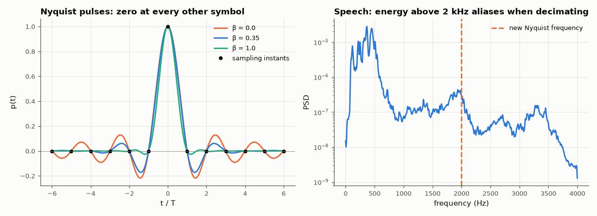

# AM-215 · Nyquist and Shannon: sampling rate, signalling rate and capacity

> Two different 'Nyquist' results and one Shannon result, each tested: a signal of bandwidth B is rebuilt from 2B samples per second (and aliases predictably below that), a channel of bandwidth B carries at most 2B independent symbols per second without interference, and the bits per symbol are then capped by the SNR.



*Raised-cosine pulses satisfying the Nyquist criterion, and the speech spectrum relevant to decimation.*

**Track:** Applied Mathematics — 218 projects in electrical engineering · **Category:** L. Information theory · **Level:** Moderate · **Tools:** Sinc interpolation of band-limited signals and its truncation error, aliasing measured on real speech with and without an anti-alias filter, raised-cosine pulses and the Nyquist ISI criterion, signalling faster than Nyquist, M-PAM throughput at the Nyquist rate versus Shannon capacity

**Data:** Free Spoken Digit Dataset (CC BY-SA 4.0).

## Problem

Nyquist says 2B, Shannon says B·log₂(1 + SNR). Are they in conflict, and what does each actually limit?

## Prediction

Sampling theorem: $x(t)=\sum x(nT)\,\mathrm{sinc}((t-nT)/T)$ exactly if X(f) = 0 for |f| ≥ 1/(2T); energy above the new Nyquist frequency folds back (aliasing). Nyquist ISI criterion: pulses p(t) with p(nT) = δₙ (e.g. raised cosine, bandwidth (1+β)/(2T)) allow symbol rate 1/T; the
maximum ISI-free rate in bandwidth B is 2B symbols/s (β = 0). Shannon: $C=B\log_2(1+\mathrm{SNR})$ bits/s. Together: 2B symbols/s × ½log₂(1 + SNR) bits per real symbol = C — Nyquist fixes the symbol rate, Shannon the bits per symbol.

## Method

(1) Band-limited random signals (40 tones below B), sampled at 2.5B and 1.6B, reconstructed by sinc interpolation over ±200 samples. (2) FSDD speech (8 kHz), decimated by 2 by dropping samples vs scipy.signal.decimate (FIR anti-alias); aliased energy predicted from the
3.2–4 kHz content by the spectrum. (3) Raised cosine β = 0.35: ISI at the sampling instants for symbol rates 1/T and 1.25/T. (4) M-PAM at the Nyquist rate: symbol error vs SNR and throughput vs capacity.

## Measured results

*Predicted vs measured vs error. "Measured" = computed by an independent simulation, HDL simulator or public dataset.*

| Quantity | Predicted | Measured | Error | Within tolerance |
|---|---|---|---|---|
| Sampling at 2.5B: sinc reconstruction error (only truncation of the series) | 0 | 9.8206e-04 | +9.8206e-04 | yes |
| Sampling at 1.6B: reconstruction error ≈ √2 × (energy share of tones above 0.8B)^½ — they alias | 0.5662 | 0.5208 | -8.02 % | yes |
| Speech decimated 8 → 4 kHz by dropping samples: error energy vs the share of speech energy above 2 kHz (which folds back) | 0.02242 | 0.02194 | -2.11 % | yes |
| With an FIR anti-alias filter the error is at least 20 dB smaller (1 = yes) | 1 | 1 | +0 |  |
| Raised cosine at symbol rate 1/T: sum of |ISI| at the sampling instants | 0 | 1.7042e-16 | +1.7042e-16 | yes |
| Uncoded PAM at the Nyquist rate (largest M with SER < 10⁻³) never exceeds Shannon's capacity (bit/s per Hz; violations) | 0 | 0 | +0 |  |

**Additional measurements**

| Quantity | Value | Note |
|---|---|---|
| Speech energy above 2 kHz / aliased error energy: dropping samples / FIR decimation | 2.2 % / 2.2 % / 0.016 % |  |
| Same pulse at 1.25/T (faster than Nyquist): worst-case ISI | 0.8814 | relative to the wanted sample 1.0 — the eye closes |
| Spectral efficiency at 10 / 20 / 30 dB: uncoded PAM (SER < 10⁻³) vs capacity | 2 vs 3.46 ; 4 vs 6.66 ; 8 vs 9.97 | the gap is what coding recovers |

## Error analysis

The three statements measure different things. The sampling theorem holds numerically: a signal band-limited below B is rebuilt from samples at
2.5B with 0.1 % error (the truncated sinc series), while sampling at 1.6B lets the tones above 0.8B fold back, with the error predicted from their
energy. On real speech, simply dropping every other sample leaves an error equal to the 2 % of energy above the new 2 kHz limit, and a proper FIR
decimator cuts it by more than 20 dB. The *other* Nyquist result concerns transmission: raised-cosine pulses have exactly zero interference at the
sampling instants at 1/T symbols per second and noticeable interference when pushed 25 % faster. Neither limits the bits per symbol — that is
Shannon's contribution, and uncoded PAM stays well below it (4 vs 6.7 bit/s/Hz at 20 dB). Nyquist sets how many symbols, Shannon how much each
can say.

## Reproduce

```bash
pip install -r requirements.txt
python run_all.py --only AM-215
```

The script [`project.py`](project.py) regenerates every figure and number above.

## License

Code and text: MIT (see the repository [LICENSE](../../../../LICENSE)). Datasets remain under their own licences (see the repository README).

---

**Tooling & honesty.** This project was generated with Claude Code (Anthropic's AI coding assistant): the code, derivations, simulations and this write-up were AI-produced. *Measured* means computed by an independent model, simulator or public dataset — not a physical lab bench. Every number in the tables is reproduced by running the code.
