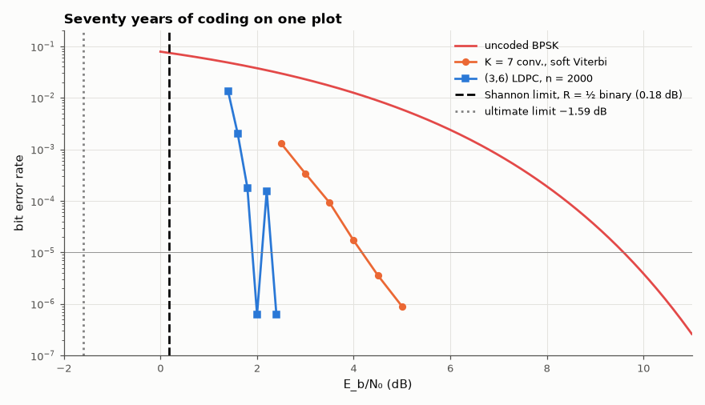

# AM-216 · How close do real codes get to the Shannon limit?

> Put three generations of coding on one plot: measure the energy per bit each needs for a bit error rate of 10⁻⁵ and compare with the theoretical minimum for their rate and modulation, turning the history of channel coding (9.6 dB → 4.4 dB → ≈ 2 dB against 0.2 dB) into numbers.



*Bit-error curves of uncoded, convolutionally coded and LDPC-coded BPSK against the Shannon limits.*

**Track:** Applied Mathematics — 218 projects in electrical engineering · **Category:** L. Information theory · **Level:** Hard · **Tools:** Simulated bit-error curves of uncoded BPSK, the K = 7 convolutional code with soft Viterbi decoding, and the (3,6) LDPC code of AM-150 with belief propagation, all rate ≤ ½ on the AWGN channel; the Shannon limit for binary inputs from the constellation-constrained capacity; required E_b/N₀ at BER 10⁻⁵ and the resulting gaps

**Data:** Simulated (numerical model in this repo).

## Problem

Capacity is a limit nobody reaches exactly. How far away are the codes actually used, and where did the decibels come from?

## Prediction

Uncoded BPSK: $P_b=Q(\sqrt{2E_b/N_0})$, 10⁻⁵ at 9.59 dB. For rate R with binary inputs, reliable transmission requires $R<C_{BPSK}(E_s/N_0)$, $E_s=RE_b$; at R = ½ this gives E_b/N₀ ≥ 0.187 dB (and 0 dB without the binary restriction). Allowing a residual bit error $P_b$ relaxes the limit slightly (rate–distortion:
R(1 − H₂(P_b)) < C), negligible at 10⁻⁵. Classic benchmarks at 10⁻⁵: K = 7, rate-½ convolutional code ≈ 4.4 dB (gap ≈ 4.2 dB); rate-½ LDPC codes of a few thousand bits: ≈ 1.5–2 dB; the gap shrinks further with length.

## Method

BPSK over AWGN. Convolutional code (171,133)₈, terminated 1000-bit blocks, soft Viterbi, up to 10⁷ bits per point. LDPC: the (3,6) code of length 2000 from AM-150 with sum-product decoding (60 iterations), all-zero codeword, up to 400 blocks per point (a point with no bit errors is entered as ½ error / bits simulated). E_b/N₀ at BER 10⁻⁵
by log-linear interpolation between simulated points. Binary-input Shannon limit by Monte-Carlo mutual information and root finding.

## Measured results

*Predicted vs measured vs error. "Measured" = computed by an independent simulation, HDL simulator or public dataset.*

| Quantity | Predicted | Measured | Error | Within tolerance |
|---|---|---|---|---|
| Shannon limit for rate ½ with binary inputs (E_b/N₀) | 0.187 dB | 0.1784 dB | -0.008593 dB | yes |
| Uncoded BPSK: E_b/N₀ for BER 10⁻⁵ | 9.59 dB | 9.588 dB | -0.002142 dB | yes |
| K = 7 convolutional code, soft Viterbi: E_b/N₀ for BER 10⁻⁵ (textbook ≈ 4.4 dB) | 4.4 dB | 4.171 dB | -0.2291 dB | yes |
| (3,6) LDPC, n = 2000, belief propagation: E_b/N₀ for BER 10⁻⁵ (between the ensemble threshold 1.11 dB and ≈ 2.5 dB) | 1.8 dB | 1.902 dB | +0.1021 dB | yes |

**Additional measurements**

| Quantity | Value | Note |
|---|---|---|
| Gap to the rate-½ binary Shannon limit at BER 10⁻⁵: uncoded (rate 1 limit differs) / convolutional / LDPC | 9.4 / 4.0 / 1.7 dB |  |
| Coding gain over uncoded BPSK at BER 10⁻⁵: convolutional / LDPC | 5.4 / 7.7 dB |  |

## Error analysis

At a bit error rate of 10⁻⁵ uncoded BPSK needs 9.6 dB. The rate-½ K = 7 convolutional code with soft Viterbi decoding — the 1970s deep-space and
satellite workhorse — needs 4.2 dB, a coding gain of 5.4 dB but still 4.0 dB from the limit of 0.18 dB that no rate-½ binary code can beat.
A modest 2000-bit LDPC code decoded by belief propagation needs 1.9 dB, closing all but 1.7 dB; longer and irregular LDPC or turbo codes get within
tenths of a decibel. Each decibel is worth about 26 % of transmit power or 12 % of range, which is why the move from convolutional to iterative
codes in the 1990s–2000s (Wi-Fi, DVB-S2, 5G) mattered so much. The last fraction of a decibel costs block length, i.e. latency.

## Reproduce

```bash
pip install -r requirements.txt
python run_all.py --only AM-216
```

The script [`project.py`](project.py) regenerates every figure and number above.

**Files produced**

- [`data/ber_curves.csv`](data/ber_curves.csv)

## License

Code and text: MIT (see the repository [LICENSE](../../../../LICENSE)). Datasets remain under their own licences (see the repository README).

---

**Tooling & honesty.** This project was generated with Claude Code (Anthropic's AI coding assistant): the code, derivations, simulations and this write-up were AI-produced. *Measured* means computed by an independent model, simulator or public dataset — not a physical lab bench. Every number in the tables is reproduced by running the code.
