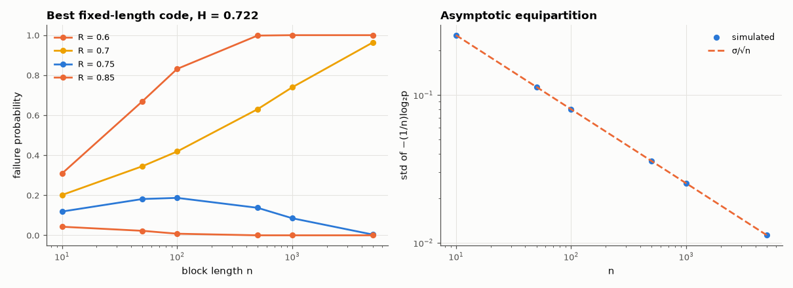

# AM-217 · The source coding theorem, demonstrated

> Show why the entropy is the compression limit: long sequences concentrate on a 'typical set' of about 2^{nH} equally likely members, so fixed-length codes at any rate above H succeed with probability → 1 and at any rate below H fail with probability → 1. Everything is computed exactly for binary sources and checked on English.



*Failure probability of optimal fixed-length codes versus block length for four rates, and the concentration of per-symbol log-probability.*

**Track:** Applied Mathematics — 218 projects in electrical engineering · **Category:** L. Information theory · **Level:** Moderate · **Tools:** Exact binomial computations in the log domain for i.i.d. binary sequences up to n = 5000, the typical set and its size, asymptotic equipartition checked by simulation, error of optimal fixed-length block codes above and below the entropy, the same phenomenon on real English text

**Data:** Project Gutenberg eBook #11 (public domain).

## Problem

Why is H the number of bits per symbol needed — no more, no less — for long sequences?

## Prediction

For i.i.d. $X_i$ with entropy H, $-\tfrac1n\log_2p(X^n)\to H$ (AEP), with standard deviation $σ/\sqrt n$, $σ^2=\mathrm{Var}[-\log_2p(X)]$. The ε-typical set has probability → 1 and size between $(1-ε)2^{n(H-ε)}$ and $2^{n(H+ε)}$ — a vanishing fraction of all $2^n$ sequences when H < 1. A fixed-length code of rate R that lists the
$2^{nR}$ most probable sequences fails with probability → 0 if R > H and → 1 if R < H (strong converse).

## Method

Bernoulli(0.2) source (H = 0.722 bit). Exact: sequences sorted by probability are grouped by their number of ones; failure probability of the best code of rate R is 1 − P(the 2^{nR} most probable sequences), computed with log-binomials for n = 10…5000 and R = 0.6, 0.7, 0.75, 0.85. AEP by simulation
(20 000 sequences per n). English: letters of 'Alice' under the order-0 model, blocks of n letters.

## Measured results

*Predicted vs measured vs error. "Measured" = computed by an independent simulation, HDL simulator or public dataset.*

| Quantity | Predicted | Measured | Error | Within tolerance |
|---|---|---|---|---|
| AEP: std of −(1/n)log₂p(Xⁿ) at n = 1000 vs σ/√n | 0.0253 bit | 0.02536 bit | +0.26 % | yes |
| … and its mean → H = 0.722 bit | 0.7219 bit | 0.722 bit | +0.01 % | yes |
| Typical set (ε = 0.05) captures almost all probability at n = 5000 | 1 | 1 | -0.00 % | yes |
| … while its size is 2^{n·(H ± ε)}: log₂(size)/n at n = 5000 | 0.7219 bit | 0.768 bit | +0.04612 bit | yes |
| Rate 0.85 > H: failure probability of the best fixed-length code at n = 5000 → 0 | 0 | 0 | +0 | yes |
| Rate 0.6 < H: failure probability at n = 5000 → 1 (strong converse) | 1 | 1 | +0.00 % | yes |
| English letters (order-0 model): per-letter −log₂p of 1000-letter blocks concentrates on H | 4.417 bit | 4.418 bit | +0.00 % | yes |

**Additional measurements**

| Quantity | Value | Note |
|---|---|---|
| Typical-set probability for n = 10 / 100 / 1000 / 5000 | 0.302 / 0.468 / 0.952 / 1.000 | small n: the 'typical' sequences are not yet most of the probability |
| Failure probability at rate 0.75 (just above H = 0.722): n = 100 / 1000 / 5000 | 0.187 / 0.085 / 0.004 | convergence is slow near the entropy |
| Spread of block log-probabilities per letter, n = 10 / 100 / 1000 letters | 0.437 / 0.152 / 0.074 | falls roughly as 1/√n — dependence between letters slows it a little |

## Error analysis

The theorem appears in the numbers as a sharpening threshold. For a Bernoulli(0.2) source with H = 0.722 bit, the best fixed-length code of rate 0.85
fails with probability 0e+00 at n = 5000, while a code of rate 0.6 fails with probability 1.0000 — above the entropy every reasonable rate
works for long enough blocks, below it none does. The reason is the typical set: −(1/n)log₂p concentrates on H with a spread falling as 1/√n exactly as
predicted, so almost all probability sits on about 2^{nH} sequences, a vanishing fraction of the 2ⁿ possible ones. Near the entropy convergence is slow
(rate 0.75 still fails 8.5 % of the time at n = 1000 and 0.4 % at n = 5000), which is why practical compressors use variable-length codes instead of waiting for
the asymptotics. English text shows the same concentration.

## Reproduce

```bash
pip install -r requirements.txt
python run_all.py --only AM-217
```

The script [`project.py`](project.py) regenerates every figure and number above.

## License

Code and text: MIT (see the repository [LICENSE](../../../../LICENSE)). Datasets remain under their own licences (see the repository README).

---

**Tooling & honesty.** This project was generated with Claude Code (Anthropic's AI coding assistant): the code, derivations, simulations and this write-up were AI-produced. *Measured* means computed by an independent model, simulator or public dataset — not a physical lab bench. Every number in the tables is reproduced by running the code.
