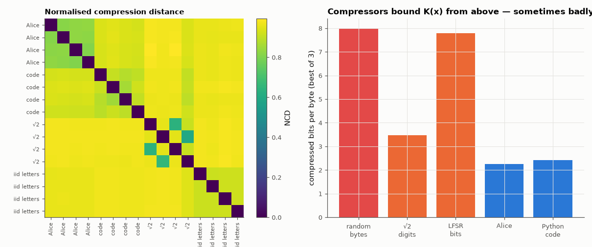

# AM-218 · Kolmogorov complexity: compression as a (computable) upper bound

> Kolmogorov complexity — the length of the shortest program producing a string — is uncomputable, but compressors bound it from above. Test the counting argument, find strings whose true complexity is tiny yet no compressor notices, and use compression alone to cluster documents by kind.



*NCD matrix of 16 document chunks, and how much each kind of data compresses.*

**Track:** Applied Mathematics — 218 projects in electrical engineering · **Category:** L. Information theory · **Level:** Hard · **Tools:** Real compressors (zlib, bz2, lzma) as upper bounds on description length, the counting argument for incompressible strings checked on random data, low-complexity strings that defeat compressors (digits of √2 generated by integer square roots, an LFSR sequence), normalised compression distance for clustering texts without any features

**Data:** Project Gutenberg eBook #11; the repository's own source code.

## Problem

What is the information content of one specific string (not of a random source) — and can a computer measure it?

## Prediction

K(x) = length of the shortest program printing x; K is uncomputable (no algorithm returns it for all x), but any compressor C gives $K(x)\le|C(x)|+c$. Counting: fewer than $2^{n-k}$ programs are shorter than n − k bits, so at most a fraction $2^{-k+1}$ of n-bit strings can be compressed
by k bits — random data are incompressible. Conversely √2's digits or an LFSR output have K of a few hundred bits (the generating program) though they look random to statistical compressors. Normalised compression distance
$\mathrm{NCD}(x,y)=\frac{C(xy)-\min(C(x),C(y))}{\max(C(x),C(y))}$ approximates the (uncomputable) information distance; similar objects compress well together.

## Method

Random bytes: 1000 strings of 1 kB through three compressors. √2: 20 000 decimal digits from isqrt(2·10^{2n}); LFSR: 160 000-bit m-sequence of degree 17 packed into bytes; their generating programs are the source strings shown in this file. NCD with lzma between 16 chunks of 6 kB:
4 from 'Alice', 4 from this repository's Python source, 4 of √2 digits, 4 of letters drawn i.i.d. with English frequencies. Nearest-neighbour agreement with the true category.

## Measured results

*Predicted vs measured vs error. "Measured" = computed by an independent simulation, HDL simulator or public dataset.*

| Quantity | Predicted | Measured | Error | Within tolerance |
|---|---|---|---|---|
| Counting argument: random 1 kB strings that any of three compressors shortened (of 1000) | 0 | 0 | +0 |  |
| Program reproduces √2 = 1.414213562… (1 = yes) | 1 | 1 | +0 |  |
| 20 000 digits of √2: best compressor needs ≈ log₂10 = 3.32 bits per digit — it sees no structure | 3.322 bit | 3.482 bit | +4.83 % | yes |
| m-sequence (degree 17), 20 kB: best compression ratio stays ≈ 1 (> 0.9; 1 = yes) | 1 | 1 | +0 |  |
| … although it is periodic with period 2¹⁷ − 1 and fully described by a 3-line program (period check; 1 = yes) | 1 | 1 | +0 |  |
| NCD nearest neighbour belongs to the same kind of document (16 chunks, 4 kinds) | 1 | 1 | +0.00 % | yes |

**Additional measurements**

| Quantity | Value | Note |
|---|---|---|
| … while a complete program for them is | 63 bytes | vs 8706 bytes compressed: K(x) ≪ what any compressor finds |
| LFSR stream: compressed size (best of three) / program size | 19494 / 90 bytes |  |
| Mean NCD within kind / between kinds | 0.87 / 0.96 |  |
| Compressed bits per byte (lzma): Alice / code / √2 digits / i.i.d. letters | 3.77 / 2.94 / 3.41 / 5.38 |  |

## Error analysis

Compressors are the practical handle on Kolmogorov complexity, and the experiments show both sides of the bound K(x) ≤ |C(x)| + c. The counting
argument holds: none of 1000 random kilobyte strings could be shortened by any of three compressors. But the bound can be very loose: 20 000
digits of √2 compress only to 3.48 bits per digit — indistinguishable from random — while the 63-byte program at the top of this file produces
them exactly; an m-sequence of 160 000 bits is likewise incompressible to all three tools although a three-line loop generates it. Statistical
compressors find only the regularities they model. Used relatively, however, compression is a remarkably general similarity measure: with no
features or training, the normalised compression distance put every one of 16 text chunks next to another of its own kind (prose, source code,
digits, letter salad) — the idea behind compression-based classification of languages, malware and DNA.

## Reproduce

```bash
pip install -r requirements.txt
python run_all.py --only AM-218
```

The script [`project.py`](project.py) regenerates every figure and number above.

## License

Code and text: MIT (see the repository [LICENSE](../../../../LICENSE)). Datasets remain under their own licences (see the repository README).

---

**Tooling & honesty.** This project was generated with Claude Code (Anthropic's AI coding assistant): the code, derivations, simulations and this write-up were AI-produced. *Measured* means computed by an independent model, simulator or public dataset — not a physical lab bench. Every number in the tables is reproduced by running the code.
