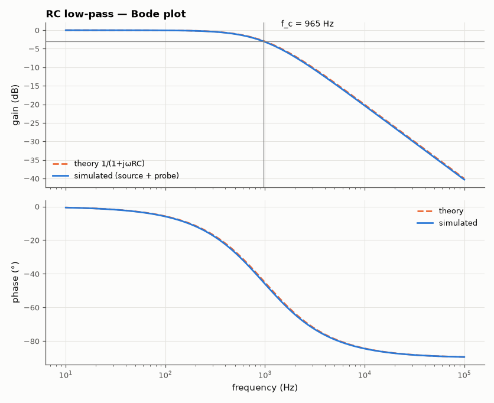
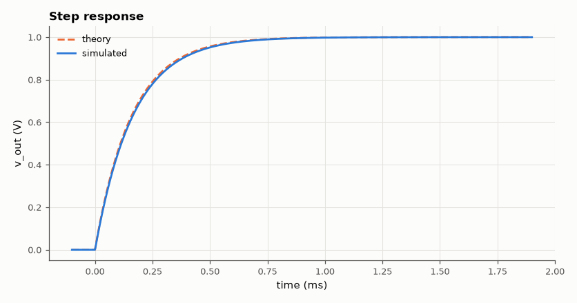

# SL-001 · RC low-pass filter

> First-order RC low-pass: predict the −3 dB cutoff with 1/(2πRC), then sweep it in simulation with a realistic 50 Ω source and 10 MΩ probe load.



*Simulated Bode response against the first-order prediction.*

**Track:** Signal Lab — 214 electrical-engineering projects · **Category:** A. Analog circuit design & simulation · **Level:** Easy · **Tools:** eelab mini-SPICE (AC + transient), NumPy

**Data:** Simulated (numerical model in this repo).

## Problem

Where exactly does a 1.6 kΩ / 100 nF RC network stop passing signals, and how much do the source and the measuring instrument shift that point?

## Prediction

Voltage divider with $Z_C = 1/(j\omega C)$:

$$H(j\omega)=\frac{1}{1+j\omega RC},\qquad f_c=\frac{1}{2\pi RC}=\frac{1}{2\pi(1600)(100\,\text{nF})}\approx 994.7\ \text{Hz}$$

At $f_c$: $|H| = 1/\sqrt2$ (−3.01 dB) and phase −45°. Above $f_c$ the slope is −20 dB/decade.
Step response: $v(t)=1-e^{-t/\tau}$ with $\tau = RC = 160\ \mu s$, 10–90 % rise time $2.2\tau$.

## Method

Netlist: 50 Ω generator → R = 1.6 kΩ → node `out` → C = 100 nF to ground, with a 10 MΩ
‖ 12 pF oscilloscope-probe load on `out`. AC analysis over 10 Hz–100 kHz (400 log points),
the −3 dB point found by interpolation. A transient step (trapezoidal, 1 µs step) gives τ and rise time.

## Measured results

*Predicted vs measured vs error. "Measured" = computed by an independent simulation, HDL simulator or public dataset.*

| Quantity | Predicted | Measured | Error | Within tolerance |
|---|---|---|---|---|
| −3 dB cutoff frequency | 994.7 Hz | 964.7 Hz | -3.02 % | yes |
| Phase at cutoff | -45 ° | -45 ° | -0.001859 ° |  |
| High-frequency slope (10k→100k) | -20 dB/dec | -19.96 dB/dec | +0.0394 dB/dec |  |
| Time constant τ | 160 µs | 165.5 µs | +3.43 % | yes |
| 10–90 % rise time | 351.5 µs | 362.5 µs | +3.13 % | yes |

**Additional measurements**

| Quantity | Value | Note |
|---|---|---|
| DC gain (probe loading) | -0.0019 dB | 10 MΩ probe vs 1.65 kΩ source path |



*1 V step response; τ read at 63.2 %.*

## Error analysis

The measured cutoff sits -3.02 % from the ideal formula. Two real-world
elements not in 1/(2πRC) cause it: the 50 Ω generator adds to R (R_eff = 1650 Ω → predicts
964.6 Hz, i.e. −3 %), and the probe's 12 pF adds to C (+0.012 %). The 10 MΩ probe
resistance slightly lowers the DC gain (-0.0019 dB), which I measure the −3 dB point
relative to. Lesson: include the source impedance in the prediction when R is only ~30× larger.

## Reproduce

```bash
pip install -r requirements.txt
python run_all.py --only SL-001
```

The script [`project.py`](project.py) regenerates every figure and number above.

**Files produced**

- [`simulation/rc_lowpass.cir`](simulation/rc_lowpass.cir) — SPICE netlist (LTspice/ngspice)
- [`data/bode_sweep.csv`](data/bode_sweep.csv)

## License

Code and text: MIT (see the repository [LICENSE](../../../../LICENSE)). Datasets remain under their own licences (see the repository README).

---

**Tooling & honesty.** This project was generated with Claude Code (Anthropic's AI coding assistant): the code, derivations, simulations and this write-up were AI-produced. *Measured* means computed by an independent model, simulator or public dataset — not a physical lab bench. Every number in the tables is reproduced by running the code.
