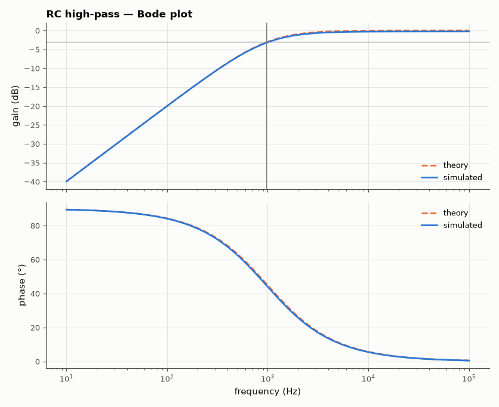
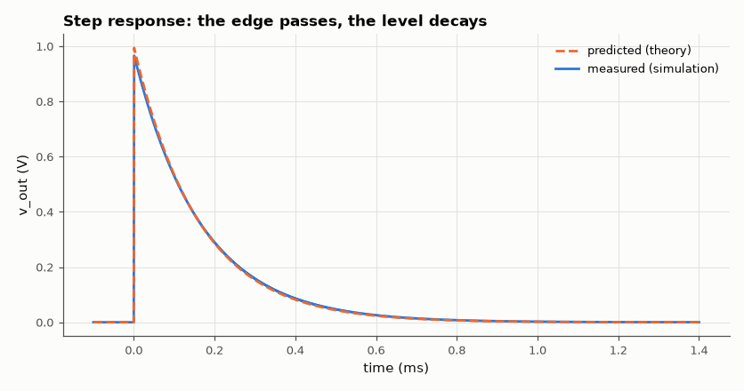

# SL-002 · RC high-pass filter

> Swap R and C of the low-pass: predict the cutoff and the +45° phase lead, then measure both, plus the edge-differentiating step response.



*High-pass Bode response; the phase lead passes through +45° at the corner.*

**Track:** Signal Lab — 214 electrical-engineering projects · **Category:** A. Analog circuit design & simulation · **Level:** Easy · **Tools:** eelab mini-SPICE (AC + transient)

**Data:** Simulated (numerical model in this repo).

## Problem

A CR network blocks DC and passes high frequencies. Where is its corner, and why does the output *lead* the input by 45° there?

## Prediction

$$H(j\omega)=\frac{j\omega RC}{1+j\omega RC},\qquad f_c=\frac1{2\pi RC}$$
With R = 1.6 kΩ, C = 100 nF: $f_c$ = 994.7 Hz. Phase $=90^\circ-\arctan(\omega RC)$, i.e. +90° at DC falling to
+45° at $f_c$ and 0° at high frequency: the capacitor current (and so the voltage across R) leads the
voltage. Step response: $v_{out}=e^{-t/RC}$ — the circuit passes the edge and forgets the level.

## Method

50 Ω generator → C = 100 nF → node `out` → R = 1.6 kΩ to ground, 10 MΩ ‖ 12 pF probe.
AC sweep 10 Hz – 100 kHz, then a 1 V step transient to measure the decay constant.

## Measured results

*Predicted vs measured vs error. "Measured" = computed by an independent simulation, HDL simulator or public dataset.*

| Quantity | Predicted | Measured | Error | Within tolerance |
|---|---|---|---|---|
| −3 dB cutoff frequency | 994.7 Hz | 964.5 Hz | -3.03 % | yes |
| Phase at cutoff | 45 ° | 45 ° | +0.002007 ° |  |
| Low-frequency slope (10→100 Hz) | 20 dB/dec | 19.95 dB/dec | -0.0464 dB/dec |  |
| Decay time constant | 160 µs | 165.3 µs | +3.32 % | yes |
| Step peak (divider R/(R+Rs)) | 969.7 mV | 965.5 mV | -0.43 % | yes |



*Output decays with τ = RC after the input step.*

## Error analysis

The cutoff error (-3.03 %) again comes from the 50 Ω source adding to the
series path, and the step peak is 0.9655 V instead of 1 V because Rs and R form a divider at the
instant of the edge (C is a short). The phase measurement shows why this is called a *lead*
network: the output crosses +45° at the corner, which is exactly what makes RC high-pass sections
useful for phase compensation.

## Reproduce

```bash
pip install -r requirements.txt
python run_all.py --only SL-002
```

The script [`project.py`](project.py) regenerates every figure and number above.

**Files produced**

- [`simulation/rc_highpass.cir`](simulation/rc_highpass.cir) — SPICE netlist
- [`data/bode_sweep.csv`](data/bode_sweep.csv)

## License

Code and text: MIT (see the repository [LICENSE](../../../../LICENSE)). Datasets remain under their own licences (see the repository README).

---

**Tooling & honesty.** This project was generated with Claude Code (Anthropic's AI coding assistant): the code, derivations, simulations and this write-up were AI-produced. *Measured* means computed by an independent model, simulator or public dataset — not a physical lab bench. Every number in the tables is reproduced by running the code.
