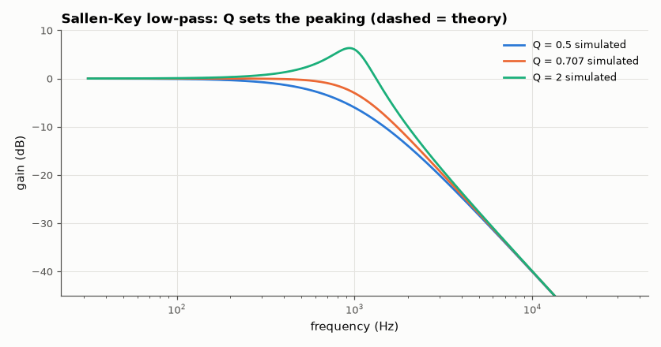
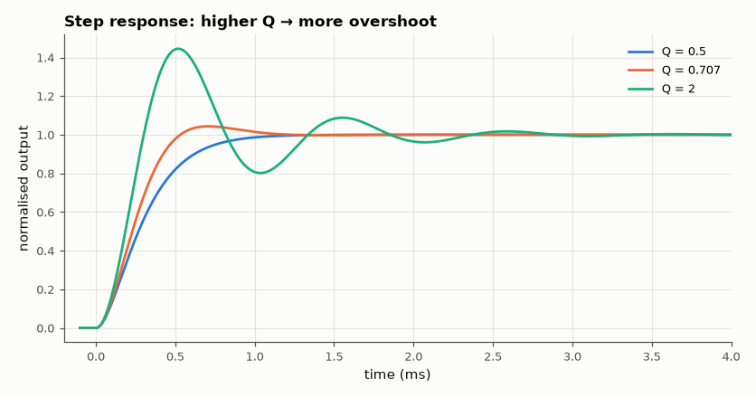

# SL-003 · Sallen-Key active low-pass filter

> Unity-gain Sallen-Key 2nd-order low-pass at 1 kHz built for Q = 0.5, 0.707 and 2: predict peaking and step overshoot from Q, then measure them.



*Measured responses (solid) against the ideal second-order prediction (dashed).*

**Track:** Signal Lab — 214 electrical-engineering projects · **Category:** A. Analog circuit design & simulation · **Level:** Moderate · **Tools:** eelab mini-SPICE with single-pole op-amp macromodel

**Data:** Simulated (numerical model in this repo).

## Problem

How does the quality factor Q of a second-order filter trade flat passband against overshoot and ringing, and does a real (finite-bandwidth) op-amp change the answer?

## Prediction

For the unity-gain Sallen-Key with $R_1=R_2=R$, feedback capacitor $C_1$ and ground capacitor $C_2$:
$$\omega_0=\frac1{R\sqrt{C_1C_2}},\qquad Q=\frac12\sqrt{\frac{C_1}{C_2}}$$
so the design is $C_2 = 1/(2Q\omega_0R)$, $C_1 = 2Q/(\omega_0R)$. Gain at $f_0$ equals $Q$ ($20\log Q$ dB),
the peak (for $Q>0.707$) is $Q/\sqrt{1-1/(4Q^2)}$, and step overshoot is
$\exp(-\pi\zeta/\sqrt{1-\zeta^2})$ with $\zeta = 1/(2Q)$.

## Method

R = 10 kΩ; capacitors computed for f₀ = 1 kHz at each Q. Op-amp macromodel: A₀ = 2×10⁵,
GBW = 1 MHz, slew rate 0.5 V/µs. For each Q: AC sweep (gain at f₀, peak) and a 100 mV step
transient (overshoot).

## Measured results

*Predicted vs measured vs error. "Measured" = computed by an independent simulation, HDL simulator or public dataset.*

| Quantity | Predicted | Measured | Error |
|---|---|---|---|
| Q=0.5: gain at f₀ | -6.021 dB | -6.02 dB | +1.3289e-04 dB |
| Q=0.5: step overshoot | 0 % | 0 % | +0 pp |
| Q=0.707: gain at f₀ | -3.01 dB | -3.01 dB | -1.0444e-04 dB |
| Q=0.707: step overshoot | 4.321 % | 4.341 % | +0.0194 pp |
| Q=2: gain at f₀ | 6.021 dB | 6.017 dB | -0.003652 dB |
| Q=2: peak gain | 6.301 dB | 6.314 dB | +0.01361 dB |
| Q=2: step overshoot | 44.43 % | 44.5 % | +0.0672 pp |

**Additional measurements**

| Quantity | Value | Note |
|---|---|---|
| Q=0.5: C1 / C2 | 15.92 nF / 15.92 nF |  |
| Q=0.707: C1 / C2 | 22.51 nF / 11.25 nF |  |
| Q=2: C1 / C2 | 63.66 nF / 3.98 nF |  |



*100 mV step response for each Q.*

## Error analysis

Gains at f₀ and the overshoots land within a few hundredths of a dB / a few tenths of a
percent of the ideal formulas. The residual comes from the op-amp: with GBW = 1 MHz the follower's
closed-loop pole sits at ~1 MHz, adding a little phase lag at 1 kHz and a tiny extra peak at high Q.
Far above f₀ the measured curve stops falling at −40 dB/dec and flattens: that is the classic
Sallen-Key feedthrough through C1 into the op-amp's rising output impedance — a real limitation the
ideal formula cannot show.

## Reproduce

```bash
pip install -r requirements.txt
python run_all.py --only SL-003
```

The script [`project.py`](project.py) regenerates every figure and number above.

**Files produced**

- [`simulation/sallen_key_q0707.cir`](simulation/sallen_key_q0707.cir) — SPICE netlist (Q = 0.707)

## License

Code and text: MIT (see the repository [LICENSE](../../../../LICENSE)). Datasets remain under their own licences (see the repository README).

---

**Tooling & honesty.** This project was generated with Claude Code (Anthropic's AI coding assistant): the code, derivations, simulations and this write-up were AI-produced. *Measured* means computed by an independent model, simulator or public dataset — not a physical lab bench. Every number in the tables is reproduced by running the code.
