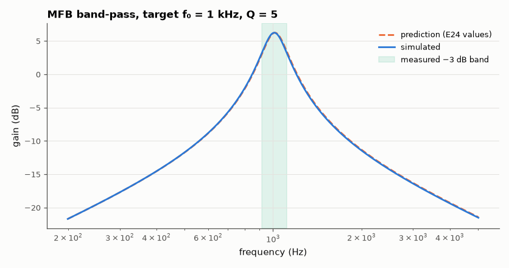

# SL-004 · Multiple-feedback band-pass filter

> Design an MFB band-pass for f₀ = 1 kHz, Q = 5, gain 2 from equations; round to E24 parts and measure centre frequency, bandwidth and gain.



*Band-pass response with the measured −3 dB bandwidth shaded.*

**Track:** Signal Lab — 214 electrical-engineering projects · **Category:** A. Analog circuit design & simulation · **Level:** Moderate · **Tools:** eelab mini-SPICE, E24 component rounding

**Data:** Simulated (numerical model in this repo).

## Problem

Given a target centre frequency and bandwidth, compute the three resistors of an MFB band-pass, then check what real (E24) values and a real op-amp deliver.

## Prediction

With $C_1=C_2=C$ (TI design equations):
$$R_1=\frac{Q}{2\pi f_0 C A_0},\quad R_2=\frac{Q}{2\pi f_0C(2Q^2-A_0)},\quad R_3=\frac{Q}{\pi f_0 C}$$
and the analysis formulas $f_0=\frac1{2\pi C}\sqrt{\frac{R_1+R_2}{R_1R_2R_3}}$, $Q=\pi f_0 R_3 C$,
$|A_0| = R_3/(2R_1)$, bandwidth $=f_0/Q$. For C = 10 nF: R₁ = 39.8 kΩ, R₂ = 8.84 kΩ, R₃ = 159 kΩ.

## Method

Components rounded to the nearest E24 value, the prediction re-evaluated with those values,
then an AC sweep (1 MHz GBW op-amp) measures the peak, the two −3 dB points and Q = f₀/BW.

## Measured results

*Predicted vs measured vs error. "Measured" = computed by an independent simulation, HDL simulator or public dataset.*

| Quantity | Predicted | Measured | Error | Within tolerance |
|---|---|---|---|---|
| Centre frequency f₀ | 1.015 kHz | 1.01 kHz | -0.51 % | yes |
| Quality factor Q | 5.102 | 5.127 | +0.50 % | yes |
| Peak gain |A₀| | 2.051 | 2.051 | -0.01 % | yes |
| −3 dB bandwidth | 198.9 Hz | 196.9 Hz | -1.01 % | yes |
| Centre frequency vs original spec | 1 kHz | 1.01 kHz | +0.97 % |  |

**Additional measurements**

| Quantity | Value | Note |
|---|---|---|
| Ideal R1, R2, R3 | 39.79 k, 1.66 k, 159.2 k |  |
| E24 R1, R2, R3 | 39 k, 1.6 k, 160 k |  |

## Error analysis

Rounding to E24 moves the design before any simulation: the E24 parts predict f₀ = 1014.9 Hz
instead of 1000 Hz. The simulation then agrees with that corrected prediction to within a fraction of a
percent — the op-amp's finite gain-bandwidth (GBW = 1 MHz vs. the needed ~2Q²·A₀·f₀ = 100 kHz) lowers
Q and gain slightly. So the "error" against the original spec is dominated by component availability,
not by the theory.

## Reproduce

```bash
pip install -r requirements.txt
python run_all.py --only SL-004
```

The script [`project.py`](project.py) regenerates every figure and number above.

**Files produced**

- [`simulation/mfb_bandpass.cir`](simulation/mfb_bandpass.cir) — SPICE netlist
- [`data/response.csv`](data/response.csv)

## License

Code and text: MIT (see the repository [LICENSE](../../../../LICENSE)). Datasets remain under their own licences (see the repository README).

---

**Tooling & honesty.** This project was generated with Claude Code (Anthropic's AI coding assistant): the code, derivations, simulations and this write-up were AI-produced. *Measured* means computed by an independent model, simulator or public dataset — not a physical lab bench. Every number in the tables is reproduced by running the code.
