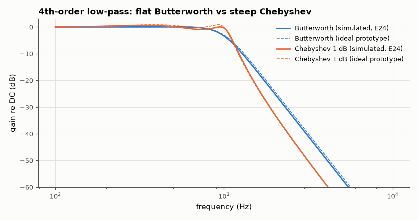
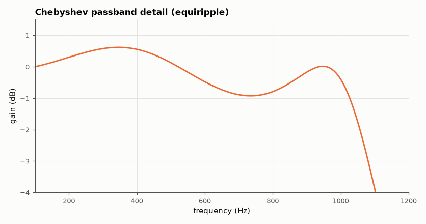

# SL-005 · Butterworth vs Chebyshev (4th order)

> Two 4th-order 1 kHz low-pass filters built as cascaded Sallen-Key stages: measure passband ripple and stop-band attenuation to show flatness vs steepness.



*Chebyshev buys ~12 dB more attenuation at 2 kHz for 1 dB of passband ripple.*

**Track:** Signal Lab — 214 electrical-engineering projects · **Category:** A. Analog circuit design & simulation · **Level:** Moderate · **Tools:** SciPy analog prototypes + eelab mini-SPICE (cascaded Sallen-Key)

**Data:** Simulated (numerical model in this repo).

## Problem

Butterworth promises a maximally flat passband; Chebyshev trades 1 dB of ripple for a steeper roll-off. How big is that trade in dB at 2 kHz, and does it survive E24 parts?

## Prediction

Poles come from the prototypes: Butterworth poles lie on a circle
($s_k = \omega_c e^{j\pi(2k+n-1)/2n}$), Chebyshev poles on an ellipse determined by the ripple ε
($\varepsilon^2=10^{R_p/10}-1$). Pairing conjugate poles gives biquads with
$\omega_{0}=|s_k|$, $Q=|s_k|/(2|\mathrm{Re}\,s_k|)$ — each built as a unity-gain Sallen-Key stage.
Predicted attenuation at 2 kHz: Butterworth $10\log(1+2^{8}) = 24.1$ dB; Chebyshev
$10\log(1+\varepsilon^2T_4^2(2))$ with $T_4(2)=97$.

## Method

scipy.signal.butter / cheby1 give analog poles → (f₀, Q) per stage → components
(R = 10 kΩ, C1 = 2Q/(ω₀R), C2 = 1/(2Qω₀R)) rounded to E24 → two cascaded op-amp stages simulated
in AC. Measured: passband ripple (max − min gain below 1 kHz), −3 dB point, attenuation at 2 kHz and 5 kHz.

## Measured results

*Predicted vs measured vs error. "Measured" = computed by an independent simulation, HDL simulator or public dataset.*

| Quantity | Predicted | Measured | Error |
|---|---|---|---|
| Butterworth: gain at passband edge 1 kHz | -3.011 dB | -3.369 dB | -0.3587 dB |
| Butterworth: max deviation below 500 Hz | 0 dB | 0.04554 dB | +0.04554 dB |
| Butterworth: attenuation at 2 kHz | 24.1 dB | 25.04 dB | +0.9385 dB |
| Butterworth: attenuation at 5 kHz | 55.92 dB | 56.94 dB | +1.021 dB |
| Chebyshev 1 dB: passband ripple (0–1 kHz) | 0.9999 dB | 1.543 dB | +0.5427 dB |
| Chebyshev 1 dB: attenuation at 2 kHz | 33.01 dB | 32.75 dB | -0.257 dB |
| Chebyshev 1 dB: attenuation at 5 kHz | 66.9 dB | 66.75 dB | -0.1481 dB |

**Additional measurements**

| Quantity | Value | Note |
|---|---|---|
| Butterworth stage 1 | f₀=1000.0 Hz, Q=1.307, C1=43 nF, C2=6.2 nF |  |
| Butterworth stage 2 | f₀=1000.0 Hz, Q=0.541, C1=18 nF, C2=15 nF |  |
| Chebyshev 1 dB stage 1 | f₀=993.2 Hz, Q=3.559, C1=110 nF, C2=2.2 nF |  |
| Chebyshev 1 dB stage 2 | f₀=528.6 Hz, Q=0.785, C1=47 nF, C2=20 nF |  |



*Zoom on the Chebyshev passband showing the 1 dB equiripple.*

## Error analysis

Chebyshev gives 7.7 dB more attenuation at
2 kHz than Butterworth, the price being 1.54 dB of passband ripple. Rounding the
capacitors to E24 shifts each stage's f₀ and Q by up to a few percent; the Chebyshev filter is far
more sensitive to this because its second stage has Q ≈ 3.6, so the ripple deviates more from the
ideal 1 dB than the Butterworth's flatness does.

## Reproduce

```bash
pip install -r requirements.txt
python run_all.py --only SL-005
```

The script [`project.py`](project.py) regenerates every figure and number above.

**Files produced**

- [`data/butterworth.csv`](data/butterworth.csv)
- [`data/chebyshev.csv`](data/chebyshev.csv)

## License

Code and text: MIT (see the repository [LICENSE](../../../../LICENSE)). Datasets remain under their own licences (see the repository README).

---

**Tooling & honesty.** This project was generated with Claude Code (Anthropic's AI coding assistant): the code, derivations, simulations and this write-up were AI-produced. *Measured* means computed by an independent model, simulator or public dataset — not a physical lab bench. Every number in the tables is reproduced by running the code.
