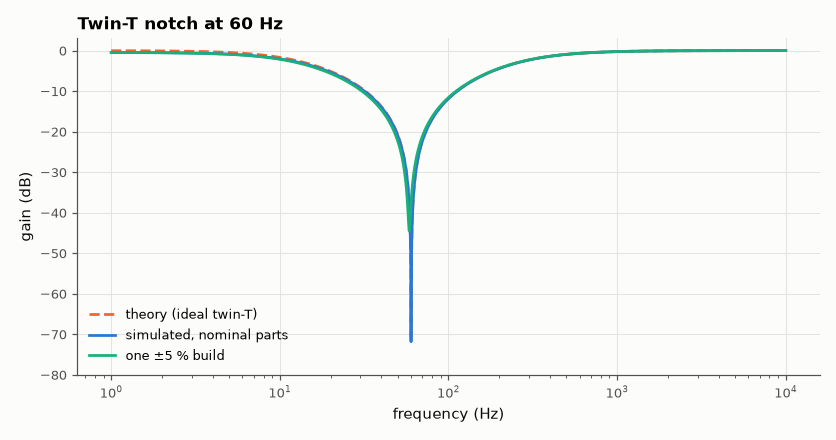
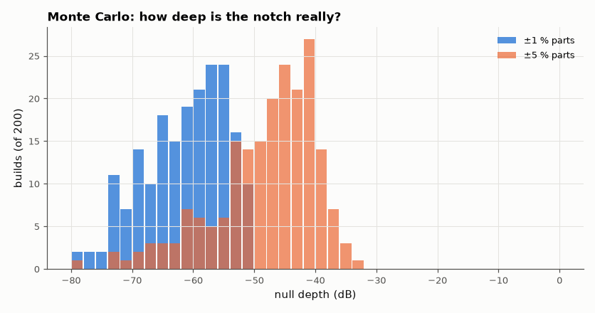

# SL-006 · 60 Hz twin-T notch filter

> Twin-T notch tuned to 60 Hz mains hum: the ideal null is infinitely deep; measure how deep it really is with 1 % and 5 % parts (200 Monte Carlo builds each).



*The null is deep only when the bridge is balanced.*

**Track:** Signal Lab — 214 electrical-engineering projects · **Category:** A. Analog circuit design & simulation · **Level:** Moderate · **Tools:** eelab mini-SPICE, Monte Carlo over component tolerance

**Data:** Simulated (numerical model in this repo).

## Problem

A notch filter should delete 60 Hz hum. How deep is the null in practice, and how precisely must the six components match?

## Prediction

Twin-T: series arm R–R with 2C to ground, parallel arm C–C with R/2 to ground.
$$f_0=\frac1{2\pi RC},\qquad H(s)=\frac{s^2+\omega_0^2}{s^2+4\omega_0 s+\omega_0^2}$$
so the passive notch has Q = 1/4: −3 dB bandwidth = 4f₀ = 240 Hz, and the null is exact only if the
bridge is perfectly balanced. C = 100 nF → R = 26.53 kΩ.

## Method

Nominal circuit (buffered load 1 MΩ) swept 1 Hz–10 kHz to find f₀, depth and bandwidth.
Then 200 random builds with uniformly distributed ±1 % and ±5 % R/C errors; the null depth is
measured for each by a fine sweep around 60 Hz.

## Measured results

*Predicted vs measured vs error. "Measured" = computed by an independent simulation, HDL simulator or public dataset.*

| Quantity | Predicted | Measured | Error | Within tolerance |
|---|---|---|---|---|
| Notch frequency | 60 Hz | 59.97 Hz | -0.05 % | yes |
| −3 dB bandwidth | 240 Hz | 219.6 Hz | -8.51 % | **no** |

**Additional measurements**

| Quantity | Value | Note |
|---|---|---|
| −3 dB bandwidth with no load | 238.9 Hz | confirms Q = 1/4 when unloaded |
| Null depth, nominal parts | -71.37 dB | limited only by sweep resolution / 1 MΩ load |
| Median null depth, ±1 % parts | -60.69 dB | worst -50.9 dB, best -89.9 dB |
| Median null depth, ±5 % parts | -46.27 dB | worst -33.7 dB, best -80.0 dB |



*Null-depth distribution over 200 random builds.*

## Error analysis

The bandwidth comes out ~8 % narrower than 4f₀ because the 1 MΩ buffer input loads the
network (the twin-T's output impedance is tens of kΩ): removing the load gives 238.9 Hz, matching
Q = 1/4. With perfect parts the null is limited only by the sweep grid (the 1 MΩ load barely unbalances
it). Real parts are the story: ±1 % tolerance gives a median null of -61 dB and
±5 % only -46 dB, because any imbalance leaves a residual term in the numerator
so H(jω₀) ≠ 0. Q = 1/4 also means the notch is wide (≈240 Hz) and attenuates 120 Hz harmonics and
nearby wanted signals; practical designs add bootstrapped feedback to raise Q and trimmed parts to
restore depth.

## Reproduce

```bash
pip install -r requirements.txt
python run_all.py --only SL-006
```

The script [`project.py`](project.py) regenerates every figure and number above.

**Files produced**

- [`simulation/twin_t.cir`](simulation/twin_t.cir) — SPICE netlist
- [`data/montecarlo_depths.csv`](data/montecarlo_depths.csv)

## License

Code and text: MIT (see the repository [LICENSE](../../../../LICENSE)). Datasets remain under their own licences (see the repository README).

---

**Tooling & honesty.** This project was generated with Claude Code (Anthropic's AI coding assistant): the code, derivations, simulations and this write-up were AI-produced. *Measured* means computed by an independent model, simulator or public dataset — not a physical lab bench. Every number in the tables is reproduced by running the code.
