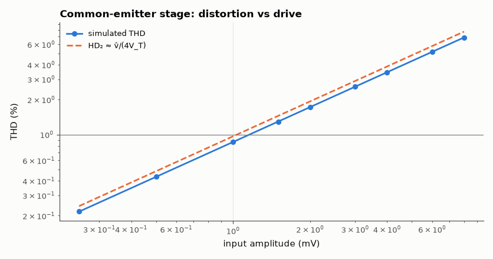
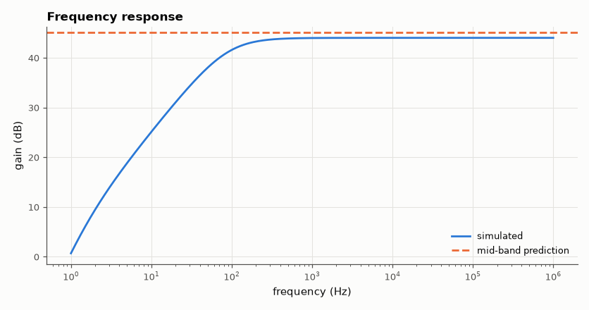
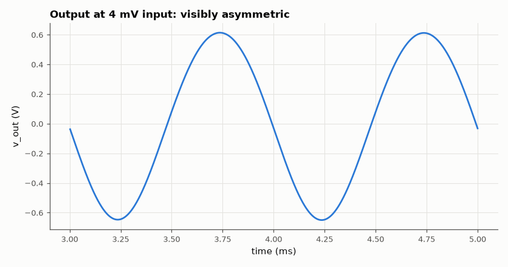

# SL-007 · Common-emitter BJT amplifier

> Bias a 2N3904-like transistor with a divider, predict Q-point and mid-band gain, then find the input level where distortion reaches 1 % THD.



*THD grows linearly with drive, as the exponential's second-order term predicts.*

**Track:** Signal Lab — 214 electrical-engineering projects · **Category:** A. Analog circuit design & simulation · **Level:** Moderate · **Tools:** eelab mini-SPICE (Ebers-Moll BJT), FFT-based THD

**Data:** Simulated (numerical model in this repo).

## Problem

What gain does a textbook common-emitter stage really give, and at what input amplitude does the exponential transistor start to distort?

## Prediction

Divider bias: $V_B = 12\cdot\frac{10k}{57k}=2.105$ V (ignoring base current), $V_E=V_B-0.65$,
$I_C\approx V_E/R_E \approx 1.45$ mA, $V_C = 12 - I_C R_C$.
Mid-band gain with $R_E$ bypassed: $A_v = -g_m (R_C\parallel R_L)$, $g_m = I_C/V_T$.
Distortion: $i_c \propto e^{v_{be}/V_T}$; for input amplitude $\hat v$ the 2nd-harmonic ratio is
$HD_2 \approx \hat v/(4V_T)$, so 1 % distortion at $\hat v \approx 0.04V_T \approx 1.03$ mV.

## Method

Transistor: Is = 6.7 fA, β = 150, VA = 75 V. R1 = 47 k, R2 = 10 k, RC = 4.7 k, RE = 1 k ‖ 100 µF,
10 µF coupling caps, RL = 10 k. Operating point by Newton-Raphson, gain from AC analysis at 1 kHz,
distortion from 5 ms transients at 1 kHz for input amplitudes 0.25–8 mV (THD from an FFT over
whole cycles).

## Measured results

*Predicted vs measured vs error. "Measured" = computed by an independent simulation, HDL simulator or public dataset.*

| Quantity | Predicted | Measured | Error | Within tolerance |
|---|---|---|---|---|
| Base voltage V_B | 2.105 V | 2.035 V | -3.35 % | yes |
| Collector current I_C | 1.455 mA | 1.355 mA | -6.91 % | yes |
| Collector voltage V_C | 5.16 V | 5.633 V | +9.16 % | yes |
| Mid-band gain |A_v| at 1 kHz | 180 | 158.3 | -12.06 % | **no** |
| Input amplitude for 1 % THD | 1.034 mV | 1.158 mV | +11.97 % | yes |

**Additional measurements**

| Quantity | Value | Note |
|---|---|---|
| Gain with measured I_C and r_o | 158.9 | refined prediction |



*Low-frequency roll-off set by the coupling and bypass capacitors.*



*At 4 mV drive the positive and negative half-cycles differ in amplitude.*

## Error analysis

The operating point is within a few percent: the prediction ignores base current (which loads
the 8.2 kΩ Thevenin divider) and assumes V_BE = 0.65 V. The gain error comes from the same I_C error
plus the Early resistance r_o = 59 kΩ in parallel with R_C‖R_L. The distortion slope matches
v̂/(4V_T) — the 1 %-THD point differs from 1.03 mV because the bypass capacitor's residual impedance
provides a little local feedback, linearising the stage slightly.

## Reproduce

```bash
pip install -r requirements.txt
python run_all.py --only SL-007
```

The script [`project.py`](project.py) regenerates every figure and number above.

**Files produced**

- [`simulation/ce_amp.cir`](simulation/ce_amp.cir) — SPICE netlist
- [`data/thd_vs_amplitude.csv`](data/thd_vs_amplitude.csv)

## License

Code and text: MIT (see the repository [LICENSE](../../../../LICENSE)). Datasets remain under their own licences (see the repository README).

---

**Tooling & honesty.** This project was generated with Claude Code (Anthropic's AI coding assistant): the code, derivations, simulations and this write-up were AI-produced. *Measured* means computed by an independent model, simulator or public dataset — not a physical lab bench. Every number in the tables is reproduced by running the code.
