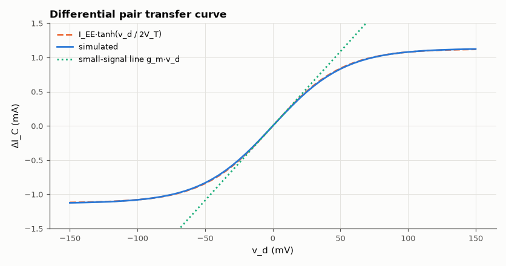
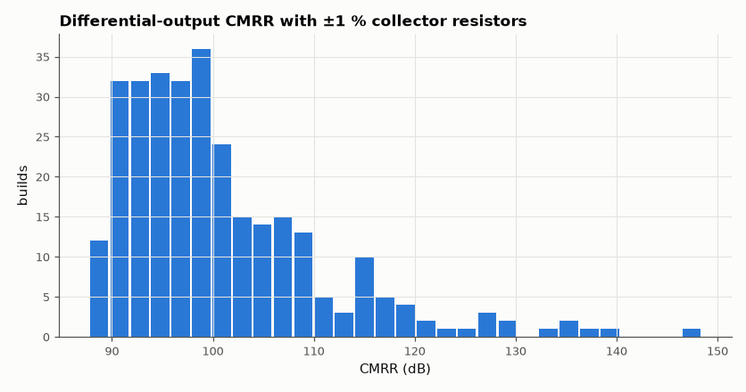

# SL-008 · BJT differential pair

> Measure the tanh transfer curve, differential gain and common-mode rejection of the long-tailed pair — the input stage of every op-amp.



*The pair is linear only within about ±V_T of balance, then steers all the tail current.*

**Track:** Signal Lab — 214 electrical-engineering projects · **Category:** A. Analog circuit design & simulation · **Level:** Moderate · **Tools:** eelab mini-SPICE (DC sweep + AC), Monte Carlo mismatch

**Data:** Simulated (numerical model in this repo).

## Problem

Why does a differential pair amplify the difference between its inputs but ignore what they have in common, and what limits that rejection?

## Prediction

With tail current $I_{EE}$: $\Delta I_C = I_{EE}\tanh\!\left(\frac{v_d}{2V_T}\right)$ (linear only for
$|v_d| \ll 2V_T$). Single-ended differential gain $A_d = g_mR_C/2$ with $g_m = I_{EE}/(2V_T)$.
Common-mode gain (tail resistance $R_{EE}$): $A_{cm}\approx -R_C/(2R_{EE})$, so
$\mathrm{CMRR}\approx g_mR_{EE}$. With perfectly matched halves the *differential output* has
CMRR → ∞; a load mismatch δ gives $A_{cm,diff}\approx \delta R_C/(2R_{EE})$.

## Method

±12 V supplies, R_C = 5 kΩ, tail resistor R_EE = 10 kΩ to −12 V. DC sweep of v_d (−150…150 mV),
AC small-signal gains, and 300 Monte Carlo builds with ±1 % R_C mismatch for differential-output CMRR.

## Measured results

*Predicted vs measured vs error. "Measured" = computed by an independent simulation, HDL simulator or public dataset.*

| Quantity | Predicted | Measured | Error | Within tolerance |
|---|---|---|---|---|
| Tail current I_EE | 1.135 mA | 1.131 mA | -0.37 % | yes |
| ΔI_C at v_d = 50 mV (tanh law) | 841 µA | 832.1 µA | -1.05 % | yes |
| Differential gain (single-ended) | 54.4 | 53.05 | -2.50 % | yes |
| Common-mode gain (single-ended) | 0.25 | 0.2481 | -0.77 % | yes |
| CMRR single-ended | 46.75 dB | 46.6 dB | -0.1527 dB |  |
| Diff-output CMRR at δ = 1 % (analytic) | 92.77 dB | 88.74 dB | -4.037 dB |  |

**Additional measurements**

| Quantity | Value | Note |
|---|---|---|
| Differential-output CMRR, ±1 % R_C (median) | 98.31 dB | 5th percentile 89.9 dB |



*Monte Carlo: mismatch, not the tail resistor, limits differential CMRR.*

## Error analysis

The large-signal curve lies on the tanh law; the small differences come from base current
(α = β/(β+1)) and the Early effect. Single-ended CMRR is limited by the 10 kΩ tail resistor as
predicted; in a real op-amp the tail is a current source with MΩ output impedance precisely to push
this up. Taking the output differentially removes the common-mode term entirely *if* the halves match,
so the Monte Carlo shows the true limit is component mismatch: 1 % resistors give CMRR in the
70–90 dB range rather than infinity.

## Reproduce

```bash
pip install -r requirements.txt
python run_all.py --only SL-008
```

The script [`project.py`](project.py) regenerates every figure and number above.

**Files produced**

- [`simulation/diff_pair.cir`](simulation/diff_pair.cir) — SPICE netlist
- [`data/transfer.csv`](data/transfer.csv)

## License

Code and text: MIT (see the repository [LICENSE](../../../../LICENSE)). Datasets remain under their own licences (see the repository README).

---

**Tooling & honesty.** This project was generated with Claude Code (Anthropic's AI coding assistant): the code, derivations, simulations and this write-up were AI-produced. *Measured* means computed by an independent model, simulator or public dataset — not a physical lab bench. Every number in the tables is reproduced by running the code.
