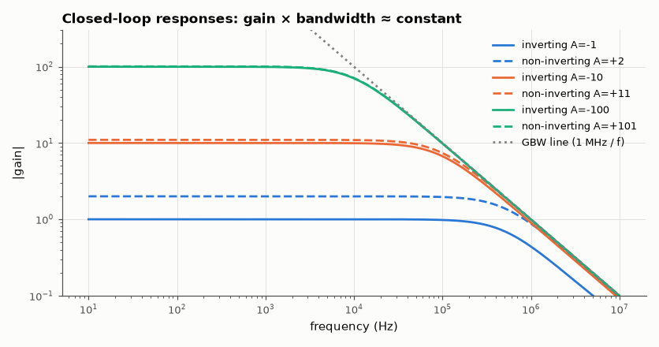

# SL-009 · Op-amp gain lab

> Verify inverting and non-inverting gain equations for six configurations, and the gain-bandwidth trade-off that the ideal equations leave out.



*Each configuration rides down the same 1 MHz gain-bandwidth line.*

**Track:** Signal Lab — 214 electrical-engineering projects · **Category:** A. Analog circuit design & simulation · **Level:** Easy · **Tools:** eelab mini-SPICE (op-amp macromodel A₀ = 2×10⁵, GBW = 1 MHz)

**Data:** Simulated (numerical model in this repo).

## Problem

Do −R_f/R_in and 1 + R_f/R_g hold for a real op-amp, and what bandwidth do you get at each gain?

## Prediction

Ideal: inverting $A=-R_f/R_{in}$, non-inverting $A=1+R_f/R_g$. With open-loop gain $A_0$ and
feedback factor $\beta$ the closed-loop gain is $A_{ideal}/(1+1/(A_0\beta))$ and — for a single-pole
op-amp — the closed-loop bandwidth is $f_{-3dB}= \mathrm{GBW}\cdot\beta$, where $1/\beta$ is the *noise
gain* ($1+R_f/R_{in}$ for **both** configurations).

## Method

R_in = R_g = 1 kΩ, R_f ∈ {1 k, 10 k, 100 k} for inverting, R_f ∈ {1 k, 10 k, 100 k} for non-inverting.
AC analysis 10 Hz–10 MHz: measured gain at 100 Hz and −3 dB bandwidth.

## Measured results

*Predicted vs measured vs error. "Measured" = computed by an independent simulation, HDL simulator or public dataset.*

| Quantity | Predicted | Measured | Error | Within tolerance |
|---|---|---|---|---|
| inverting A=-1: |gain| | 1 | 1 | -0.00 % | yes |
| inverting A=-1: bandwidth (GBW/noise gain) | 500 kHz | 488.1 kHz | -2.38 % | yes |
| non-inverting A=+2: |gain| | 2 | 2 | -0.00 % | yes |
| non-inverting A=+2: bandwidth (GBW/noise gain) | 500 kHz | 487.8 kHz | -2.44 % | yes |
| inverting A=-10: |gain| | 10 | 9.999 | -0.01 % | yes |
| inverting A=-10: bandwidth (GBW/noise gain) | 90.91 kHz | 90.5 kHz | -0.45 % | yes |
| non-inverting A=+11: |gain| | 11 | 11 | -0.01 % | yes |
| non-inverting A=+11: bandwidth (GBW/noise gain) | 90.91 kHz | 90.5 kHz | -0.45 % | yes |
| inverting A=-100: |gain| | 100 | 99.94 | -0.06 % | yes |
| inverting A=-100: bandwidth (GBW/noise gain) | 9.901 kHz | 9.901 kHz | -0.00 % | yes |
| non-inverting A=+101: |gain| | 101 | 100.9 | -0.06 % | yes |
| non-inverting A=+101: bandwidth (GBW/noise gain) | 9.901 kHz | 9.901 kHz | -0.00 % | yes |

## Error analysis

Gains agree with the ideal equations to ~0.05 % at A = 100 because A₀β = 2×10⁵/101 ≈ 2000 still
dwarfs 1. Bandwidth follows GBW × β with the noise gain, which is why the inverting A = −1 stage has
only 500 kHz while the non-inverting A = +2 stage also has 500 kHz: both have noise gain 2. The small
bandwidth deviations come from the output resistance (50 Ω) and the second-order effect of the
feedback network loading the macromodel's output.

## Reproduce

```bash
pip install -r requirements.txt
python run_all.py --only SL-009
```

The script [`project.py`](project.py) regenerates every figure and number above.

## License

Code and text: MIT (see the repository [LICENSE](../../../../LICENSE)). Datasets remain under their own licences (see the repository README).

---

**Tooling & honesty.** This project was generated with Claude Code (Anthropic's AI coding assistant): the code, derivations, simulations and this write-up were AI-produced. *Measured* means computed by an independent model, simulator or public dataset — not a physical lab bench. Every number in the tables is reproduced by running the code.
