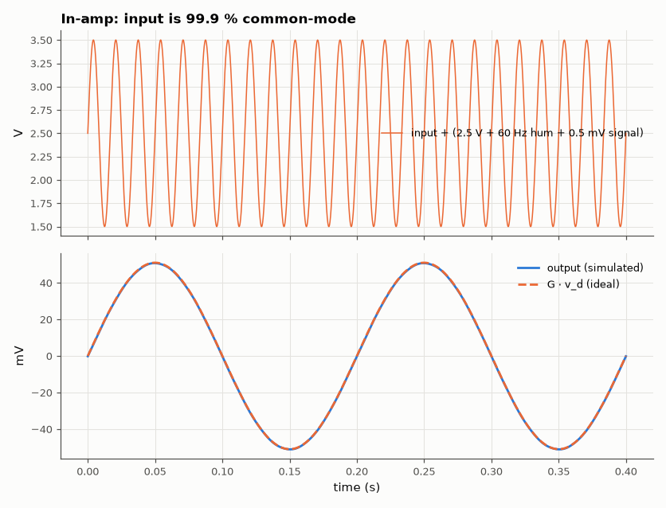
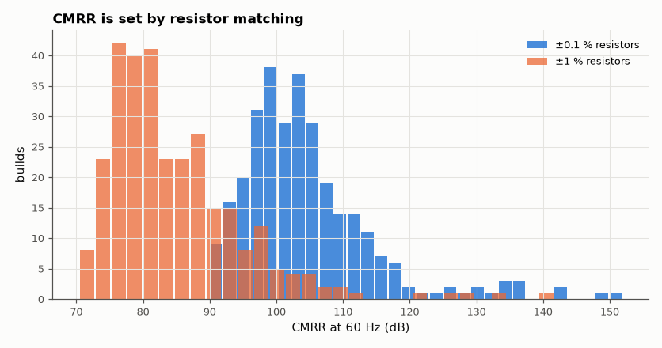

# SL-010 · Three-op-amp instrumentation amplifier

> Amplify a 1 mV bridge-sensor signal sitting on 2.5 V plus 1 V of 60 Hz common-mode hum; predict gain and CMRR from resistor tolerance and measure both.



*The 1 mV differential signal emerges ×51 while 1 V of hum is rejected.*

**Track:** Signal Lab — 214 electrical-engineering projects · **Category:** A. Analog circuit design & simulation · **Level:** Moderate · **Tools:** eelab mini-SPICE, Monte Carlo resistor tolerance

**Data:** Simulated (numerical model in this repo).

## Problem

A strain-gauge bridge gives millivolts riding on volts of common-mode voltage and mains pickup. How well does a 3-op-amp in-amp separate them, and what sets the limit?

## Prediction

Gain $G=\left(1+\frac{2R}{R_G}\right)\frac{R_3}{R_2}$; with R = 25 kΩ, R_G = 1 kΩ, R₂ = R₃ = 10 kΩ,
G = 51. The input stage passes common-mode at unity gain, so all rejection comes from the difference
amplifier: with resistor tolerance t the worst-case difference-amp CMRR is
$\mathrm{CMRR_{DA}}\approx\frac{1+R_3/R_2}{4t}$, and the whole amp improves this by the first-stage gain:
$\mathrm{CMRR}\approx G_1\cdot\frac{1+R_3/R_2}{4t}$ (G₁ = 51). For t = 0.1 %: ≈ 94 dB worst case.

## Method

Ideal-ish op-amps (A₀ = 2×10⁵). AC analysis gives differential gain and common-mode gain; 300
Monte Carlo builds with uniform ±0.1 % and ±1 % resistors give the CMRR distribution. A transient
with 1 mV·sin(2π·5 Hz) differential + 2.5 V + 1 V·sin(2π·60 Hz) common mode shows the separation.

## Measured results

*Predicted vs measured vs error. "Measured" = computed by an independent simulation, HDL simulator or public dataset.*

| Quantity | Predicted | Measured | Error | Within tolerance |
|---|---|---|---|---|
| Differential gain | 51 | 50.99 | -0.03 % | yes |
| Worst-case CMRR, ±0.1 % resistors | 88.13 dB | 89.87 dB | +1.743 dB |  |
| Worst-case CMRR, ±1 % resistors | 68.13 dB | 70.4 dB | +2.268 dB |  |

**Additional measurements**

| Quantity | Value | Note |
|---|---|---|
| CMRR with perfect resistors | 164.6 dB | limited by op-amp finite gain |
| Median CMRR, ±0.1 % | 102.6 dB |  |
| Median CMRR, ±1 % | 81.9 dB |  |
| Residual 60 Hz at output (RMS) | 0.07298 mV |  |



*Ten times better matching buys 20 dB of CMRR.*

## Error analysis

The gain matches 1 + 2R/R_G to better than 0.1 %. The Monte Carlo minima land just above the
worst-case formula (the formula assumes every resistor at its tolerance edge in the worst direction,
which 300 random builds rarely hit) and the medians are ~10 dB better. Each 10× improvement in
resistor matching buys 20 dB of CMRR — the reason monolithic in-amps use laser-trimmed thin-film
resistors instead of discrete parts.

## Reproduce

```bash
pip install -r requirements.txt
python run_all.py --only SL-010
```

The script [`project.py`](project.py) regenerates every figure and number above.

**Files produced**

- [`data/cmrr_montecarlo.csv`](data/cmrr_montecarlo.csv)

## License

Code and text: MIT (see the repository [LICENSE](../../../../LICENSE)). Datasets remain under their own licences (see the repository README).

---

**Tooling & honesty.** This project was generated with Claude Code (Anthropic's AI coding assistant): the code, derivations, simulations and this write-up were AI-produced. *Measured* means computed by an independent model, simulator or public dataset — not a physical lab bench. Every number in the tables is reproduced by running the code.
