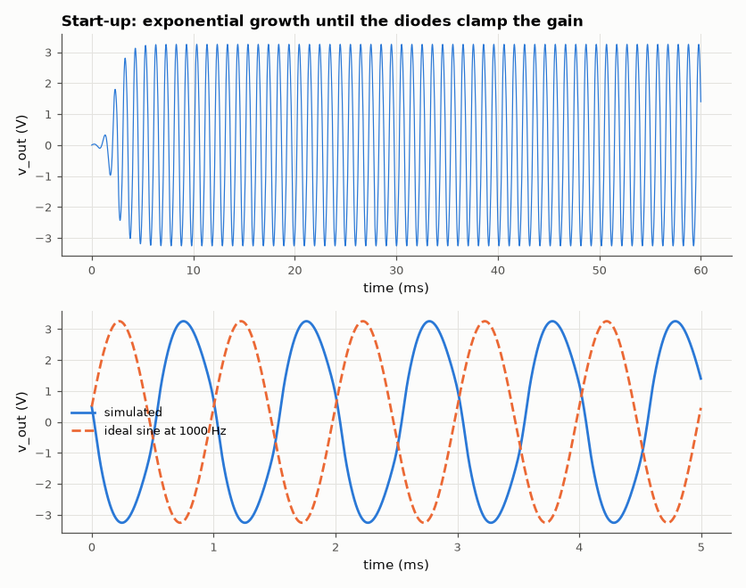
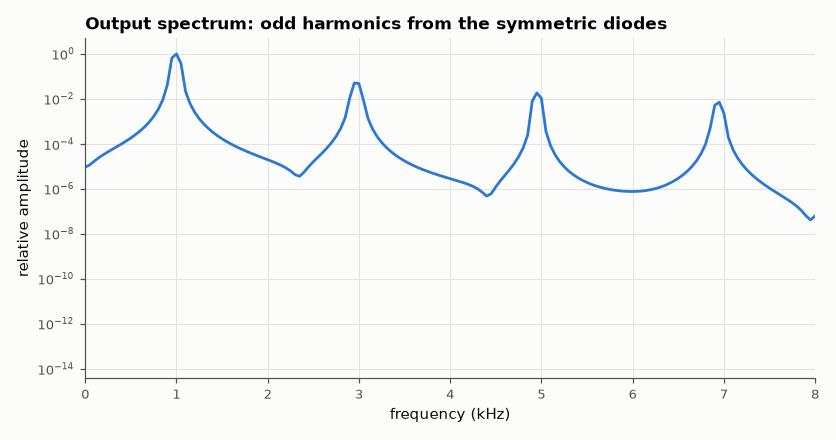

# SL-011 · Wien bridge oscillator

> A 1 kHz Wien bridge sine oscillator with diode amplitude stabilisation: predict frequency and required gain, then measure start-up, frequency and distortion.



*Growth from a 1 µA kick, then a stable ~sine at the predicted frequency.*

**Track:** Signal Lab — 214 electrical-engineering projects · **Category:** A. Analog circuit design & simulation · **Level:** Moderate · **Tools:** eelab mini-SPICE transient (op-amp + diode amplitude limiter)

**Data:** Simulated (numerical model in this repo).

## Problem

An oscillator needs loop gain exactly 1. Too little and it dies, too much and it clips. How do two diodes solve the amplitude problem, and at what cost in distortion?

## Prediction

The RC series–parallel network has $\beta(j\omega_0)=1/3$ at $\omega_0 = 1/(RC)$ with zero phase,
so the amplifier needs gain exactly 3 (Barkhausen). R = 10 kΩ, C = 15.9 nF → f₀ = 1.00 kHz.
Amplifier: $1+R_f/R_g$ with R_g = 10 kΩ, R_f = 15 kΩ + (12 kΩ ‖ diodes): small signals see gain 3.7
(start-up guaranteed), large signals switch the diodes on and gain falls toward 2.5, so amplitude
settles where the *average* gain is 3 — roughly where the diodes start conducting on the 12 kΩ.

## Method

Transient 60 ms at 2 µs step (trapezoidal). A 1 µA, 50 µs current kick starts the oscillation.
Frequency from zero crossings over the last 20 ms; THD from an FFT of the settled waveform.

## Measured results

*Predicted vs measured vs error. "Measured" = computed by an independent simulation, HDL simulator or public dataset.*

| Quantity | Predicted | Measured | Error | Within tolerance |
|---|---|---|---|---|
| Oscillation frequency | 1 kHz | 991 Hz | -0.91 % | yes |

**Additional measurements**

| Quantity | Value | Note |
|---|---|---|
| Small-signal amplifier gain (start-up) | 3.7 | must exceed 3 for start-up |
| Settled amplitude | 3.253 V |  |
| THD of settled sine | 5.448 % |  |
| Start-up time to 90 % amplitude | 3 ms |  |



*Symmetric soft clipping produces mostly odd harmonics.*

## Error analysis

The measured frequency lands -0.91 % from 1/(2πRC): the op-amp's finite bandwidth adds a
small phase shift so the loop settles slightly off ω₀ to make total phase zero. The diodes solve the
amplitude problem by making gain amplitude-dependent — but a gain that changes *within* each cycle is
nonlinearity, so the sine carries 5.4 % THD of mostly odd harmonics. Classic designs (Hewlett's
1939 HP200A) used a lamp or later a JFET, whose resistance responds to the *average* amplitude over
many cycles, to get THD below 0.01 %.

## Reproduce

```bash
pip install -r requirements.txt
python run_all.py --only SL-011
```

The script [`project.py`](project.py) regenerates every figure and number above.

**Files produced**

- [`simulation/wien_bridge.cir`](simulation/wien_bridge.cir) — SPICE netlist
- [`data/waveform.csv`](data/waveform.csv)

## License

Code and text: MIT (see the repository [LICENSE](../../../../LICENSE)). Datasets remain under their own licences (see the repository README).

---

**Tooling & honesty.** This project was generated with Claude Code (Anthropic's AI coding assistant): the code, derivations, simulations and this write-up were AI-produced. *Measured* means computed by an independent model, simulator or public dataset — not a physical lab bench. Every number in the tables is reproduced by running the code.
