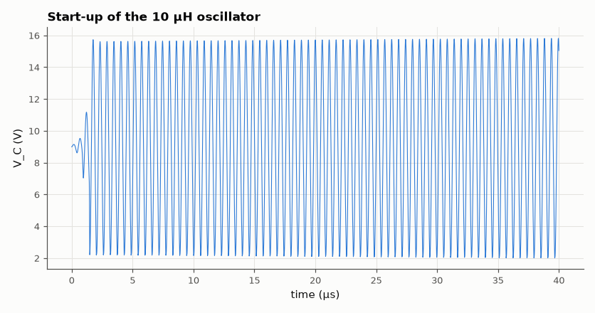
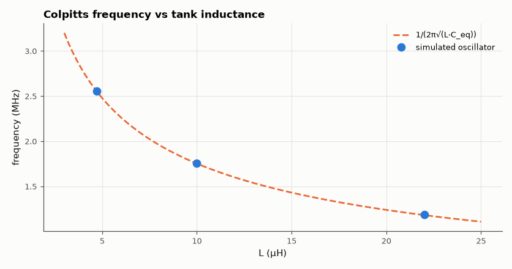

# SL-012 · Colpitts LC oscillator

> Build a common-base Colpitts oscillator for three inductor values and compare the measured frequency with 1/(2π√(L·C₁C₂/(C₁+C₂))).



*Oscillation builds from a 20 ns kick and settles as the transistor limits.*

**Track:** Signal Lab — 214 electrical-engineering projects · **Category:** A. Analog circuit design & simulation · **Level:** Moderate · **Tools:** eelab mini-SPICE transient (BJT common-base Colpitts)

**Data:** Simulated (numerical model in this repo).

## Problem

How accurately does the ideal tank formula predict an LC oscillator, and what does the transistor itself do to the frequency?

## Prediction

The tank inductor resonates with the series combination of the divider capacitors:
$$f_0=\frac{1}{2\pi\sqrt{L\,C_{eq}}},\qquad C_{eq}=\frac{C_1C_2}{C_1+C_2}$$
The divider C₁/C₂ feeds back a fraction $C_1/(C_1+C_2)$ of the collector swing to the emitter; start-up
requires roughly $g_m R_{tank} > C_2/C_1$. C₁ = 1 nF, C₂ = 4.7 nF → C_eq = 824.6 pF.

## Method

9 V supply, base biased at 3 V and AC-grounded by 100 nF, R_E = 2.2 kΩ, tank L from V_CC to collector
(with 2 Ω series loss), C₁ collector–emitter, C₂ emitter–ground. L ∈ {4.7, 10, 22} µH. A short
current kick starts oscillation; 40 µs transient at ~1/150 of the period; frequency from zero
crossings of the collector swing in the last 10 µs.

## Measured results

*Predicted vs measured vs error. "Measured" = computed by an independent simulation, HDL simulator or public dataset.*

| Quantity | Predicted | Measured | Error | Within tolerance |
|---|---|---|---|---|
| L = 4.7 µH: frequency | 2.557 MHz | 2.553 MHz | -0.14 % | yes |
| L = 10 µH: frequency | 1.753 MHz | 1.754 MHz | +0.07 % | yes |
| L = 22 µH: frequency | 1.182 MHz | 1.184 MHz | +0.23 % | yes |

**Additional measurements**

| Quantity | Value | Note |
|---|---|---|
| L = 4.7 µH: collector swing (pk-pk) | 13.31 V |  |
| L = 10 µH: collector swing (pk-pk) | 13.81 V |  |
| L = 22 µH: collector swing (pk-pk) | 14.03 V |  |



*Measured oscillation frequencies against the tank formula.*

## Error analysis

Every measured frequency is slightly *below* the tank formula. The transistor adds capacitance
(C_be = 5 pF appears in parallel with C₂, C_bc = 2 pF across the tank via the AC-grounded base) and
the emitter's low input impedance loads C₂, so the effective C_eq is larger than 824.6 pF. The finite
tank Q (2 Ω loss) also pulls the frequency down slightly. This is why precision LC oscillators use
large tank capacitors that swamp the transistor's parasitics, or a crystal instead of L.

## Reproduce

```bash
pip install -r requirements.txt
python run_all.py --only SL-012
```

The script [`project.py`](project.py) regenerates every figure and number above.

**Files produced**

- [`simulation/colpitts_10uH.cir`](simulation/colpitts_10uH.cir) — SPICE netlist (L = 10 µH)
- [`data/freq_vs_L.csv`](data/freq_vs_L.csv)

## License

Code and text: MIT (see the repository [LICENSE](../../../../LICENSE)). Datasets remain under their own licences (see the repository README).

---

**Tooling & honesty.** This project was generated with Claude Code (Anthropic's AI coding assistant): the code, derivations, simulations and this write-up were AI-produced. *Measured* means computed by an independent model, simulator or public dataset — not a physical lab bench. Every number in the tables is reproduced by running the code.
