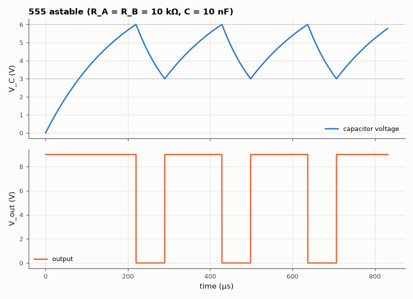
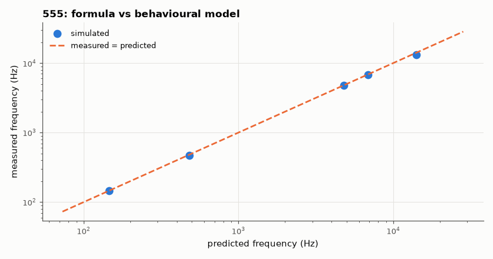

# SL-013 · 555 timer astable multivibrator

> Derive f = 1.44/((R_A+2R_B)C) and the duty cycle, then verify on a behavioural 555 with a non-ideal discharge transistor and comparator delay, across five designs.



*Capacitor ramps between 3 V and 6 V; the output is high while charging.*

**Track:** Signal Lab — 214 electrical-engineering projects · **Category:** A. Analog circuit design & simulation · **Level:** Easy · **Tools:** Behavioural 555 model integrated numerically (NumPy)

**Data:** Simulated (numerical model in this repo).

## Problem

Where do the 555's famous 0.693 and 1.44 constants come from, and how far do real internals (discharge on-resistance, comparator delay) move the frequency?

## Prediction

The capacitor charges through $R_A+R_B$ from $V_{CC}/3$ to $2V_{CC}/3$ and discharges through $R_B$
from $2V_{CC}/3$ to $V_{CC}/3$. Each is an exponential segment that covers half the remaining distance:
$t_H = \ln 2\,(R_A+R_B)C$, $t_L=\ln2\,R_BC$, so
$$f=\frac{1}{0.693(R_A+2R_B)C}=\frac{1.443}{(R_A+2R_B)C},\qquad D=\frac{R_A+R_B}{R_A+2R_B}$$

## Method

Behavioural model: capacitor ODE integrated with 10 ns steps (exact exponential update per step);
comparators at 2/3 and 1/3 V_CC with 100 ns propagation delay; SR flip-flop; discharge transistor
with 15 Ω on-resistance. V_CC = 9 V. Frequency and duty measured over the last 10 cycles.

## Measured results

*Predicted vs measured vs error. "Measured" = computed by an independent simulation, HDL simulator or public dataset.*

| Quantity | Predicted | Measured | Error | Within tolerance |
|---|---|---|---|---|
| R_A=1k R_B=10k C=10n: frequency | 6.871 kHz | 6.742 kHz | -1.89 % | yes |
| R_A=1k R_B=10k C=10n: duty cycle | 52.38 % | 51.53 % | -0.848 pp |  |
| R_A=10k R_B=10k C=10n: frequency | 4.81 kHz | 4.792 kHz | -0.37 % | yes |
| R_A=10k R_B=10k C=10n: duty cycle | 66.67 % | 66.55 % | -0.116 pp |  |
| R_A=4.7k R_B=47k C=100n: frequency | 146.2 Hz | 145.5 Hz | -0.47 % | yes |
| R_A=4.7k R_B=47k C=100n: duty cycle | 52.38 % | 52.2 % | -0.179 pp |  |
| R_A=1k R_B=1k C=1000n: frequency | 481 Hz | 472.7 Hz | -1.72 % | yes |
| R_A=1k R_B=1k C=1000n: duty cycle | 66.67 % | 65.6 % | -1.06 pp |  |
| R_A=100k R_B=1k C=1n: frequency | 14.15 kHz | 13.17 kHz | -6.91 % | **no** |
| R_A=100k R_B=1k C=1n: duty cycle | 99.02 % | 98.93 % | -0.0901 pp |  |



*All five designs fall on the identity line except the fastest one.*

## Error analysis

For slow designs the formula is essentially exact. The errors grow when timing intervals get
short: the fixed 100 ns comparator delay lets the capacitor overshoot both thresholds (lowering f),
and with R_B = 1 kΩ the 15 Ω discharge resistance is no longer negligible. The 100 kΩ/1 kΩ/1 nF design
has a 0.7 µs low time, so 100 ns of delay is a 14 % timing error there. This is why the datasheet
recommends R_B ≫ discharge resistance and why the 555 tops out near a few hundred kHz.

## Reproduce

```bash
pip install -r requirements.txt
python run_all.py --only SL-013
```

The script [`project.py`](project.py) regenerates every figure and number above.

**Files produced**

- [`data/designs.csv`](data/designs.csv)

## License

Code and text: MIT (see the repository [LICENSE](../../../../LICENSE)). Datasets remain under their own licences (see the repository README).

---

**Tooling & honesty.** This project was generated with Claude Code (Anthropic's AI coding assistant): the code, derivations, simulations and this write-up were AI-produced. *Measured* means computed by an independent model, simulator or public dataset — not a physical lab bench. Every number in the tables is reproduced by running the code.
