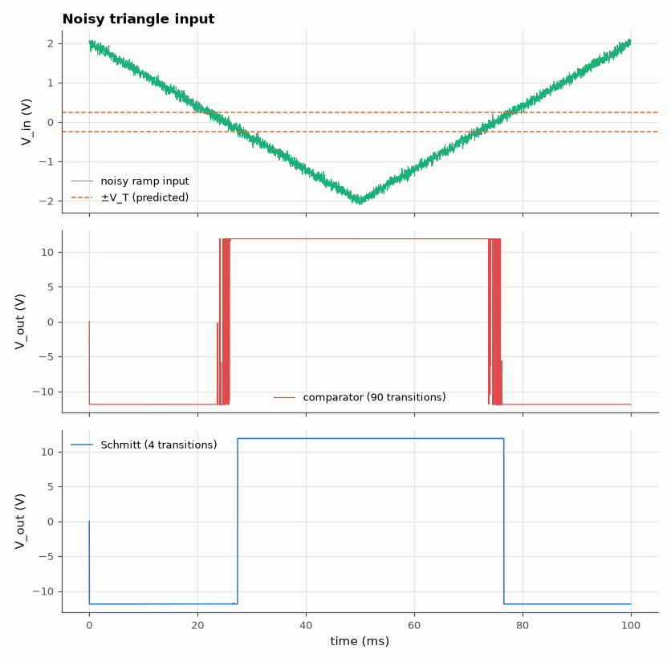

# SL-014 · Schmitt trigger (comparator with hysteresis)

> Feed a slow, noisy ramp into a plain comparator and a Schmitt trigger: predict the hysteresis thresholds and count false transitions in each.



*The plain comparator chatters at every crossing; hysteresis gives one clean edge.*

**Track:** Signal Lab — 214 electrical-engineering projects · **Category:** A. Analog circuit design & simulation · **Level:** Easy · **Tools:** eelab mini-SPICE transient, noisy slow ramp input

**Data:** Simulated (numerical model in this repo).

## Problem

A slowly changing noisy signal makes a comparator chatter as it crosses the threshold. How much hysteresis stops it, and where exactly do the thresholds land?

## Prediction

Inverting Schmitt trigger: input to (−), positive feedback R₁ (to ground) / R₂ (to output) on (+).
With output saturation $\pm V_{sat}$:
$$V_{T\pm}=\pm V_{sat}\frac{R_1}{R_1+R_2}$$
R₁ = 1 kΩ, R₂ = 47 kΩ, V_sat = 12 V → ±250 mV (500 mV window). Noise of amplitude below half the
window cannot cause a second transition.

## Method

Input: triangle ±2 V at 10 Hz plus Gaussian noise (σ = 60 mV, 20 kHz bandwidth). Op-amp macromodel with
V_sat = 12 V, GBW 10 MHz, SR 10 V/µs. Compare a plain comparator (no feedback) and the Schmitt trigger;
count output transitions and read the input value at each Schmitt transition.

## Measured results

*Predicted vs measured vs error. "Measured" = computed by an independent simulation, HDL simulator or public dataset.*

| Quantity | Predicted | Measured | Error | Within tolerance |
|---|---|---|---|---|
| Upper threshold V_T+ | 250 mV | 264.8 mV | +5.92 % | yes |
| Lower threshold V_T− | -250 mV | -269.9 mV | -7.97 % | yes |
| Transitions, Schmitt trigger | 4 | 4 | +0.00 % |  |
| Transitions, plain comparator | 4 | 90 | +2150.00 % |  |

## Error analysis

Measured thresholds are a little outside ±250 mV because the transition is detected at the
sample where the output changes sign: noise pushes the input past the threshold earlier or later, and
finite slew rate adds a few µs of delay. The chatter count is the real result — with σ = 60 mV noise
the comparator produces many transitions per crossing, while the 500 mV window is ≈ 8σ wide so the
Schmitt trigger switches exactly twice per period.

## Reproduce

```bash
pip install -r requirements.txt
python run_all.py --only SL-014
```

The script [`project.py`](project.py) regenerates every figure and number above.

**Files produced**

- [`simulation/schmitt.cir`](simulation/schmitt.cir) — SPICE netlist
- [`data/waveforms.csv`](data/waveforms.csv)

## License

Code and text: MIT (see the repository [LICENSE](../../../../LICENSE)). Datasets remain under their own licences (see the repository README).

---

**Tooling & honesty.** This project was generated with Claude Code (Anthropic's AI coding assistant): the code, derivations, simulations and this write-up were AI-produced. *Measured* means computed by an independent model, simulator or public dataset — not a physical lab bench. Every number in the tables is reproduced by running the code.
