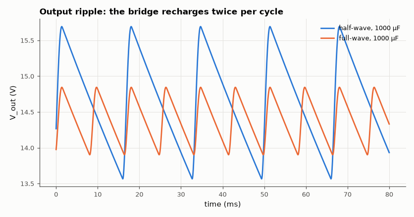
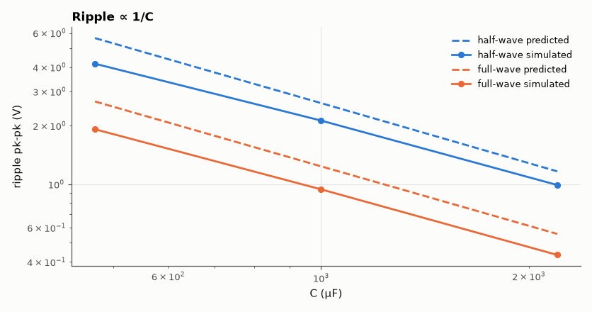

# SL-015 · Rectifier and reservoir-capacitor ripple study

> Half-wave vs full-wave bridge rectifiers feeding a 100 Ω load: predict ripple from V_p/(f·R·C) and measure it for three capacitor sizes.



*Same capacitor, same load: full-wave ripple is about half.*

**Track:** Signal Lab — 214 electrical-engineering projects · **Category:** A. Analog circuit design & simulation · **Level:** Easy · **Tools:** eelab mini-SPICE transient (1N4001-class diode model)

**Data:** Simulated (numerical model in this repo).

## Problem

How big must the reservoir capacitor be, and why does a full-wave bridge halve the ripple for the same capacitor?

## Prediction

Between recharges the capacitor supplies the load almost linearly, so
$$V_{r,pp}\approx\frac{V_{p}}{f_r R C},\qquad f_r = f \text{ (half-wave)},\ 2f\text{ (full-wave)}$$
with $V_p$ the peak after diode drops ($V_p = 12\sqrt2 - V_D$ half-wave, $-2V_D$ bridge). 60 Hz, 12 V RMS,
R = 100 Ω, C ∈ {470, 1000, 2200} µF.

## Method

1N4001-like diode (Is = 14 nA, N = 1.98, Rs = 34 mΩ), 0.5 Ω transformer winding resistance. 250 ms
transient (backward Euler, 20 µs step); ripple = max − min of the output over the last 50 ms.

## Measured results

*Predicted vs measured vs error. "Measured" = computed by an independent simulation, HDL simulator or public dataset.*

| Quantity | Predicted | Measured | Error | Within tolerance |
|---|---|---|---|---|
| half-wave, C = 470 µF: ripple (pk-pk) | 5.647 V | 4.17 V | -26.16 % | **no** |
| half-wave, C = 1000 µF: ripple (pk-pk) | 2.615 V | 2.127 V | -18.69 % | **no** |
| half-wave, C = 2200 µF: ripple (pk-pk) | 1.166 V | 991.7 mV | -14.94 % | yes |
| full-wave, C = 470 µF: ripple (pk-pk) | 2.667 V | 1.919 V | -28.03 % | **no** |
| full-wave, C = 1000 µF: ripple (pk-pk) | 1.237 V | 941.9 mV | -23.86 % | **no** |
| full-wave, C = 2200 µF: ripple (pk-pk) | 555.8 mV | 433.3 mV | -22.04 % | **no** |

**Additional measurements**

| Quantity | Value | Note |
|---|---|---|
| half-wave, 470 µF: exponential-decay estimate | 4.754 V | V_p(1−e^(−T/RC)) |
| half-wave, 1000 µF: exponential-decay estimate | 2.409 V | V_p(1−e^(−T/RC)) |
| half-wave, 2200 µF: exponential-decay estimate | 1.123 V | V_p(1−e^(−T/RC)) |
| full-wave, 470 µF: exponential-decay estimate | 2.444 V | V_p(1−e^(−T/RC)) |
| full-wave, 1000 µF: exponential-decay estimate | 1.187 V | V_p(1−e^(−T/RC)) |
| full-wave, 2200 µF: exponential-decay estimate | 545.4 mV | V_p(1−e^(−T/RC)) |
| Peak output, half-wave (1000 µF) | 15.69 V | diode drop ≈ 1.28 V |
| Peak output, bridge (1000 µF) | 14.84 V | two diode drops ≈ 2.13 V |



*Predicted and simulated ripple versus reservoir capacitance.*

## Error analysis

The simple formula slightly *overestimates* ripple because it assumes the capacitor discharges
for the full period, whereas the diodes actually recharge it during the last part of each cycle, and
because the load current falls as the voltage sags. The error is largest for the smallest capacitor,
where the voltage droops most. The peak is also lower than 12√2 by one diode drop (half-wave) or two
(bridge) plus the winding-resistance drop during the large charging-current pulses.

## Reproduce

```bash
pip install -r requirements.txt
python run_all.py --only SL-015
```

The script [`project.py`](project.py) regenerates every figure and number above.

**Files produced**

- [`simulation/bridge_1000uF.cir`](simulation/bridge_1000uF.cir) — SPICE netlist (bridge, 1000 µF)
- [`data/ripple.csv`](data/ripple.csv)

## License

Code and text: MIT (see the repository [LICENSE](../../../../LICENSE)). Datasets remain under their own licences (see the repository README).

---

**Tooling & honesty.** This project was generated with Claude Code (Anthropic's AI coding assistant): the code, derivations, simulations and this write-up were AI-produced. *Measured* means computed by an independent model, simulator or public dataset — not a physical lab bench. Every number in the tables is reproduced by running the code.
