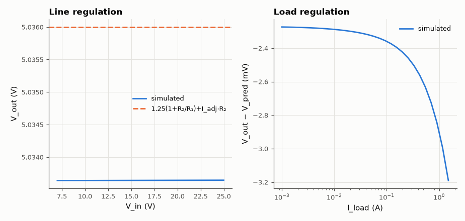

# SL-016 · LM317-style linear regulator

> Model an adjustable regulator from an error amp, a 1.25 V reference and an NPN pass device; predict V_out and measure line and load regulation.



*Output holds within millivolts across input and load.*

**Track:** Signal Lab — 214 electrical-engineering projects · **Category:** A. Analog circuit design & simulation · **Level:** Moderate · **Tools:** eelab mini-SPICE (error amplifier + pass transistor + 1.25 V reference)

**Data:** Simulated (numerical model in this repo).

## Problem

How does an LM317 turn a 1.25 V reference and two resistors into any output voltage, and how well does it hold that voltage as input and load change?

## Prediction

The regulator forces $V_{OUT}-V_{ADJ}=V_{REF}=1.25$ V, so a current $V_{REF}/R_1$ flows in R₁ and on through
R₂ together with the adjust-pin current:
$$V_{out}=1.25\left(1+\frac{R_2}{R_1}\right)+I_{ADJ}R_2$$
R₁ = 240 Ω, R₂ = 720 Ω, I_ADJ = 50 µA → 5.036 V. With loop gain T, output resistance is the pass
device's $1/g_m$ divided by (1+T) → load regulation of order mV per amp.

## Method

Pass transistor NPN (β = 100, Is = 1e-13) in a darlington-free follower, error amplifier op-amp
macromodel (A₀ = 10⁴ to mimic a simple on-chip amp), 50 µA adjust current source. DC sweeps: V_in
7–25 V at 100 mA; load 1 mA–1.5 A at V_in = 12 V.

## Measured results

*Predicted vs measured vs error. "Measured" = computed by an independent simulation, HDL simulator or public dataset.*

| Quantity | Predicted | Measured | Error | Within tolerance |
|---|---|---|---|---|
| Output voltage (12 V in, 100 mA) | 5.036 V | 5.034 V | -0.05 % | yes |
| Output resistance at ~1 A | 406.2 µΩ | 588.6 µΩ | +182.3 µΩ |  |

**Additional measurements**

| Quantity | Value | Note |
|---|---|---|
| Line regulation (9 → 25 V) | 6.4410e-06 %/V | LM317 datasheet typ. 0.01 %/V |
| Load regulation (1 mA → 1.5 A) | 0.01822 % | LM317 datasheet typ. 0.1 % |
| Dropout (V_in where V_out reaches 99 %) | 1.966 V | headroom above V_out |

## Error analysis

V_out matches the formula to within the error amplifier's finite-gain error (≈ V_out/A₀β). The
dropout region at low V_in is set by the base drive: the op-amp can't pull the base above V_in, so the
pass transistor needs V_BE + a little headroom — our single NPN drops out much lower than a real LM317
(≈ 2 V), which uses a darlington pass device and has internal current sources that need headroom. Load
regulation is dominated by the pass device's r_e = V_T/I_C divided by the loop gain.

## Reproduce

```bash
pip install -r requirements.txt
python run_all.py --only SL-016
```

The script [`project.py`](project.py) regenerates every figure and number above.

**Files produced**

- [`simulation/lm317_model.cir`](simulation/lm317_model.cir) — SPICE netlist
- [`data/line.csv`](data/line.csv)
- [`data/load.csv`](data/load.csv)

## License

Code and text: MIT (see the repository [LICENSE](../../../../LICENSE)). Datasets remain under their own licences (see the repository README).

---

**Tooling & honesty.** This project was generated with Claude Code (Anthropic's AI coding assistant): the code, derivations, simulations and this write-up were AI-produced. *Measured* means computed by an independent model, simulator or public dataset — not a physical lab bench. Every number in the tables is reproduced by running the code.
