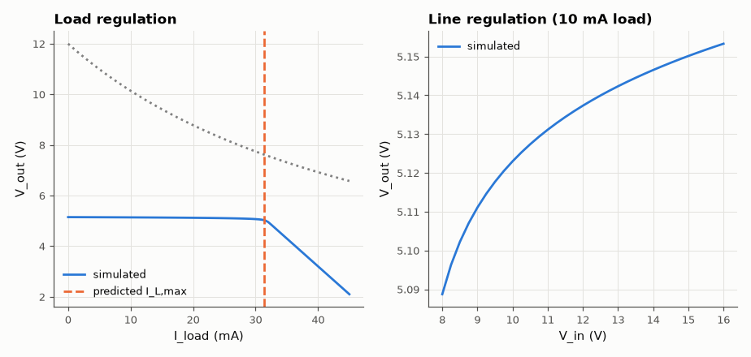

# SL-017 · Zener shunt regulator

> A 5.1 V zener and 220 Ω series resistor from 12 V: predict the maximum load current, zener dissipation and line regulation, then sweep load and input.



*Output collapses once the load steals all the zener current.*

**Track:** Signal Lab — 214 electrical-engineering projects · **Category:** A. Analog circuit design & simulation · **Level:** Easy · **Tools:** eelab mini-SPICE (diode with reverse breakdown)

**Data:** Simulated (numerical model in this repo).

## Problem

A zener regulator is the simplest voltage reference. How much load can it hold before regulation fails, and where does the power go?

## Prediction

Series current $I_S=(V_{in}-V_Z)/R_S$ splits between zener and load. Regulation holds while
$I_Z>0$, so $I_{L,max} \approx (12-5.1)/220 = 31.4$ mA. At no load the zener dissipates
$P_Z=V_Z I_S=0.16$ W. Line regulation is set by the zener's dynamic resistance:
$\Delta V_{out}/\Delta V_{in} = r_z/(R_S+r_z)$.

## Method

Zener modelled as a diode with BV = 5.1 V, 5 mA at BV, exponential breakdown (ideality 1). DC sweeps of load
current 0–45 mA and of input 8–16 V.

## Measured results

*Predicted vs measured vs error. "Measured" = computed by an independent simulation, HDL simulator or public dataset.*

| Quantity | Predicted | Measured | Error | Within tolerance |
|---|---|---|---|---|
| Output voltage at no load | 5.1 V | 5.147 V | +0.93 % | yes |
| Max load for regulation (−2 % point) | 31.15 mA | 31.5 mA | +1.13 % | yes |
| Zener dissipation at no load | 160 mW | 160.3 mW | +0.24 % | yes |
| Line regulation ΔV_out/ΔV_in | 0.005526 | 0.006857 | +0.001331 |  |

**Additional measurements**

| Quantity | Value | Note |
|---|---|---|
| Efficiency at 25 mA load | 33.95 % |  |

## Error analysis

Regulation fails slightly *before* the simple limit because the zener's knee is soft: as its
current approaches zero its voltage falls, so the output already sags 2 % while a little current still
flows. Line regulation follows r_z/(R_S + r_z) with r_z = N·V_T/I_Z, and the efficiency figure shows the
shunt regulator's real weakness: it burns the full series current at all times, whatever the load.

## Reproduce

```bash
pip install -r requirements.txt
python run_all.py --only SL-017
```

The script [`project.py`](project.py) regenerates every figure and number above.

**Files produced**

- [`simulation/zener.cir`](simulation/zener.cir) — SPICE netlist
- [`data/load_sweep.csv`](data/load_sweep.csv)

## License

Code and text: MIT (see the repository [LICENSE](../../../../LICENSE)). Datasets remain under their own licences (see the repository README).

---

**Tooling & honesty.** This project was generated with Claude Code (Anthropic's AI coding assistant): the code, derivations, simulations and this write-up were AI-produced. *Measured* means computed by an independent model, simulator or public dataset — not a physical lab bench. Every number in the tables is reproduced by running the code.
