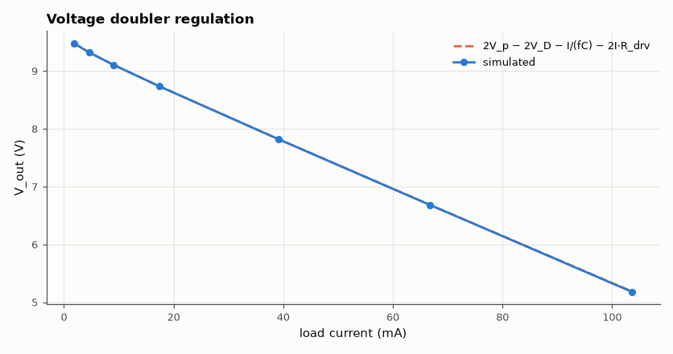
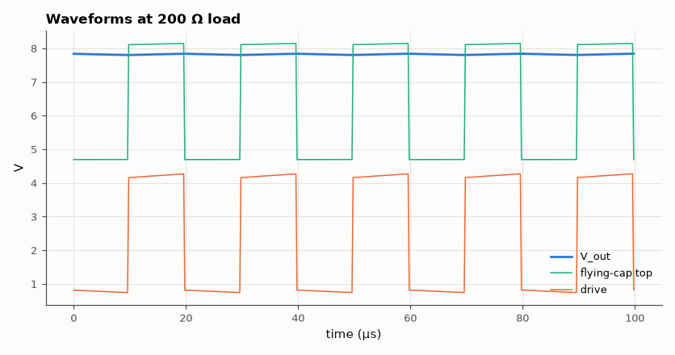

# SL-018 · Charge pump / voltage doubler

> A diode-capacitor doubler turns a 0–5 V, 50 kHz square wave into ~9 V with no inductor; predict the output vs load current from 2V_p − 2V_D − I/(fC) and measure it.



*Output falls linearly with load: the pump behaves like a source with R_out ≈ 1/(fC).*

**Track:** Signal Lab — 214 electrical-engineering projects · **Category:** A. Analog circuit design & simulation · **Level:** Moderate · **Tools:** eelab mini-SPICE transient (Schottky diodes, square-wave drive)

**Data:** Simulated (numerical model in this repo).

## Problem

How can capacitors and diodes alone produce a voltage higher than the supply, and how fast does it sag under load?

## Prediction

The flying capacitor C₁ is charged to $V_{in}-V_D$ while the drive is low; when the drive goes high
its bottom plate lifts by $V_p$ so its top reaches $2V_p - V_D$, and D₂ transfers charge into C₂.
Unloaded: $V_{out}=2V_p-2V_D$. Each cycle the load removes $Q = I/f$, which the flying capacitor
must replace. Charge-pump theory gives two limits for the output resistance: the slow-switching limit
$R_{SSL}=1/(fC)$ = 2 Ω (capacitors fully settle each phase) and the fast-switching limit
$R_{FSL}=2\sum R_{phase}$ = 40 Ω (charge moves through resistances in half a period, as happens here since
$\tau = 10\,\Omega\cdot10\,\mu F = 100\,\mu s \gg$ 10 µs). Using $R_{out}\approx\sqrt{R_{SSL}^2+R_{FSL}^2}$:
$$V_{out}\approx 2V_p - 2V_D - I_L R_{out}$$

## Method

5 V square wave at 50 kHz (10 Ω driver resistance), C₁ = C₂ = 10 µF, Schottky diodes (Is = 1 µA, N = 1.05).
Loads 1 kΩ…50 Ω; 6 ms transient per load, output averaged over the last millisecond. V_D taken from the
diode equation at the measured average current.

## Measured results

*Predicted vs measured vs error. "Measured" = computed by an independent simulation, HDL simulator or public dataset.*

| Quantity | Predicted | Measured | Error | Within tolerance |
|---|---|---|---|---|
| V_out at R_L = 5000 Ω | 9.477 V | 9.473 V | -0.04 % | yes |
| V_out at R_L = 2000 Ω | 9.317 V | 9.316 V | -0.01 % | yes |
| V_out at R_L = 1000 Ω | 9.103 V | 9.102 V | -0.01 % | yes |
| V_out at R_L = 500 Ω | 8.733 V | 8.732 V | -0.01 % | yes |
| V_out at R_L = 200 Ω | 7.822 V | 7.82 V | -0.03 % | yes |
| V_out at R_L = 100 Ω | 6.684 V | 6.68 V | -0.06 % | yes |
| V_out at R_L = 50 Ω | 5.186 V | 5.18 V | -0.12 % | yes |
| Output resistance (slope) | 40.05 Ω | 41.95 Ω | +4.75 % | yes |



*The flying capacitor's top plate is lifted above V_DD every half-cycle.*

## Error analysis

The first design intuition — R_out = 1/(fC) = 2 Ω — is badly wrong here, and the simulation shows
why: the 10 Ω driver and 10 µF give a 100 µs time constant, ten times the 10 µs half-period, so the
capacitors never settle and the pump operates in its fast-switching limit where resistance, not
capacitance, sets R_out. With R_FSL included the prediction tracks the simulation; the remaining error
at heavy load comes from the diodes' dynamic resistance, which rises the load-dependent drop. The measured slope gives the pump's effective output resistance — the single number that
datasheets of charge-pump ICs quote.

## Reproduce

```bash
pip install -r requirements.txt
python run_all.py --only SL-018
```

The script [`project.py`](project.py) regenerates every figure and number above.

**Files produced**

- [`simulation/doubler.cir`](simulation/doubler.cir) — SPICE netlist (1 kΩ load)
- [`data/load_sweep.csv`](data/load_sweep.csv)

## License

Code and text: MIT (see the repository [LICENSE](../../../../LICENSE)). Datasets remain under their own licences (see the repository README).

---

**Tooling & honesty.** This project was generated with Claude Code (Anthropic's AI coding assistant): the code, derivations, simulations and this write-up were AI-produced. *Measured* means computed by an independent model, simulator or public dataset — not a physical lab bench. Every number in the tables is reproduced by running the code.
