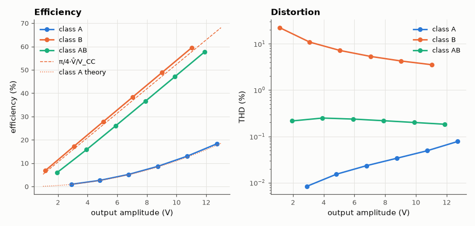
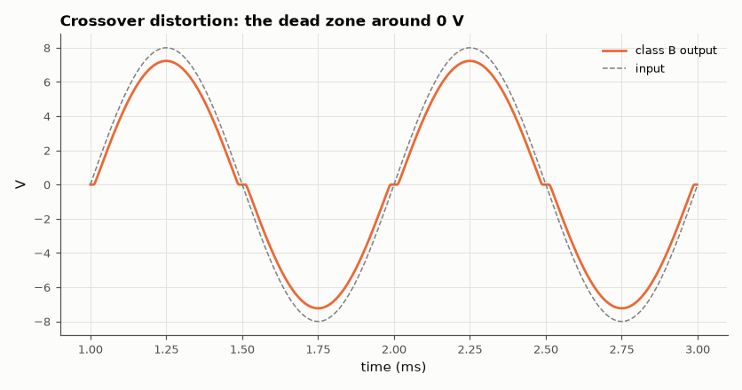

# SL-019 · Class-A vs Class-B vs Class-AB output stages

> Compare efficiency and crossover distortion of three emitter-follower output stages driving 8 Ω, against the textbook 25 % and π/4 limits.



*Class B is efficient but distorted; AB keeps the efficiency and removes crossover distortion.*

**Track:** Signal Lab — 214 electrical-engineering projects · **Category:** A. Analog circuit design & simulation · **Level:** Moderate · **Tools:** eelab mini-SPICE transient, FFT THD, supply-power integration

**Data:** Simulated (numerical model in this repo).

## Problem

Why do audio amplifiers use class AB? Quantify efficiency and distortion of class A, B and AB at the same output power.

## Prediction

Class A (resistor-biased emitter follower, quiescent current ≥ peak load current): efficiency
$\eta = P_L/P_{supply}$ is at most 25 % and scales as $(\hat V/V_{CC})^2$.
Class B (complementary pair, no bias): $\eta=\frac{\pi}{4}\frac{\hat V}{V_{CC}}$, max 78.5 %, but each transistor
conducts only when $|v_{in}|>V_{BE}\approx0.6$ V → crossover distortion.
Class AB: two diodes pre-bias the bases by ~2V_BE so one device is always on → distortion
collapses, efficiency ≈ class B.

## Method

±15 V rails, 8 Ω load, 1 kHz drive. Class A: NPN follower with a 1.9 A constant-current sink (≈ 57 W
standby). Class B: complementary NPN/PNP. Class AB: same pair with two biasing diodes fed by 40 mA
current sources (enough to supply the ≈ 20 mA peak base current at full output). Amplitudes 2–12 V; efficiency from ∫v·i of both supplies, THD from FFT.

## Measured results

*Predicted vs measured vs error. "Measured" = computed by an independent simulation, HDL simulator or public dataset.*

| Quantity | Predicted | Measured | Error |
|---|---|---|---|
| class A: efficiency at V̂ ≈ 12.7 V | 17.72 % | 18.29 % | +0.565 pp |
| class B: efficiency at V̂ ≈ 11.0 V | 57.73 % | 59.48 % | +1.75 pp |
| class AB: efficiency at V̂ ≈ 11.9 V | 62.2 % | 57.6 % | -4.6 pp |

**Additional measurements**

| Quantity | Value | Note |
|---|---|---|
| class A: THD at 2 V drive | 0.008403 % |  |
| class A: THD at 12 V drive | 0.07774 % |  |
| class B: THD at 2 V drive | 22.18 % |  |
| class B: THD at 12 V drive | 3.523 % |  |
| class AB: THD at 2 V drive | 0.2159 % |  |
| class AB: THD at 12 V drive | 0.1831 % |  |



*Class B output is flat while |v_in| < V_BE.*

## Error analysis

Class B's efficiency tracks π/4·V̂/V_CC, slightly lower because the output never reaches the rail
and because of the V_BE loss. Its THD is large at low amplitude — the fixed 1.2 V dead zone is a bigger
fraction of a small signal — which is exactly the wrong way round for music, most of which is quiet.
The class-A stage has almost no distortion but burns 57 W at idle to deliver a few watts. Class AB
removes the dead zone with two diode drops of bias and keeps most of class-B's efficiency — the few
points it loses against π/4·V̂/V_CC are the 2 × 40 mA bias-network current drawn from ±15 V
(2.4 W), which the textbook formula ignores.

## Reproduce

```bash
pip install -r requirements.txt
python run_all.py --only SL-019
```

The script [`project.py`](project.py) regenerates every figure and number above.

**Files produced**

- [`data/sweep.csv`](data/sweep.csv)

## License

Code and text: MIT (see the repository [LICENSE](../../../../LICENSE)). Datasets remain under their own licences (see the repository README).

---

**Tooling & honesty.** This project was generated with Claude Code (Anthropic's AI coding assistant): the code, derivations, simulations and this write-up were AI-produced. *Measured* means computed by an independent model, simulator or public dataset — not a physical lab bench. Every number in the tables is reproduced by running the code.
