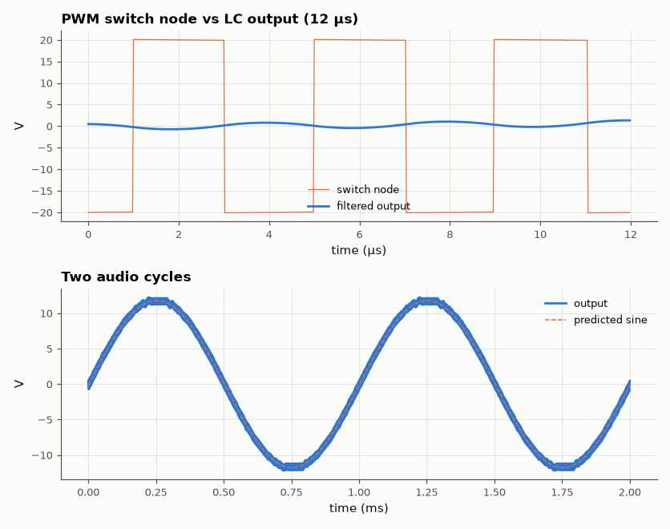
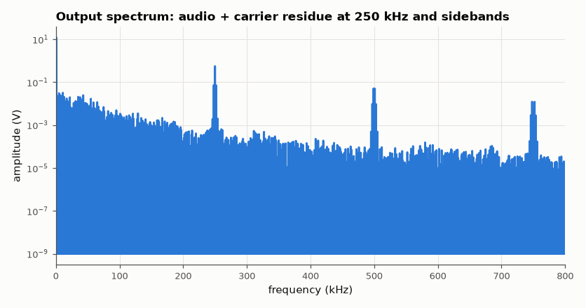

# SL-020 · Class-D switching amplifier

> A 250 kHz PWM half-bridge with a 2nd-order LC output filter driving 8 Ω: predict output amplitude, carrier ripple and efficiency, then measure them.



*The LC filter extracts the 1 kHz average from ±20 V PWM.*

**Track:** Signal Lab — 214 electrical-engineering projects · **Category:** A. Analog circuit design & simulation · **Level:** Hard · **Tools:** eelab mini-SPICE (switch-level half bridge + LC filter)

**Data:** Simulated (numerical model in this repo).

## Problem

A class-D amplifier only ever switches its transistors fully on or off. How does an LC filter turn that square wave back into audio, and what does the filter leave behind?

## Prediction

Natural-sampling PWM of $m\sin(\omega t)$ against a triangle gives a switch node whose *average* is
$m V_S\sin\omega t$, so $\hat V_{out}=mV_S\,|H(j\omega)|$. The LC filter ($L$ = 22 µH, $C$ = 680 nF,
$f_c=1/(2\pi\sqrt{LC})$ = 41.1 kHz) passes audio and attenuates the carrier by ≈ $(f_{sw}/f_c)^2$
(40 dB/decade). For a switch node swinging $2V_S$ with duty D the output ripple is
$\Delta V_{pp}=\frac{2V_S\,D(1-D)}{8LCf_{sw}^2}$, largest ($D=\tfrac12$) at the audio zero crossings: 1.34 V.
Efficiency: only $I^2R_{on}$ conduction loss in this idealised model → η ≈ $R_L/(R_L+R_{on}+R_{DCR})$.

## Method

Supplies ±20 V, switches with R_on = 0.1 Ω (complementary, controlled by the PWM comparator), L with
50 mΩ DCR, 8 Ω load, m = 0.6 at 1 kHz. 3 ms transient at 20 ns steps. Measured: 1 kHz amplitude by FFT,
carrier ripple, THD and efficiency from supply and load power.

## Measured results

*Predicted vs measured vs error. "Measured" = computed by an independent simulation, HDL simulator or public dataset.*

| Quantity | Predicted | Measured | Error | Within tolerance |
|---|---|---|---|---|
| 1 kHz output amplitude | 11.78 V | 11.76 V | -0.24 % | yes |
| Carrier ripple (pk-pk) | 1.337 V | 1.41 V | +5.44 % | yes |
| Efficiency | 98.16 % | 96.1 % | -2.06 pp |  |

**Additional measurements**

| Quantity | Value | Note |
|---|---|---|
| THD (harmonics 2–9) | 0.4367 % |  |
| LC filter corner frequency | 41.15 kHz |  |
| Output power | 8.659 W |  |



*Carrier and its sidebands are attenuated ~40 dB by the LC filter.*

## Error analysis

The audio amplitude matches m·V_S·|H(j2π·1kHz)| within the switch-resistance loss. The ripple
formula gives the worst case (D = ½, at the audio zero crossings); with modulation the duty swings from
20 % to 80 % and the ripple shrinks toward the audio peaks, so the envelope of the residue breathes at
2 kHz. The measured maximum lands close to the D = ½ prediction. Efficiency in
this model counts only conduction loss — real class-D stages are ~90 % because of switching loss
(charging MOSFET capacitances every edge) and dead-time, which a switch-level model does not include.

## Reproduce

```bash
pip install -r requirements.txt
python run_all.py --only SL-020
```

The script [`project.py`](project.py) regenerates every figure and number above.

**Files produced**

- [`simulation/class_d.cir`](simulation/class_d.cir) — SPICE netlist (switches listed as comments)
- [`data/output.csv`](data/output.csv)

## License

Code and text: MIT (see the repository [LICENSE](../../../../LICENSE)). Datasets remain under their own licences (see the repository README).

---

**Tooling & honesty.** This project was generated with Claude Code (Anthropic's AI coding assistant): the code, derivations, simulations and this write-up were AI-produced. *Measured* means computed by an independent model, simulator or public dataset — not a physical lab bench. Every number in the tables is reproduced by running the code.
