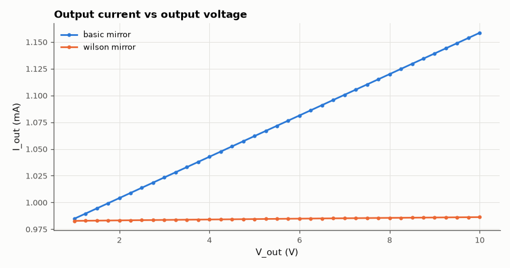

# SL-021 · BJT current mirrors (basic vs Wilson)

> Measure the copying accuracy and output impedance of a two-transistor mirror and a Wilson mirror against β- and Early-effect predictions.



*The Wilson mirror's output is nearly flat; the basic mirror slopes by 1/r_o.*

**Track:** Signal Lab — 214 electrical-engineering projects · **Category:** A. Analog circuit design & simulation · **Level:** Moderate · **Tools:** eelab mini-SPICE DC sweeps (Ebers-Moll with Early effect)

**Data:** Simulated (numerical model in this repo).

## Problem

A current mirror should copy a reference current regardless of the output voltage. How accurate is the copy, and how constant is it?

## Prediction

Basic mirror: base currents steal from the reference, $I_{out}=I_{ref}/(1+2/\beta)$, and the Early
effect gives $r_o = (V_A+V_{CE})/I_{out}$, i.e. $\Delta I/\Delta V = 1/r_o$.
Wilson mirror: β error $\approx 2/\beta^2$, but Q₁ sits at $V_{CE}=2V_{BE}$ while Q₂ sits at $V_{BE}$, an Early mismatch of
$\approx V_{BE}/V_A$ (1.4 % here) that the textbook formula omits, output resistance $\approx \beta r_o/2$ (feedback through the
third transistor).

## Method

β = 100, V_A = 50 V, I_ref set to 1 mA by a resistor from 10 V. Output voltage swept 1–10 V;
current ratio at V_out = V_BE and output resistance from the slope.

## Measured results

*Predicted vs measured vs error. "Measured" = computed by an independent simulation, HDL simulator or public dataset.*

| Quantity | Predicted | Measured | Error | Within tolerance |
|---|---|---|---|---|
| Basic: I_out/I_ref (β error, at V_CE = V_BE) | 0.9938 | 0.9959 | +0.20 % | yes |
| Basic: output resistance | 55.31 kΩ | 51.79 kΩ | -6.36 % | yes |
| Wilson: I_out/I_ref (β² error × Early mismatch) | 0.9862 | 0.9861 | -0.01 % | yes |
| Wilson: output resistance | 2.797 MΩ | 2.65 MΩ | -5.29 % | yes |

## Error analysis

The basic mirror's copy error is the 2/β base-current loss plus the Early-effect mismatch between the
diode-connected transistor (V_CE = V_BE) and the output transistor (V_CE = V_out). Its output
resistance equals r_o within a few percent. The Wilson mirror's negative feedback both cancels the
base-current error to second order and multiplies the output resistance by ~β/2; the measured
value is somewhat below βr_o/2 because the formula assumes r_o ≫ everything else in the loop.

## Reproduce

```bash
pip install -r requirements.txt
python run_all.py --only SL-021
```

The script [`project.py`](project.py) regenerates every figure and number above.

**Files produced**

- [`simulation/basic_mirror.cir`](simulation/basic_mirror.cir) — SPICE netlist (basic)
- [`simulation/wilson_mirror.cir`](simulation/wilson_mirror.cir) — SPICE netlist (wilson)
- [`data/basic_sweep.csv`](data/basic_sweep.csv)
- [`data/wilson_sweep.csv`](data/wilson_sweep.csv)

## License

Code and text: MIT (see the repository [LICENSE](../../../../LICENSE)). Datasets remain under their own licences (see the repository README).

---

**Tooling & honesty.** This project was generated with Claude Code (Anthropic's AI coding assistant): the code, derivations, simulations and this write-up were AI-produced. *Measured* means computed by an independent model, simulator or public dataset — not a physical lab bench. Every number in the tables is reproduced by running the code.
