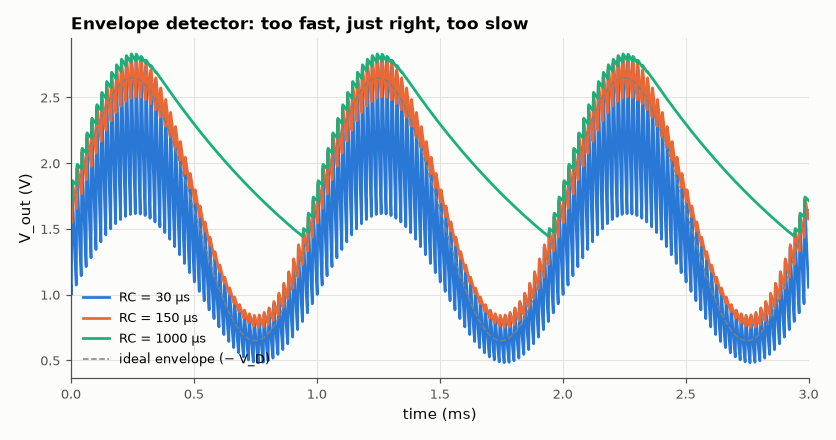

# SL-022 · Envelope (AM peak) detector

> Recover a 1 kHz tone from a 50 kHz AM carrier with a diode + RC; tune the time constant between ripple (too small) and diagonal clipping (too large).



*Small RC leaves ripple; large RC cannot follow the falling envelope (diagonal clipping).*

**Track:** Signal Lab — 214 electrical-engineering projects · **Category:** A. Analog circuit design & simulation · **Level:** Easy · **Tools:** eelab mini-SPICE transient, FFT distortion measurement

**Data:** Simulated (numerical model in this repo).

## Problem

An AM radio's detector is one diode and one RC. How do you choose RC so the output follows the envelope without carrier ripple and without missing the falling edges?

## Prediction

Need $1/f_c \ll RC$ (smooth carrier) but the capacitor must discharge as fast as the envelope falls.
For modulation index m and modulating frequency $\omega_m$ the no-diagonal-clipping condition is
$$RC\le\frac{\sqrt{1-m^2}}{\omega_m m}$$
For m = 0.5, f_m = 1 kHz: RC ≤ 276 µs. Carrier period is 20 µs.

## Method

AM source 2(1 + 0.5·sin 2π·1kHz·t)·sin 2π·50kHz·t, germanium-like diode (Is = 1 µA), C = 10 nF, R chosen for
RC = 30 µs, 150 µs and 1 ms. 6 ms transients; output distortion measured by fitting the ideal
envelope shape; audio THD by FFT after removing the carrier.

## Measured results

*Predicted vs measured vs error. "Measured" = computed by an independent simulation, HDL simulator or public dataset.*

| Quantity | Predicted | Measured | Error | Within tolerance |
|---|---|---|---|---|
| Best RC is within the no-clipping bound | 1 | 1 | +0 |  |
| Recovered audio amplitude (RC=150 µs) | 930 mV | 933.4 mV | +0.37 % | yes |

**Additional measurements**

| Quantity | Value | Note |
|---|---|---|
| Maximum RC for no diagonal clipping | 275.7 µs | √(1−m²)/(ω_m·m) |
| RC = 30 µs: audio THD | 0.1353 % |  |
| RC = 30 µs: 50 kHz ripple amplitude | 290.4 mV |  |
| RC = 150 µs: audio THD | 0.1585 % |  |
| RC = 150 µs: 50 kHz ripple amplitude | 73.03 mV |  |
| RC = 1000 µs: audio THD | 28.58 % |  |
| RC = 1000 µs: 50 kHz ripple amplitude | 14.25 mV |  |

## Error analysis

RC = 30 µs follows the envelope but leaves visible carrier ripple (it discharges noticeably in each
20 µs carrier period). RC = 1 ms is far beyond the 276 µs limit: on the falling side of the envelope
the capacitor decays slower than the envelope, so the output cuts diagonally across the troughs —
high harmonic distortion. The middle value sits inside the window predicted by the two inequalities.

## Reproduce

```bash
pip install -r requirements.txt
python run_all.py --only SL-022
```

The script [`project.py`](project.py) regenerates every figure and number above.

**Files produced**

- [`simulation/envelope.cir`](simulation/envelope.cir) — SPICE netlist (RC = 150 µs)
- [`data/sweep.csv`](data/sweep.csv)

## License

Code and text: MIT (see the repository [LICENSE](../../../../LICENSE)). Datasets remain under their own licences (see the repository README).

---

**Tooling & honesty.** This project was generated with Claude Code (Anthropic's AI coding assistant): the code, derivations, simulations and this write-up were AI-produced. *Measured* means computed by an independent model, simulator or public dataset — not a physical lab bench. Every number in the tables is reproduced by running the code.
