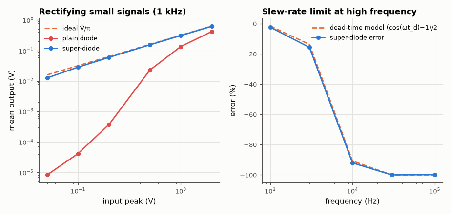
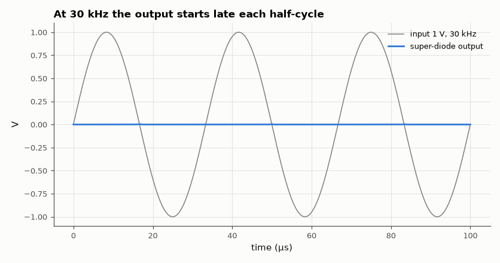

# SL-023 · Precision (super-diode) rectifier

> Put the diode inside an op-amp's feedback loop to rectify millivolt signals: measure the error vs a plain diode, and the frequency where slew rate breaks it.



*The op-amp hides the diode drop until slew rate runs out.*

**Track:** Signal Lab — 214 electrical-engineering projects · **Category:** A. Analog circuit design & simulation · **Level:** Moderate · **Tools:** eelab mini-SPICE transient (op-amp macromodel)

**Data:** Simulated (numerical model in this repo).

## Problem

A silicon diode can't rectify anything smaller than ~0.6 V. How does an op-amp hide the diode drop, and what new limitation appears?

## Prediction

Plain diode half-wave rectifier: output ≈ $\max(v_{in}-V_D,0)$, so a 100 mV signal gives nothing.
Super-diode: the op-amp drives the diode until the output equals the input; the effective drop is
$V_D/A_0$ ≈ 3 µV. Mean of a half-wave-rectified sine: $\hat V/\pi$.
Limitation: when the input crosses zero, the op-amp output must slew from negative saturation up by
$V_D$ before conduction resumes — a dead time ≈ $(V_{int}+V_D)/SR$ each cycle, where $V_{int}$ is how far the op-amp's internal node has saturated (1.5·V_sat = 19.5 V in this macromodel), so error grows with frequency.

## Method

Super-diode (non-inverting, diode in feedback, 10 kΩ load) vs a plain diode into 10 kΩ. Sine inputs of 50 mV–2 V
at 1 kHz, and 1 V at 1–100 kHz. Output mean compared with V̂/π.

## Measured results

*Predicted vs measured vs error. "Measured" = computed by an independent simulation, HDL simulator or public dataset.*

| Quantity | Predicted | Measured | Error |
|---|---|---|---|
| plain: mean output at 100 mV peak | 31.83 mV | 41.04 µV | -99.87 % |
| plain: mean output at 1 V peak | 318.3 mV | 135.3 mV | -57.48 % |
| precision: mean output at 100 mV peak | 31.83 mV | 28.4 mV | -10.78 % |
| precision: mean output at 1 V peak | 318.3 mV | 311 mV | -2.30 % |
| Super-diode error at 1 kHz (slew dead-time model) | -1.587 % | -2.302 % | -0.716 pp |
| Super-diode error at 10 kHz (slew dead-time model) | -90.82 % | -92.04 % | -1.22 pp |
| Super-diode error at 30 kHz (slew dead-time model) | -100 % | -99.98 % | +0.017 pp |



*The op-amp must slew out of negative saturation before the diode conducts again.*

## Error analysis

At 1 kHz the super-diode's error is tiny at any amplitude, while the plain diode's output is
essentially zero below ~0.4 V and still loses ~0.6 V at 2 V peak. At high frequency the op-amp spends
each negative half-cycle saturated at −13 V; recovering takes (19.5 V + V_D)/SR ≈ 40 µs, more than a
whole 33 µs period at 30 kHz. Missing the part of each positive half-cycle from 0 to ω·t_d gives an error of (cos ωt_d − 1)/2,
which reaches −100 % once t_d exceeds half a period; the model tracks the simulation, with the extra
error at low frequency coming from finite-bandwidth settling after recovery. Improved circuits clamp the op-amp output with a
second diode so it never saturates.

## Reproduce

```bash
pip install -r requirements.txt
python run_all.py --only SL-023
```

The script [`project.py`](project.py) regenerates every figure and number above.

**Files produced**

- [`data/amplitude_sweep.csv`](data/amplitude_sweep.csv)

## License

Code and text: MIT (see the repository [LICENSE](../../../../LICENSE)). Datasets remain under their own licences (see the repository README).

---

**Tooling & honesty.** This project was generated with Claude Code (Anthropic's AI coding assistant): the code, derivations, simulations and this write-up were AI-produced. *Measured* means computed by an independent model, simulator or public dataset — not a physical lab bench. Every number in the tables is reproduced by running the code.
