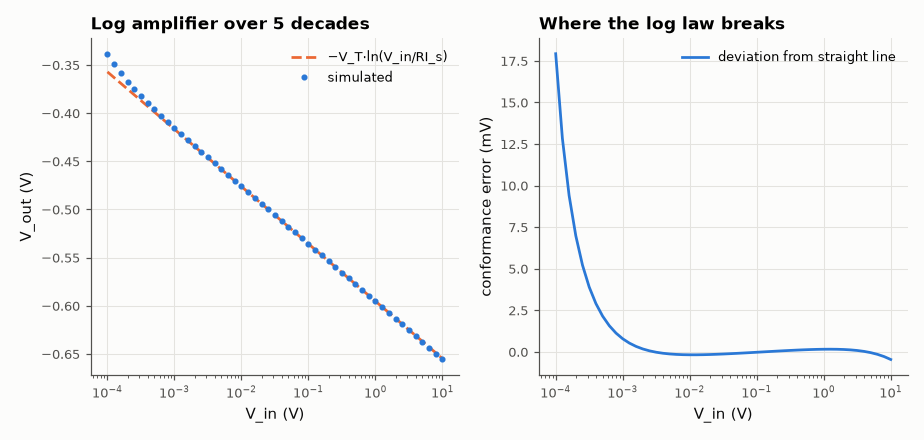
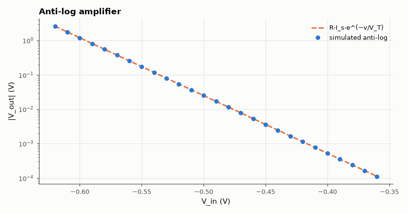

# SL-024 · Logarithmic and anti-log amplifiers

> Exploit the diode law to build an amplifier whose output is the logarithm of its input: verify 59.5 mV per decade over six decades and invert it with an anti-log stage.



*Straight line in log-x across the middle decades; offset and R_s bend both ends.*

**Track:** Signal Lab — 214 electrical-engineering projects · **Category:** A. Analog circuit design & simulation · **Level:** Hard · **Tools:** eelab mini-SPICE DC sweeps over 6 decades

**Data:** Simulated (numerical model in this repo).

## Problem

The diode's exponential I–V curve is usually a nuisance. Can it be turned into an exact logarithm function, and over how many decades does it hold?

## Prediction

With the diode in the feedback of an inverting op-amp, the input current $I=V_{in}/R$ flows through it:
$$V_{out}=-nV_T\ln\frac{V_{in}}{RI_s}\quad\Rightarrow\quad \frac{dV_{out}}{d\log_{10}V_{in}}=-2.303\,nV_T=-59.5\text{ mV/decade}\ (n=1)$$
Anti-log (diode at the input): $V_{out}=-RI_s e^{-V_{in}/nV_T}$. Cascading the two should return the input.
Limits: at low currents the op-amp offset and leakage dominate; at high currents the diode's series
resistance adds a linear term.

## Method

Transistor-quality diode (Is = 10 fA, n = 1, Rs = 1 Ω), R = 10 kΩ, op-amp with 50 µV input offset. Input
100 µV–10 V (6 decades). Slope measured by linear regression in the log domain over the middle
4 decades; conformance error = deviation from the fitted line.

## Measured results

*Predicted vs measured vs error. "Measured" = computed by an independent simulation, HDL simulator or public dataset.*

| Quantity | Predicted | Measured | Error | Within tolerance |
|---|---|---|---|---|
| Log slope | -0.05954 V/dec | -0.05981 V/dec | -0.46 % | yes |
| V_out at V_in = 10 mV | -476.2 mV | -476 mV | +0.04 % | yes |
| Anti-log output at input −0.55 V | 173.6 mV | 173.6 mV | -0.00 % | yes |

**Additional measurements**

| Quantity | Value | Note |
|---|---|---|
| Conformance error at 100 µV (offset-limited) | 17.93 mV |  |
| Conformance error at 10 V (R_s-limited) | -0.4585 mV |  |



*The anti-log stage is an exponential amplifier.*

## Error analysis

Across the middle four decades the slope is within a fraction of a percent of 2.303·V_T. At the
bottom the 50 µV op-amp offset is half of the 100 µV input and the curve flattens; at the top the
1 Ω series resistance adds I·R_s (1 mA → 1 mV and growing). Real log amps use a matched transistor pair
to cancel I_s and its strong temperature dependence, and a temperature-compensating resistor for V_T.

## Reproduce

```bash
pip install -r requirements.txt
python run_all.py --only SL-024
```

The script [`project.py`](project.py) regenerates every figure and number above.

**Files produced**

- [`simulation/log_amp.cir`](simulation/log_amp.cir) — SPICE netlist
- [`data/log_sweep.csv`](data/log_sweep.csv)

## License

Code and text: MIT (see the repository [LICENSE](../../../../LICENSE)). Datasets remain under their own licences (see the repository README).

---

**Tooling & honesty.** This project was generated with Claude Code (Anthropic's AI coding assistant): the code, derivations, simulations and this write-up were AI-produced. *Measured* means computed by an independent model, simulator or public dataset — not a physical lab bench. Every number in the tables is reproduced by running the code.
