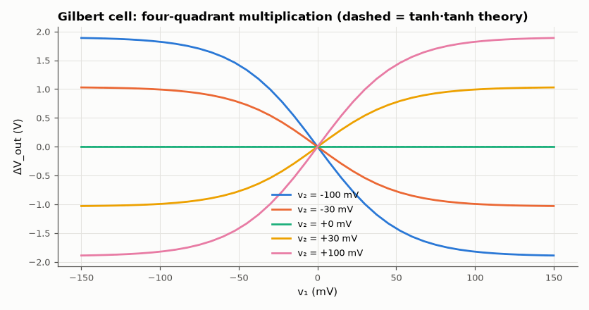
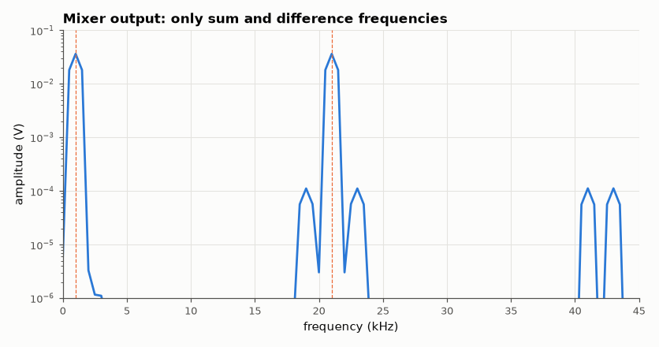

# SL-025 · Four-quadrant analog multiplier (Gilbert cell)

> Build a Gilbert cell, verify ΔI = I_EE·tanh(v₁/2V_T)·tanh(v₂/2V_T) in all four quadrants, then use it to mix 10 kHz and 11 kHz into 1 kHz and 21 kHz.



*Output sign follows sign(v₁)·sign(v₂) in all four quadrants.*

**Track:** Signal Lab — 214 electrical-engineering projects · **Category:** A. Analog circuit design & simulation · **Level:** Hard · **Tools:** eelab mini-SPICE (6-transistor Gilbert cell), DC sweeps + FFT of mixing products

**Data:** Simulated (numerical model in this repo).

## Problem

How do six transistors multiply two voltages, and how clean are the sum and difference frequencies when the multiplier is used as a mixer?

## Prediction

The lower pair splits $I_{EE}$ by $\tanh(v_2/2V_T)$; each upper pair splits its share by $\tanh(v_1/2V_T)$,
and the cross-coupled collectors subtract:
$$\Delta I = \alpha^2 I_{EE}\tanh\frac{v_1}{2V_T}\tanh\frac{v_2}{2V_T}\approx \frac{I_{EE}}{4V_T^2}v_1v_2$$
Mixing $v_1=A\cos\omega_1t$, $v_2=B\cos\omega_2t$ gives $\frac{AB}{2}[\cos(\omega_1-\omega_2)t+\cos(\omega_1+\omega_2)t]$,
so each product's output amplitude is $R_C\frac{I_{EE}}{4V_T^2}\frac{AB}{2}$.

## Method

V_CC = 12 V, R_C = 2 kΩ, I_EE = 1 mA, upper bases at 6 V, lower at 3 V, β = 200. DC sweeps of v₁ for five v₂
values; then a transient with A = B = 10 mV at 10 kHz and 11 kHz, spectrum of the differential output.

## Measured results

*Predicted vs measured vs error. "Measured" = computed by an independent simulation, HDL simulator or public dataset.*

| Quantity | Predicted | Measured | Error | Within tolerance |
|---|---|---|---|---|
| ΔV_out at v₁ = 20 mV, v₂ = 30 mV | 380.1 mV | 380.1 mV | -0.00 % | yes |
| Difference product (1 kHz) amplitude | 37.04 mV | 36.35 mV | -1.86 % | yes |
| Sum product (21 kHz) amplitude | 37.04 mV | 36.35 mV | -1.86 % | yes |

**Additional measurements**

| Quantity | Value | Note |
|---|---|---|
| Feedthrough of 10 kHz input | 68 nV | ideal balanced cell: 0 |
| Multiplier constant K = R_C·I_EE/(4V_T²) | 740.7 1/V |  |



*10 kHz × 11 kHz → 1 kHz and 21 kHz; the inputs themselves cancel.*

## Error analysis

The DC sweeps follow α²·I_EE·tanh·tanh closely; small deviations come from the base currents of the
upper quad and the Early-free model's exact symmetry. As a mixer the cell produces the two predicted
products with the amplitude K·AB/2, while the inputs themselves cancel because the cell is perfectly
balanced in simulation — in silicon, V_BE mismatch leaves some carrier feedthrough, which is why
real mixers specify LO-to-IF isolation.

## Reproduce

```bash
pip install -r requirements.txt
python run_all.py --only SL-025
```

The script [`project.py`](project.py) regenerates every figure and number above.

**Files produced**

- [`simulation/gilbert.cir`](simulation/gilbert.cir) — SPICE netlist

## License

Code and text: MIT (see the repository [LICENSE](../../../../LICENSE)). Datasets remain under their own licences (see the repository README).

---

**Tooling & honesty.** This project was generated with Claude Code (Anthropic's AI coding assistant): the code, derivations, simulations and this write-up were AI-produced. *Measured* means computed by an independent model, simulator or public dataset — not a physical lab bench. Every number in the tables is reproduced by running the code.
