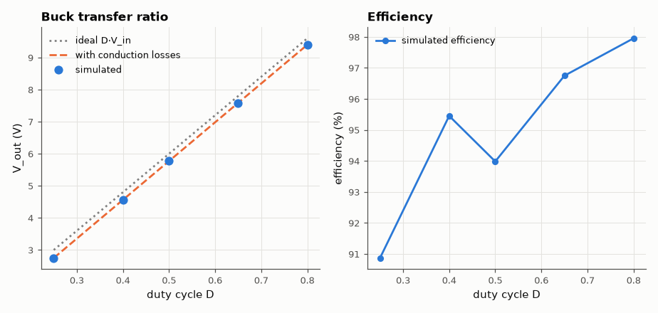
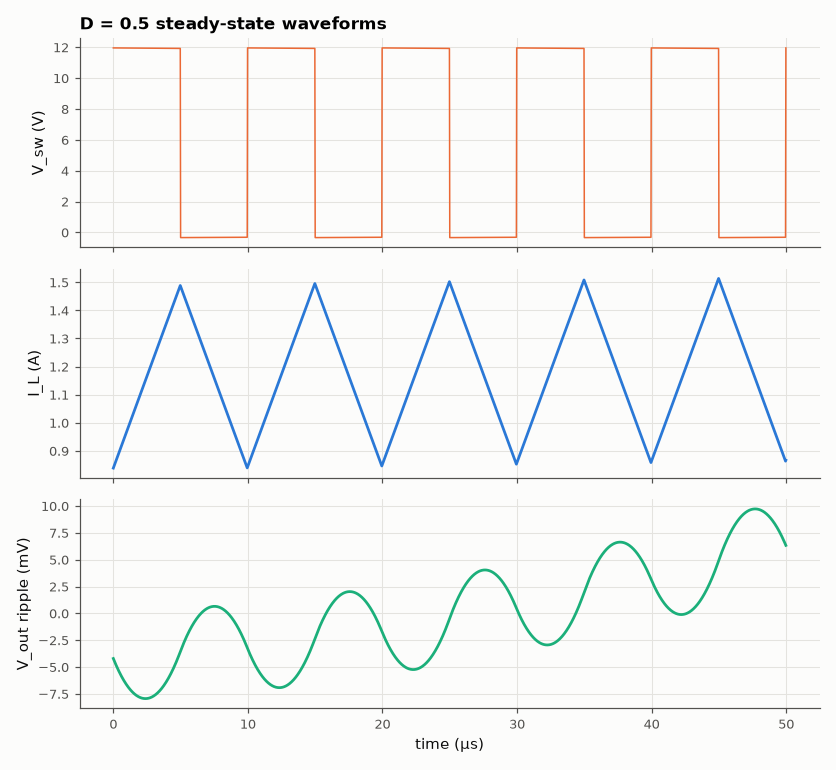

# SL-026 · Buck (step-down) converter

> 12 V → D·12 V at 100 kHz: predict output voltage, inductor ripple and output ripple from volt-second balance, then measure them and the efficiency across duty cycle.



*V_out follows D·V_in minus the diode and resistive drops.*

**Track:** Signal Lab — 214 electrical-engineering projects · **Category:** B. Power electronics · **Level:** Moderate · **Tools:** eelab mini-SPICE switch-level transient (MOSFET switch + Schottky diode)

**Data:** Simulated (numerical model in this repo).

## Problem

How does chopping 12 V on and off produce a smooth lower voltage, and how big are the ripples that the L and C must absorb?

## Prediction

Volt-second balance on L in continuous conduction: $V_{out}=D\,V_{in}$ (ideal).
Inductor ripple $\Delta I_L=\frac{(V_{in}-V_{out})D}{Lf_{sw}}$; output ripple (capacitive part)
$\Delta V_{out}=\frac{\Delta I_L}{8f_{sw}C}$. Losses: switch $I^2R_{on}D$, diode $V_F I(1-D)$, so
$V_{out}\approx D V_{in} - (1-D)V_F - I R_{on} D$ (first-order).

## Method

V_in = 12 V, f_sw = 100 kHz, L = 47 µH (30 mΩ DCR), C = 100 µF, R_L = 5 Ω, switch R_on = 50 mΩ, Schottky
(Is = 10 µA, N = 1.05). D ∈ {0.25, 0.4, 0.5, 0.65, 0.8}; 2 ms transient at 25 ns steps starting near
the predicted steady state; measurements over the last 50 µs (ripple = median peak-to-peak per switching period,
which excludes any residual slow LC settling).

## Measured results

*Predicted vs measured vs error. "Measured" = computed by an independent simulation, HDL simulator or public dataset.*

| Quantity | Predicted | Measured | Error | Within tolerance |
|---|---|---|---|---|
| D = 0.25: V_out (ideal D·V_in) | 3 V | 2.752 V | -8.26 % |  |
| D = 0.25: V_out (with losses) | 2.75 V | 2.752 V | +0.08 % | yes |
| D = 0.25: inductor ripple ΔI_L | 491.9 mA | 496 mA | +0.83 % | yes |
| D = 0.25: output ripple ΔV (per switching period) | 6.149 mV | 6.229 mV | +1.31 % | yes |
| D = 0.4: V_out (ideal D·V_in) | 4.8 V | 4.566 V | -4.88 % |  |
| D = 0.4: V_out (with losses) | 4.563 V | 4.566 V | +0.06 % | yes |
| D = 0.4: inductor ripple ΔI_L | 632.7 mA | 629 mA | -0.59 % | yes |
| D = 0.4: output ripple ΔV (per switching period) | 7.909 mV | 7.554 mV | -4.48 % | yes |
| D = 0.5: V_out (ideal D·V_in) | 6 V | 5.773 V | -3.79 % |  |
| D = 0.5: V_out (with losses) | 5.773 V | 5.773 V | -0.00 % | yes |
| D = 0.5: inductor ripple ΔI_L | 662.5 mA | 675.2 mA | +1.91 % | yes |
| D = 0.5: output ripple ΔV (per switching period) | 8.281 mV | 9.112 mV | +10.03 % | yes |
| D = 0.65: V_out (ideal D·V_in) | 7.8 V | 7.586 V | -2.75 % |  |
| D = 0.65: V_out (with losses) | 7.587 V | 7.586 V | -0.01 % | yes |
| D = 0.65: inductor ripple ΔI_L | 610.5 mA | 596.4 mA | -2.30 % | yes |
| D = 0.65: output ripple ΔV (per switching period) | 7.631 mV | 7.751 mV | +1.57 % | yes |
| D = 0.8: V_out (ideal D·V_in) | 9.6 V | 9.405 V | -2.03 % |  |
| D = 0.8: V_out (with losses) | 9.399 V | 9.405 V | +0.06 % | yes |
| D = 0.8: inductor ripple ΔI_L | 441.8 mA | 433.8 mA | -1.80 % | yes |
| D = 0.8: output ripple ΔV (per switching period) | 5.522 mV | 4.787 mV | -13.32 % | yes |



*Switch node, triangular inductor current and the parabolic output ripple.*

## Error analysis

The ideal D·V_in is off by up to ~0.4 V, almost entirely because of the Schottky's forward drop
during the (1−D) freewheeling interval — which is why low-voltage bucks replace the diode with a
synchronous MOSFET. With that loss included the prediction lands within a fraction of a percent.
The measured inductor ripple matches (V_in − V_out)D/(Lf). The output ripple formula assumes an ideal
capacitor and exactly triangular current; it is a good estimate here because the capacitor has no ESR
in the model — with a real electrolytic, ESR·ΔI_L would dominate.

## Reproduce

```bash
pip install -r requirements.txt
python run_all.py --only SL-026
```

The script [`project.py`](project.py) regenerates every figure and number above.

**Files produced**

- [`simulation/buck.cir`](simulation/buck.cir) — SPICE netlist (switch as comment)
- [`data/duty_sweep.csv`](data/duty_sweep.csv)

## License

Code and text: MIT (see the repository [LICENSE](../../../../LICENSE)). Datasets remain under their own licences (see the repository README).

---

**Tooling & honesty.** This project was generated with Claude Code (Anthropic's AI coding assistant): the code, derivations, simulations and this write-up were AI-produced. *Measured* means computed by an independent model, simulator or public dataset — not a physical lab bench. Every number in the tables is reproduced by running the code.
