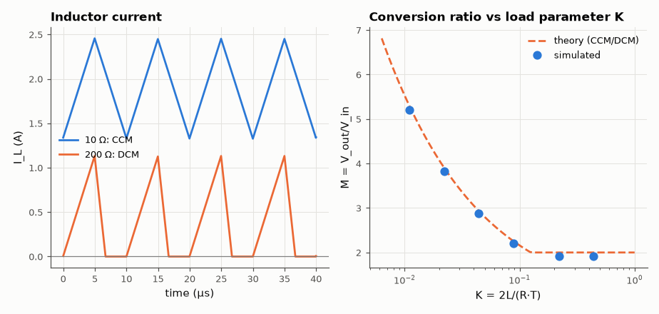

# SL-027 · Boost converter: continuous vs discontinuous conduction

> 5 V → 1/(1−D) boost: show continuous (CCM) and discontinuous (DCM) inductor current and predict each mode's conversion ratio, including the CCM/DCM boundary.



*Light load pushes the boost into DCM, where the gain rises above 1/(1−D).*

**Track:** Signal Lab — 214 electrical-engineering projects · **Category:** B. Power electronics · **Level:** Moderate · **Tools:** eelab mini-SPICE switch-level transient

**Data:** Simulated (numerical model in this repo).

## Problem

A boost converter's famous formula V_out = V_in/(1−D) silently assumes the inductor current never reaches zero. What happens at light load?

## Prediction

CCM: $M = V_{out}/V_{in} = 1/(1-D)$. With $K=2L/(RT_{sw})$ the converter is in DCM when
$K < D(1-D)^2$, and then
$$M_{DCM}=\frac{1+\sqrt{1+4D^2/K}}{2}$$
(Erickson & Maksimović). The DCM ratio depends on load — the converter no longer behaves like an ideal
transformer.

## Method

V_in = 5 V, L = 22 µH, C = 47 µF, f_sw = 100 kHz, D = 0.5, Schottky output diode. Loads 10 Ω (K = 0.44,
CCM) and 200 Ω (K = 0.022, DCM), plus a load sweep to trace M vs K. Transients of 3–8 ms.

## Measured results

*Predicted vs measured vs error. "Measured" = computed by an independent simulation, HDL simulator or public dataset.*

| Quantity | Predicted | Measured | Error | Within tolerance |
|---|---|---|---|---|
| R_L = 10 Ω (CCM, K = 0.440): V_out | 9.65 V | 9.541 V | -1.12 % | yes |
| R_L = 20 Ω (CCM, K = 0.220): V_out | 9.65 V | 9.587 V | -0.65 % | yes |
| R_L = 50 Ω (DCM, K = 0.088): V_out | 11.12 V | 11.01 V | -0.96 % | yes |
| R_L = 100 Ω (DCM, K = 0.044): V_out | 14.5 V | 14.36 V | -0.99 % | yes |
| R_L = 200 Ω (DCM, K = 0.022): V_out | 19.36 V | 19.16 V | -1.08 % | yes |
| R_L = 400 Ω (DCM, K = 0.011): V_out | 26.29 V | 26.02 V | -1.03 % | yes |

**Additional measurements**

| Quantity | Value | Note |
|---|---|---|
| CCM/DCM boundary (D = 0.5) | 35.2 Ω | loads above this R are DCM |

## Error analysis

In CCM the output sits a diode drop below 1/(1−D)·V_in as predicted. Crossing the boundary
(R ≈ 35 Ω for these values) the inductor current returns to zero every cycle and the gain climbs
above 2 — at 400 Ω the ideal DCM ratio is ~5.3. This is why an unloaded boost
converter without a controller can overvolt its output capacitor. The DCM formula neglects the diode
drop and ringing of the switch node during the idle interval, hence the few-percent residuals.

## Reproduce

```bash
pip install -r requirements.txt
python run_all.py --only SL-027
```

The script [`project.py`](project.py) regenerates every figure and number above.

**Files produced**

- [`simulation/boost.cir`](simulation/boost.cir) — SPICE netlist
- [`data/load_sweep.csv`](data/load_sweep.csv)

## License

Code and text: MIT (see the repository [LICENSE](../../../../LICENSE)). Datasets remain under their own licences (see the repository README).

---

**Tooling & honesty.** This project was generated with Claude Code (Anthropic's AI coding assistant): the code, derivations, simulations and this write-up were AI-produced. *Measured* means computed by an independent model, simulator or public dataset — not a physical lab bench. Every number in the tables is reproduced by running the code.
