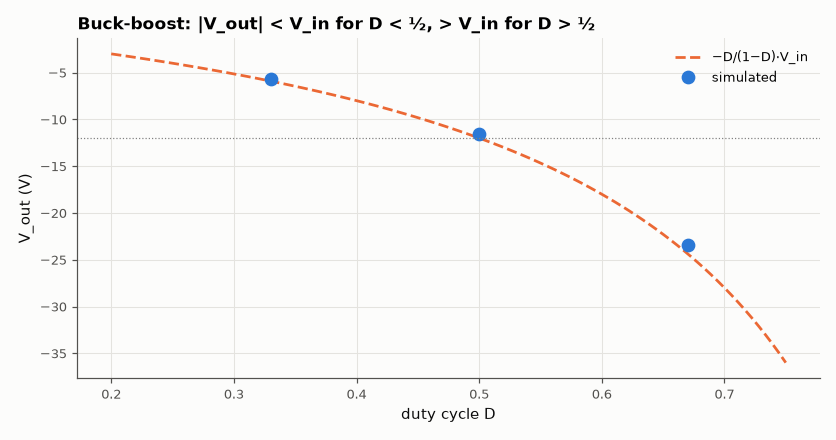

# SL-028 · Inverting buck-boost converter

> One switch, one inductor, one diode — and a negative output that can be larger or smaller than the input. Verify −D/(1−D) and compare stresses with buck and boost.



*Inverting output crossing −V_in at D = 0.5.*

**Track:** Signal Lab — 214 electrical-engineering projects · **Category:** B. Power electronics · **Level:** Moderate · **Tools:** eelab mini-SPICE switch-level transient

**Data:** Simulated (numerical model in this repo).

## Problem

How does the buck-boost produce both step-down and step-up with inverted polarity, and what does that flexibility cost in component stress?

## Prediction

The inductor is charged from $V_{in}$ during $DT$ and dumps into the output during $(1-D)T$:
$$\frac{V_{out}}{V_{in}}=-\frac{D}{1-D}$$
The switch sees $V_{in}+|V_{out}|$ and the inductor carries $I_L = I_{out}/(1-D)$ — higher stress than
either buck ($I_L=I_{out}$) or boost ($V_{sw}=V_{out}$).

## Method

V_in = 12 V, L = 47 µH, C = 100 µF, R_L = 10 Ω, f_sw = 100 kHz, D ∈ {0.33, 0.5, 0.67}. Switch in series with
V_in to the inductor top; the inductor goes to ground; the diode points from output to the inductor
node (so the output goes negative).

## Measured results

*Predicted vs measured vs error. "Measured" = computed by an independent simulation, HDL simulator or public dataset.*

| Quantity | Predicted | Measured | Error | Within tolerance |
|---|---|---|---|---|
| D = 0.33: V_out | -5.91 V | -5.649 V | +4.43 % | yes |
| D = 0.33: mean inductor current | 843.1 mA | 824.9 mA | -2.16 % | yes |
| D = 0.5: V_out | -12 V | -11.57 V | +3.60 % | yes |
| D = 0.5: mean inductor current | 2.314 A | 2.275 A | -1.66 % | yes |
| D = 0.67: V_out | -24.36 V | -23.39 V | +4.01 % | yes |
| D = 0.67: mean inductor current | 7.087 A | 7.224 A | +1.93 % | yes |

**Additional measurements**

| Quantity | Value | Note |
|---|---|---|
| D = 0.33: switch off-state voltage | 17.65 V | V_in + |V_out| |
| D = 0.5: switch off-state voltage | 23.57 V | V_in + |V_out| |
| D = 0.67: switch off-state voltage | 35.39 V | V_in + |V_out| |

## Error analysis

Measured magnitudes are slightly lower than D/(1−D)·V_in because of the diode drop and switch/
inductor resistance; the error grows at high D because the inductor current (I_out/(1−D)) — and
hence every resistive loss — grows. The stress numbers show the price of flexibility: at D = 0.67 the
switch blocks ~36 V for a 12 V input.

## Reproduce

```bash
pip install -r requirements.txt
python run_all.py --only SL-028
```

The script [`project.py`](project.py) regenerates every figure and number above.

**Files produced**

- [`simulation/buck_boost.cir`](simulation/buck_boost.cir) — SPICE netlist
- [`data/duty_sweep.csv`](data/duty_sweep.csv)

## License

Code and text: MIT (see the repository [LICENSE](../../../../LICENSE)). Datasets remain under their own licences (see the repository README).

---

**Tooling & honesty.** This project was generated with Claude Code (Anthropic's AI coding assistant): the code, derivations, simulations and this write-up were AI-produced. *Measured* means computed by an independent model, simulator or public dataset — not a physical lab bench. Every number in the tables is reproduced by running the code.
