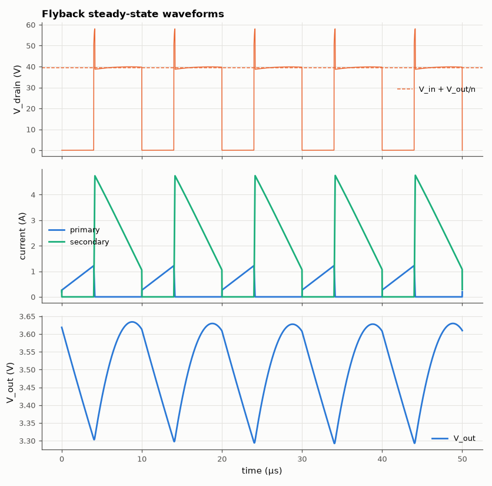

# SL-029 · Flyback converter (isolated, coupled inductor)

> 24 V → ~4 V isolated supply using a 4:1 coupled inductor — the phone-charger topology. Predict V_out = n·V_in·D/(1−D) and the leakage-inductance voltage spike the clamp must absorb.



*Energy stored in the primary during the on-time is released through the secondary during the off-time.*

**Track:** Signal Lab — 214 electrical-engineering projects · **Category:** B. Power electronics · **Level:** Hard · **Tools:** eelab mini-SPICE with mutual inductance (K), RCD clamp

**Data:** Simulated (numerical model in this repo).

## Problem

How does a flyback store energy in a transformer's core and release it to an isolated output, and why does every flyback need a snubber?

## Prediction

With turns ratio $n=N_s/N_p$ and CCM operation: $V_{out}=nV_{in}\frac{D}{1-D}$.
While the switch is off the primary is clamped at $V_{in}+V_{out}/n$ (reflected voltage).
Leakage inductance $L_{lk}=(1-k^2)L_p$ does not couple to the secondary; its energy $\tfrac12L_{lk}I_{pk}^2$
drives the drain above the reflected voltage until the RCD clamp (clamp voltage $V_{cl}$) absorbs it:
$P_{clamp}\approx \tfrac12L_{lk}I_{pk}^2 f_{sw}\frac{V_{cl}}{V_{cl}-V_{out}/n}$.

## Method

L_p = 100 µH, L_s = 6.25 µH (n = 0.25), k = 0.99 (≈ 2 µH leakage), f_sw = 100 kHz, D = 0.4, 22 µF output with
2 Ω load. RCD clamp: diode drain → clamp node, 10 nF ‖ 3.3 kΩ to V_in. 2.5 ms transient at 10 ns steps.

## Measured results

*Predicted vs measured vs error. "Measured" = computed by an independent simulation, HDL simulator or public dataset.*

| Quantity | Predicted | Measured | Error | Within tolerance |
|---|---|---|---|---|
| Output voltage (ideal n·V_in·D/(1−D)) | 4 V | 3.502 V | -12.44 % |  |
| Output voltage (minus diode drop) | 3.607 V | 3.502 V | -2.91 % | yes |
| Drain plateau (V_in + V_out/n) | 39.58 V | 39.75 V | +0.44 % | yes |
| Clamp dissipation | 323.8 mW | 252.5 mW | -22.04 % | yes |

**Additional measurements**

| Quantity | Value | Note |
|---|---|---|
| Peak drain voltage (leakage spike, clamped) | 58.09 V |  |
| Clamp capacitor voltage | 52.86 V |  |
| Efficiency | 86.03 % |  |

## Error analysis

The output sits one diode drop below the ideal flyback ratio. The drain waveform shows the three
phases every flyback designer knows: the on-state near 0 V, a spike when the switch opens (leakage
inductance forcing current into the clamp), then the plateau at V_in + V_out/n while the secondary
conducts. The clamp-dissipation estimate is rough because the clamp capacitor voltage itself sets how
fast leakage current resets; it confirms the order of magnitude — leakage energy is pure loss, which is
why transformer interleaving (k → 0.999) matters so much in real chargers.

## Reproduce

```bash
pip install -r requirements.txt
python run_all.py --only SL-029
```

The script [`project.py`](project.py) regenerates every figure and number above.

**Files produced**

- [`simulation/flyback.cir`](simulation/flyback.cir) — SPICE netlist (switch as comment)
- [`data/waveforms.csv`](data/waveforms.csv)

## License

Code and text: MIT (see the repository [LICENSE](../../../../LICENSE)). Datasets remain under their own licences (see the repository README).

---

**Tooling & honesty.** This project was generated with Claude Code (Anthropic's AI coding assistant): the code, derivations, simulations and this write-up were AI-produced. *Measured* means computed by an independent model, simulator or public dataset — not a physical lab bench. Every number in the tables is reproduced by running the code.
