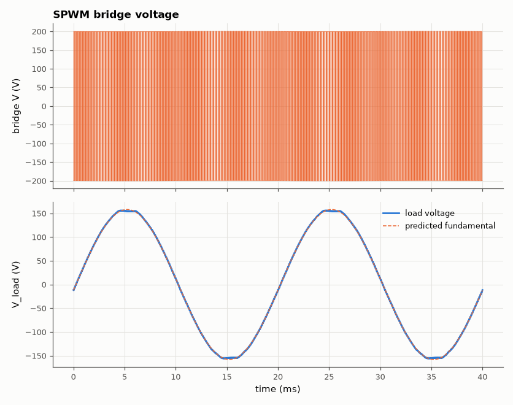
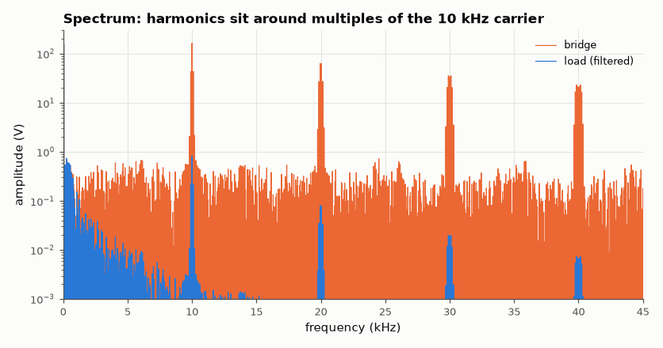

# SL-030 · Full-bridge SPWM inverter

> Turn 200 V DC into a 50 Hz sine with sinusoidal PWM on an H-bridge: predict the fundamental amplitude m·V_dc and compare output THD before and after the LC filter.



*±200 V switching becomes a 50 Hz sine after the LC filter.*

**Track:** Signal Lab — 214 electrical-engineering projects · **Category:** B. Power electronics · **Level:** Hard · **Tools:** eelab mini-SPICE (4 switches, LC filter), FFT THD

**Data:** Simulated (numerical model in this repo).

## Problem

How does a solar or UPS inverter make a clean mains sine wave out of DC with switches that are only ever on or off?

## Prediction

Bipolar SPWM on a full bridge: the bridge output's local average is $m V_{dc}\sin\omega_1t$, so
$\hat V_1 = mV_{dc}$ for $m\le1$ (linear modulation). Harmonics cluster around the carrier $f_c$ and its
multiples; an LC filter with $f_0 = 1/(2\pi\sqrt{LC})$ ≪ $f_c$ attenuates them by $(f_c/f_0)^2$ while
passing 50 Hz (fundamental gain $\approx 1/(1-\omega_1^2LC)$).

## Method

V_dc = 200 V, f_c = 10 kHz, m = 0.8, L = 5 mH (0.1 Ω), C = 10 µF, R = 20 Ω. Diagonal switch pairs driven by
the comparison sin vs triangle. 60 ms (3 cycles) at 1 µs steps; THD of bridge voltage and of load voltage
over the last 40 ms.

## Measured results

*Predicted vs measured vs error. "Measured" = computed by an independent simulation, HDL simulator or public dataset.*

| Quantity | Predicted | Measured | Error | Within tolerance |
|---|---|---|---|---|
| Bridge fundamental amplitude (m·V_dc) | 160 V | 158.5 V | -0.92 % | yes |
| Load fundamental amplitude (m·V_dc·|H(50 Hz)|) | 159.5 V | 158 V | -0.92 % | yes |
| Carrier-band attenuation by LC filter | -45.89 dB | -45.91 dB | -0.01917 dB |  |

**Additional measurements**

| Quantity | Value | Note |
|---|---|---|
| LC corner frequency | 711.8 Hz |  |
| THD of bridge voltage (unfiltered) | 119 % |  |
| THD of load voltage (filtered) | 1.112 % |  |



*The LC filter removes ~40 dB of the carrier-band harmonics.*

## Error analysis

The bridge fundamental equals m·V_dc to within the switch-resistance drop, confirming the linear-
modulation result. Bipolar SPWM puts large harmonic sidebands at f_c ± 2f₁, ± 4f₁…, and 2f_c; the LC
filter (f₀ = 712 Hz) removes them at 40 dB/decade, taking THD from >100 % to a few percent. Unipolar
(three-level) SPWM would double the effective ripple frequency and shrink the filter further.

## Reproduce

```bash
pip install -r requirements.txt
python run_all.py --only SL-030
```

The script [`project.py`](project.py) regenerates every figure and number above.

**Files produced**

- [`simulation/h_bridge.cir`](simulation/h_bridge.cir) — SPICE netlist (switches as comments)
- [`data/output.csv`](data/output.csv)

## License

Code and text: MIT (see the repository [LICENSE](../../../../LICENSE)). Datasets remain under their own licences (see the repository README).

---

**Tooling & honesty.** This project was generated with Claude Code (Anthropic's AI coding assistant): the code, derivations, simulations and this write-up were AI-produced. *Measured* means computed by an independent model, simulator or public dataset — not a physical lab bench. Every number in the tables is reproduced by running the code.
