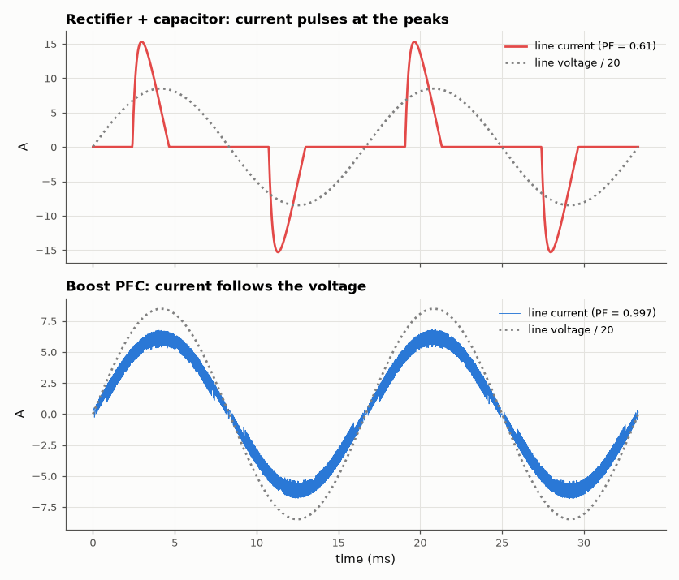

# SL-031 · Boost power-factor-correction stage

> Compare a plain rectifier-capacitor front end with a boost PFC stage whose inductor current is forced to follow the rectified line voltage: measure power factor and current THD.



*PFC turns the pulsed input current into a sine in phase with the line.*

**Track:** Signal Lab — 214 electrical-engineering projects · **Category:** B. Power electronics · **Level:** Hard · **Tools:** eelab mini-SPICE with feedback controller (hysteretic current mode)

**Data:** Simulated (numerical model in this repo).

## Problem

Why do mains-powered supplies above 75 W need power-factor correction, and how does a boost converter make the input look like a resistor?

## Prediction

Power factor $PF=\frac{P}{V_{rms}I_{rms}}=\frac{\cos\phi}{\sqrt{1+THD_i^2}}$. A peak-rectifier draws short current
pulses near the voltage peaks, giving PF ≈ 0.5–0.7. The PFC controller sets the inductor current
reference $i_{ref}=k|v_{in}|$, so the line current is sinusoidal and in phase: PF → 1. The multiplier
$k$ comes from the output power: $k = 2P_{out}/(\eta V_p^2)$.

## Method

120 V RMS / 60 Hz source through an ideal rectifier. (a) Plain: rectified voltage → 470 µF ‖ 320 Ω.
(b) PFC: rectified voltage → 1 mH → synchronous switch pair → 470 µF ‖ 320 Ω (~400 V bus, 500 W).
Hysteretic control holds i_L within ±0.3 A of k|v_in|; k is updated each half-cycle by a slow PI loop on
V_out. 100 ms transients, PF and THD over the last two line cycles.

## Measured results

*Predicted vs measured vs error. "Measured" = computed by an independent simulation, HDL simulator or public dataset.*

| Quantity | Predicted | Measured | Error | Within tolerance |
|---|---|---|---|---|
| PFC power factor | 1 | 0.9968 | -0.32 % | yes |
| Plain rectifier PF (textbook range 0.5–0.7) | 0.6 | 0.61 | +0.009978 |  |

**Additional measurements**

| Quantity | Value | Note |
|---|---|---|
| Line-current THD, plain rectifier | 119.4 % |  |
| Line-current THD, PFC | 2.269 % |  |
| PFC output voltage (mean) | 393.8 V |  |
| Input power, PFC | 514.9 W |  |

## Error analysis

The rectifier-capacitor front end conducts only for a few milliseconds near each peak, so its
current is rich in 3rd, 5th, 7th harmonics (THD 119 %) and PF ≈ 0.61. The PFC stage forces the
inductor current to track k·|v_in| within a ±0.3 A hysteresis band, so the line sees a nearly resistive
load. PF falls short of 1 because of the hysteresis ripple, a small phase distortion near the zero
crossings (where the boost cannot source current when |v_in| is tiny) and the 120 Hz ripple on k
introduced by the voltage loop.

## Reproduce

```bash
pip install -r requirements.txt
python run_all.py --only SL-031
```

The script [`project.py`](project.py) regenerates every figure and number above.

**Files produced**

- [`data/pfc_current.csv`](data/pfc_current.csv)

## License

Code and text: MIT (see the repository [LICENSE](../../../../LICENSE)). Datasets remain under their own licences (see the repository README).

---

**Tooling & honesty.** This project was generated with Claude Code (Anthropic's AI coding assistant): the code, derivations, simulations and this write-up were AI-produced. *Measured* means computed by an independent model, simulator or public dataset — not a physical lab bench. Every number in the tables is reproduced by running the code.
