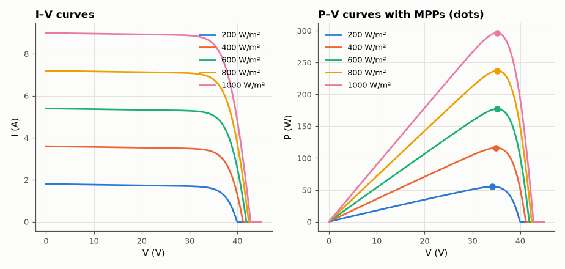
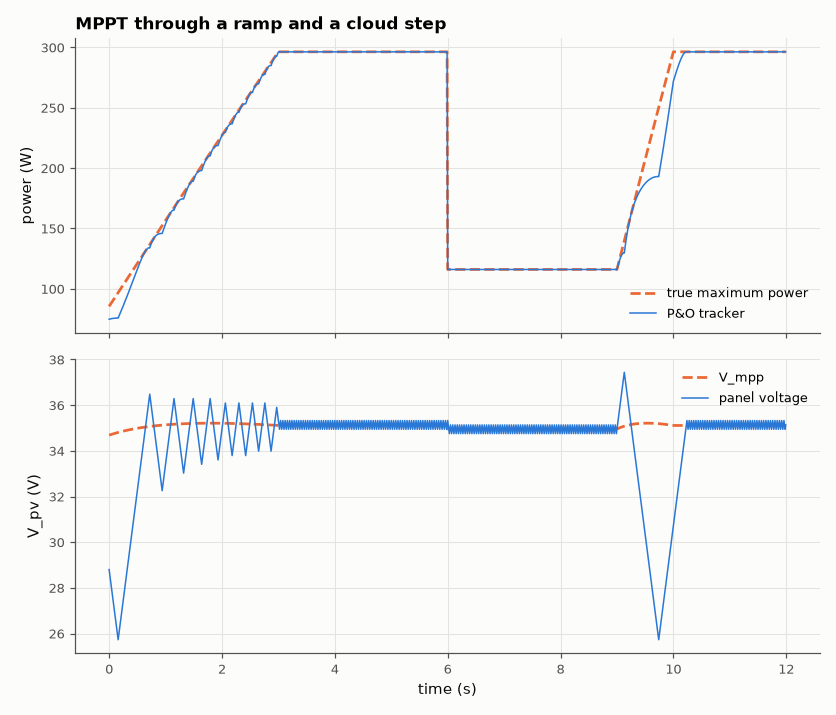

# SL-032 · MPPT solar tracker (perturb & observe)

> Model a 60-cell PV panel, locate its maximum power point analytically, then run a perturb-and-observe tracker through an irradiance ramp and a cloud step and measure how much energy it captures.



*The maximum power point shifts with irradiance.*

**Track:** Signal Lab — 214 electrical-engineering projects · **Category:** B. Power electronics · **Level:** Hard · **Tools:** Single-diode PV model (NumPy/SciPy) + averaged boost-converter MPPT loop

**Data:** Simulated (numerical model in this repo).

## Problem

A solar panel's power depends on the voltage you hold it at, and the best voltage moves with sunlight. How close does the simplest MPPT algorithm get to the true optimum?

## Prediction

Single-diode model: $I = I_{ph} - I_0\left(e^{(V+IR_s)/(nN_sV_T)}-1\right) - \frac{V+IR_s}{R_{sh}}$, with
$I_{ph}\propto G$ (irradiance). The maximum power point satisfies $dP/dV = 0$ ⇔ $dI/dV = -I/V$; it sits at
≈ 80 % of $V_{oc}$ and moves roughly logarithmically with G. P&O perturbs the operating voltage by ΔV and
keeps the direction if power rose — it oscillates in a ±ΔV band around the MPP, costing ≈ a few ×0.1 %.

## Method

Panel: 60 cells, I_sc = 9 A at 1000 W/m², I₀ = 1e-10 A, n = 1.1, R_s = 0.3 Ω, R_sh = 300 Ω, 25 °C.
Predicted MPP by numerically maximising P(V) on the implicit I–V curve (Brent root + scalar optimiser).
Tracker: boost converter averaged model sets V_pv = V_bus(1−D), P&O updates D every 10 ms with ΔD = 0.004,
bus held at 48 V. Irradiance profile over 12 s: ramp 300→1000 W/m², hold, cloud step to 400, recovery.

## Measured results

*Predicted vs measured vs error. "Measured" = computed by an independent simulation, HDL simulator or public dataset.*

| Quantity | Predicted | Measured | Error | Within tolerance |
|---|---|---|---|---|
| Steady-state tracking efficiency (1000 W/m²) | 100 % | 99.98 % | -0.0122 pp |  |
| Energy captured over whole profile | 100 % | 98.65 % | -1.35 pp |  |
| V_mpp at 1000 W/m² (fractional-V_oc rule 0.8·V_oc) | 34.21 V | 35.11 V | +2.64 % | yes |

**Additional measurements**

| Quantity | Value | Note |
|---|---|---|
| G = 400: V_mpp / V_oc | 0.8492 | V_mpp = 34.96 V, P_max = 116.1 W |
| G = 1000: V_mpp / V_oc | 0.8211 | V_mpp = 35.11 V, P_max = 296.4 W |



*The tracker hunts in a ±ΔV band around the moving MPP and recovers from the cloud in <1 s.*

## Error analysis

The fractional-V_oc rule of thumb (0.8·V_oc) lands within a few percent of the true MPP. P&O
captures 98.7 % of the available energy over the whole profile; the loss comes from the ±ΔV
limit cycle in steady state and from the lag after the cloud step — during a ramp P&O can even
step the wrong way because the power change from irradiance swamps the change from its own
perturbation (the classic P&O drift problem that incremental-conductance and dP-P&O variants fix).

## Reproduce

```bash
pip install -r requirements.txt
python run_all.py --only SL-032
```

The script [`project.py`](project.py) regenerates every figure and number above.

**Files produced**

- [`data/tracking.csv`](data/tracking.csv)

## License

Code and text: MIT (see the repository [LICENSE](../../../../LICENSE)). Datasets remain under their own licences (see the repository README).

---

**Tooling & honesty.** This project was generated with Claude Code (Anthropic's AI coding assistant): the code, derivations, simulations and this write-up were AI-produced. *Measured* means computed by an independent model, simulator or public dataset — not a physical lab bench. Every number in the tables is reproduced by running the code.
