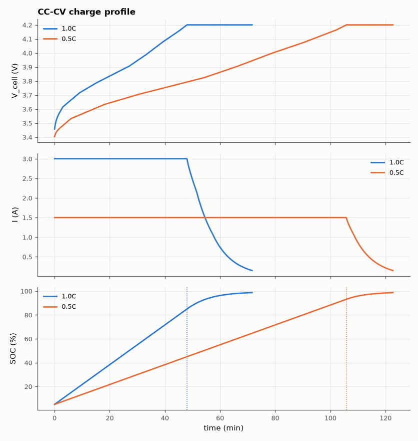

# SL-033 · CC-CV lithium-ion charger

> Simulate the constant-current / constant-voltage charge profile of a 3 Ah 18650 cell and predict when CC ends, how much charge CV adds and the total charge time.



*Voltage rises at constant current, then current tapers at 4.2 V (dotted = CC→CV).*

**Track:** Signal Lab — 214 electrical-engineering projects · **Category:** B. Power electronics · **Level:** Moderate · **Tools:** Equivalent-circuit Li-ion cell (OCV(SOC) + R₀ + R₁C₁) integrated with SciPy

**Data:** Simulated (numerical model in this repo).

## Problem

Why does a phone reach 80 % quickly and then crawl to 100 %? Model the CC-CV algorithm and the cell's internal resistance that causes it.

## Prediction

During CC at current $I$: terminal $V_t = OCV(SOC) + IR_0 + v_1$ rises until it hits $V_{max}$ = 4.2 V.
CC ends when $OCV(SOC_{cc}) \approx 4.2 - I(R_0+R_1)$ (steady-state polarization), so higher current or
resistance means *lower* SOC at the CC→CV transition. In CV the current decays roughly exponentially
with time constant $\tau\approx Q\,(R_0+R_1)/(dOCV/dSOC)$ until the cut-off $I_{term}=C/20$.

## Method

Cell: Q = 3.0 Ah, R₀ = 35 mΩ, R₁ = 20 mΩ, C₁ = 1500 F (τ₁ = 30 s), OCV curve fitted to typical NMC data.
Charge from 5 % SOC at 1C (3 A) and 0.5C; CV at 4.2 V until I < 150 mA. ODE solved with RK45 (CC) and an
algebraic current solve each step (CV).

## Measured results

*Predicted vs measured vs error. "Measured" = computed by an independent simulation, HDL simulator or public dataset.*

| Quantity | Predicted | Measured | Error | Within tolerance |
|---|---|---|---|---|
| 1.0C: SOC at CC→CV transition | 85 % | 85 % | +3.87e-12 pp |  |
| 1.0C: CC duration | 2.88 ks | 2.88 ks | -0.00 % | yes |
| 1.0C: CV duration (exponential-decay model) | 1.271 ks | 1.416 ks | +11.40 % | yes |
| 0.5C: SOC at CC→CV transition | 93.12 % | 93.13 % | +0.005 pp |  |
| 0.5C: CC duration | 6.345 ks | 6.345 ks | +0.01 % | yes |
| 0.5C: CV duration (exponential-decay model) | 977 s | 1.013 ks | +3.69 % | yes |

**Additional measurements**

| Quantity | Value | Note |
|---|---|---|
| 1.0C: total charge time | 71.6 min |  |
| 1.0C: final SOC | 98.68 % |  |
| 0.5C: total charge time | 122.6 min |  |
| 0.5C: final SOC | 98.68 % |  |

## Error analysis

The CC→CV transition SOC is predicted almost exactly by OCV(SOC) = 4.2 V − I(R₀ + R₁) once the RC
branch has reached steady state — confirming that internal resistance, not the chemistry, forces the
early switch to CV at high current. The CV phase is only approximately exponential because the OCV
slope changes with SOC near full charge, so the single-time-constant estimate is rough. Charging at 1C
does not halve the time vs 0.5C: the CV tail is longer because more of the charge must be delivered
at tapering current.

## Reproduce

```bash
pip install -r requirements.txt
python run_all.py --only SL-033
```

The script [`project.py`](project.py) regenerates every figure and number above.

**Files produced**

- [`data/profile_1p0C.csv`](data/profile_1p0C.csv)
- [`data/profile_0p5C.csv`](data/profile_0p5C.csv)

## License

Code and text: MIT (see the repository [LICENSE](../../../../LICENSE)). Datasets remain under their own licences (see the repository README).

---

**Tooling & honesty.** This project was generated with Claude Code (Anthropic's AI coding assistant): the code, derivations, simulations and this write-up were AI-produced. *Measured* means computed by an independent model, simulator or public dataset — not a physical lab bench. Every number in the tables is reproduced by running the code.
